# 🎨 Vertex Color Master

> **项目地址**: [Blender Vertex Color Master](https://github.com/andyp123/blender_vertex_color_master)

**Vertex Color Master 插件**，简称 VCM 插件。

## 📖 用途

- 解决 3Dmigoto Mod 制作中精细刷 COLOR 值的问题。
- 刷 COLOR 值的标准工具只推荐 VCM 插件，其它方法都是偷懒不推荐。

## ⚡ 快速设置轮廓线粗细

在部分游戏比如 GI 中，COLOR 的 RGBA 分量中的 Alpha 分量，是控制轮廓线粗细的。

在远古时期，人们喜欢使用 GIMI 的快速轮廓线设置脚本来快速设置轮廓线粗细：

> **脚本链接**: [Genshin Set Outlines](https://github.com/SilentNightSound/GI-Model-Importer/blob/main/Tools/genshin_set_outlines.py)

以及快速 COLOR 设置脚本来设置 COLOR 的四个分量：

> **脚本链接**: [Genshin Set Color](https://github.com/SilentNightSound/GI-Model-Importer/blob/main/Tools/genshin_set_color.py)

但是这种方法有如下缺点：

- 学习成本高，额外学习并记忆一个工具的使用。
- 不通用，只有 GI 的部分数据类型可以使用。
- 黑框框脚本很难用。
- 在 HSR、ZZZ、WuWa 等需要精确控制 COLOR 内容的游戏中，无法达到正确效果，例如部分 Shader 需要读取正确的 COLOR 值才能显示模型，如果不刷对 COLOR 值，就会导致做好的 Mod 不显示的问题。

最标准的做法是使用 VCM 插件，以快速设置轮廓线粗细举例：

1. **切换到顶点绘制**：

   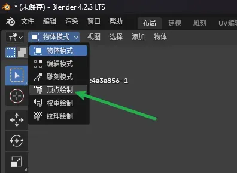

2. **打开 VCM 插件右侧面板**

   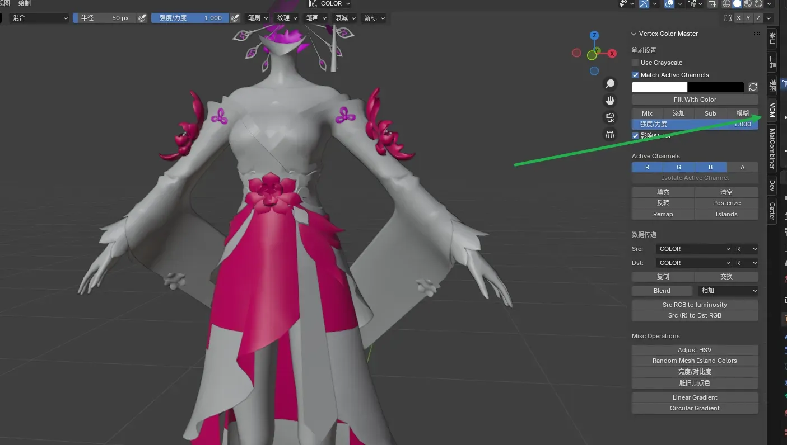

3. **因为我们要设置 COLOR 的 A 分量，所以这里选择 A**：

   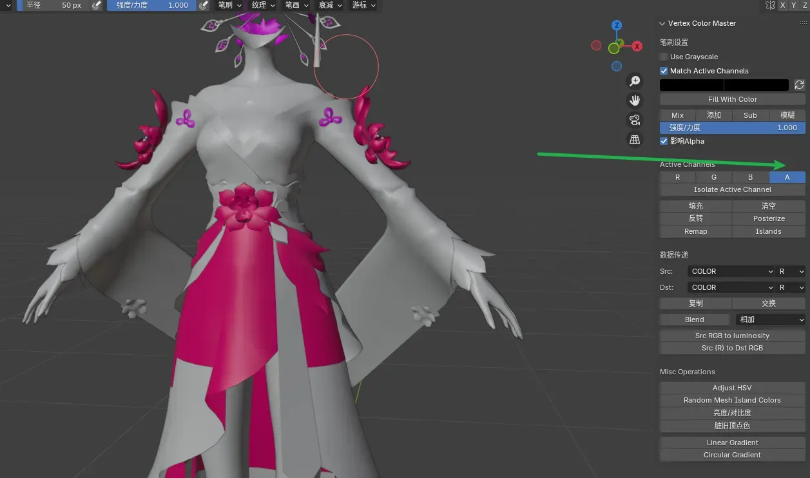

4. **随后点击 Isolate Active Channel**

   被选中的 A 就是 A 通道 (A Channel)，Isolate 就是隔离的意思，Active 指被选中的就是被激活的。点击后进入 A 通道的视图中：

   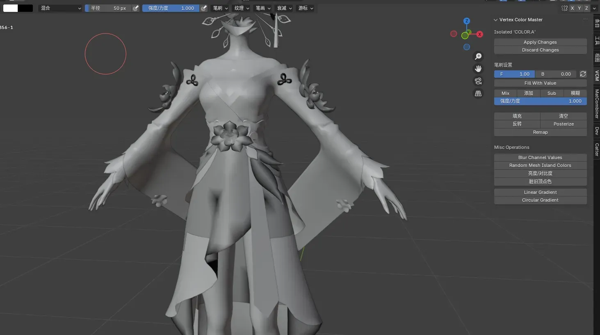

5. **选择具体的 RGB 值**，可以看到这里能够非常精细地控制这个通道要刷的具体颜色。

   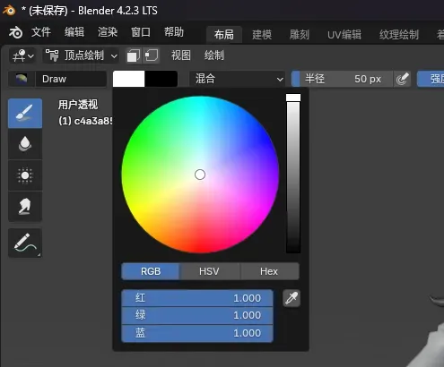

   一般单个通道中，只刷黑到白的颜色，所以我们在滑条上拖动：

   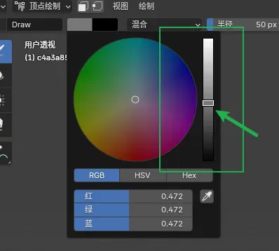

   你要设置的轮廓线粗细，就是这个滑条的值，也就是 RGB 的统一值，对于 GI 这个游戏来说，0 就是没有轮廓线，1 就是轮廓线最粗，0.5 是默认值。这里我们随便选择一个值：

   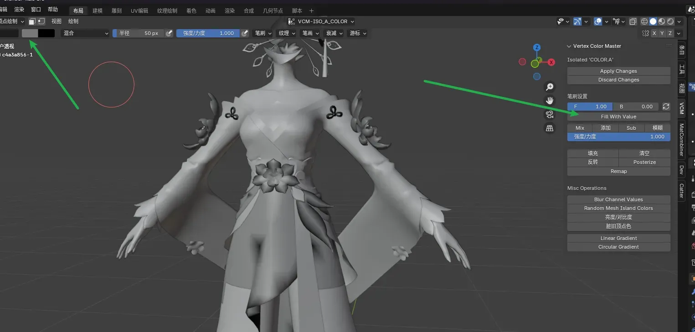

6. **然后点击 Fill With Value**，可以看到整个 A 通道所有内容都 Fill 为具体某个值了：

   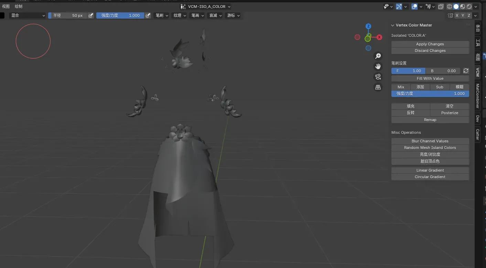

   这里你看到颜色不一致，是因为我们选择的视图着色方式错误，在刷 COLOR 值时，一定要将光照设置为平面，否则还会导致吸出来和涂出来不是一个色：

   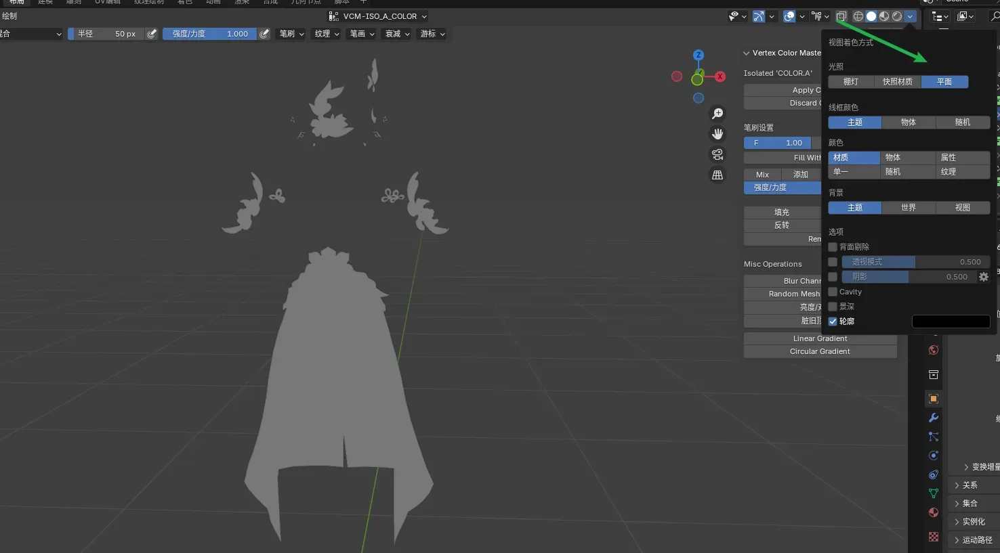

   这样才能更好的看清楚效果。

7. **在刷完之后，我们点击 Apply Changes**：

   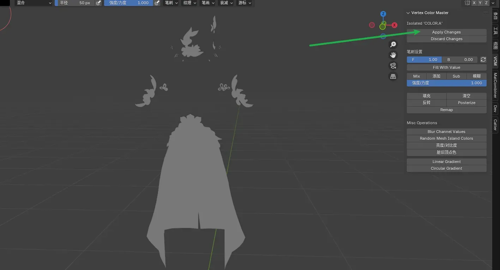

   就会应用并返回 RGBA 四个通道同时显示的界面：

   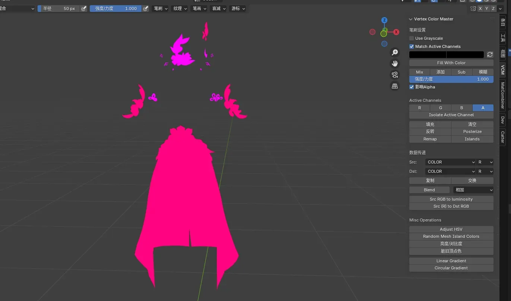

8. **此时我们已经刷完了，返回物体模式即可**：

   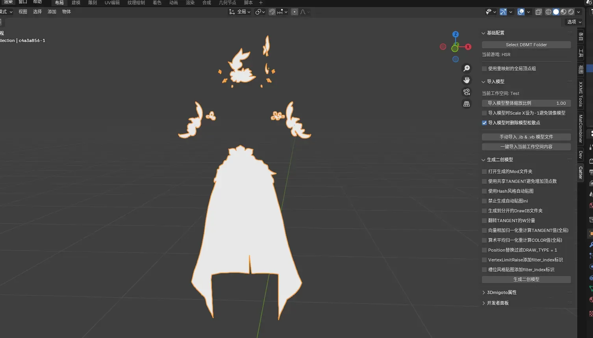

   别忘了把视图着色方式改回来：

   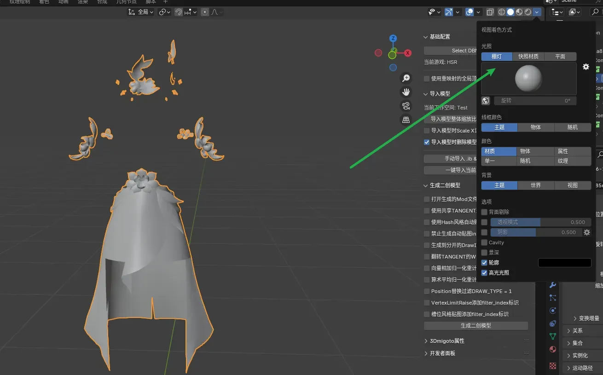
