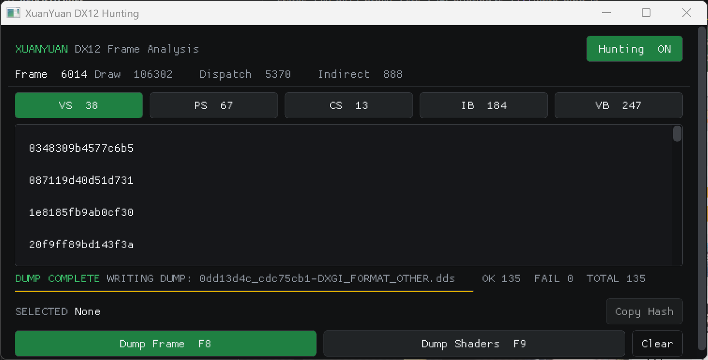
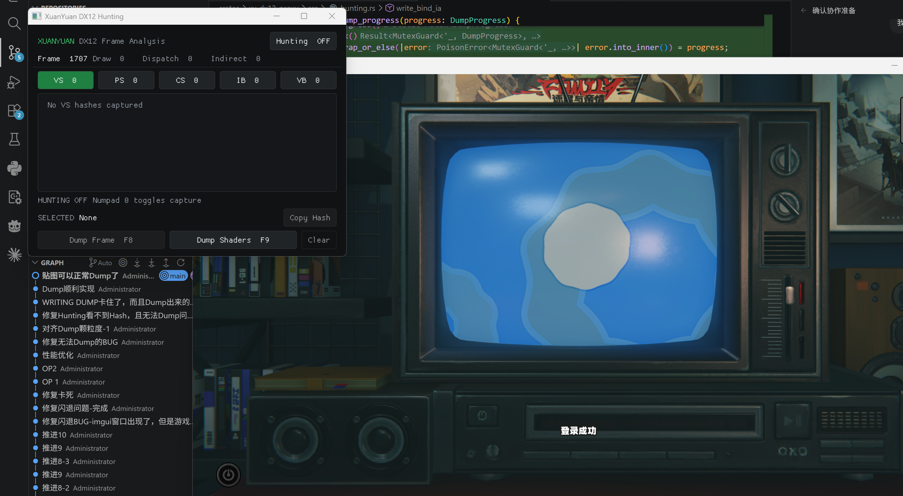
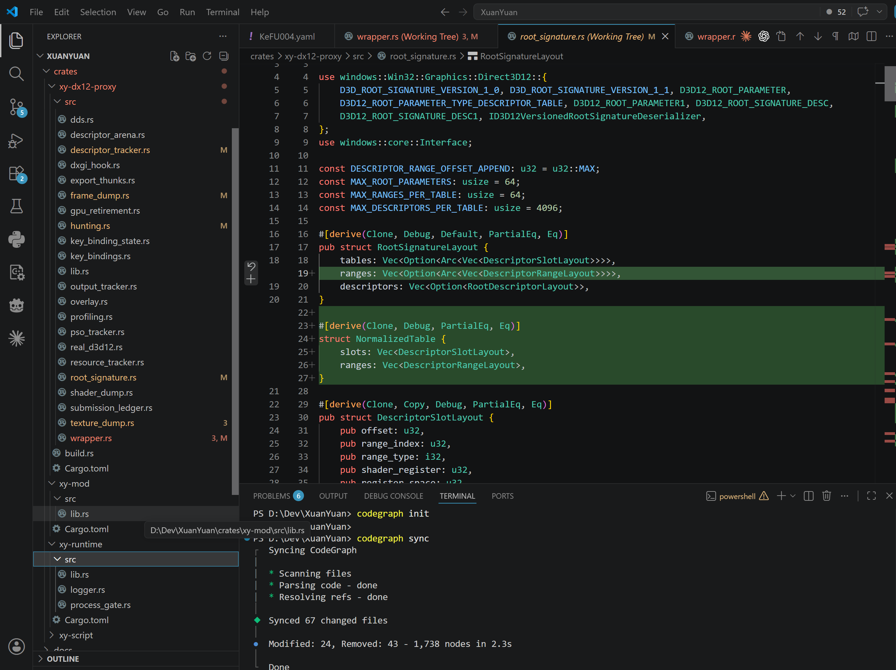

# 开发进度记录

## 20260715

已完整迁移为Rust架构，改名为：XuanYuan，轩辕：下一代DX12Mod平台

目前进度：

- F8 Dump不会导致游戏卡住，可实时查看Dump进度，成功数，失败数，总数。
- Hunting窗口使用imgui绘制，与游戏本体分离，可随意拖拽调节位置和大小以及最小化等，不会影响
- F8 Dump所需世界大大减小，0.1秒内即可完成角色界面Dump、大世界3秒内完成。
- Mod格式与配置格式均改为YAML，支持AST抽象语法树，Mod可以任意复杂，图灵完备。
- Mod运行时可调用Cranelift JIT联动任意功能，实现从未想象的复杂效果。
- 二次性能优化已完成，迁移到Rust之后，光追极高新地图大世界无帧生成稳定20FPS以上。
- 全部库无GPL协议污染风险，合理合法不开源，无道德风险。

进度稳步推进中，敬请期待

## 20260714

性能优化完成，但目前遇到了几个问题：

1.由于为了兼容3Dmigoto的格式解析，其Mod表现形式和3Dmigoto差不多，也使用了ini语法解析，这导致了GPL协议污染，无法闭源发布。
2.ini架构过于老旧，无法实现运行时调试，其调试全部依赖于红字、绿字显示，10几年前的架构设计老旧，很多功能理论上能做实际上做不了。

现决定做出如下调整：

1.全面使用Rust重写，以完全规避GPL协议污染，永远保持闭源开发，避免道德绑架的被迫源码公开。
2.配置切换为YAML + lua实现Mod可以在运行时做任意复杂的操作，可实时联动多种工具实现复杂效果，同时规避设计上的GPL污染。
3.Hook库不再使用Nektra，规避GPL污染风险。

已有的ProjectBunny项目将彻底废弃，不再公开发布，以规避道德绑架。

因为3Dmigoto项目并未包含DX12部分代码，所以此次Rust重写后，将彻底避开3Dmigoto项目的许可证污染，避免国外开源社区要求开源源码的道德绑架。

## 20260713

目前状态：
- 模型替换、贴图替换、首次性能优化已开发完成，正在进行二次性能优化

虽然之前已经进行了一次性能优化，但是在开启光线追踪 极高 且不开启帧生成的情况下，主城区5070仍然跑不到30帧

经过排查发现，仍然有大量地方可以优化，目前正在进行性能优化中

