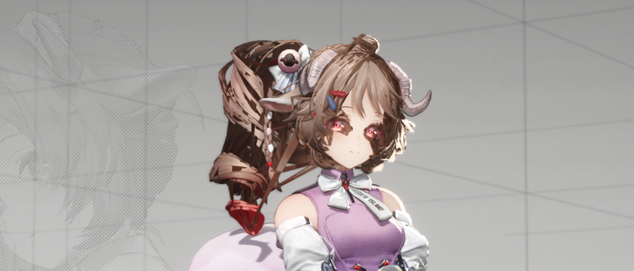
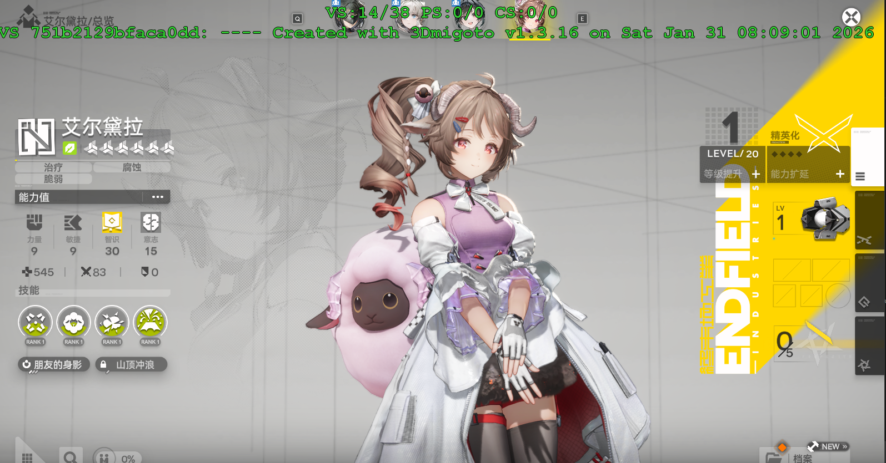

# 头发生成Mod后炸裂

头发生成Mod后，大概率会炸裂，如图：



此时我们可以把 751b2129bfaca0dd 这个Shader隐藏掉，像这样：

```ini
[ShaderOverride_751b2129bfaca0dd]
allow_duplicate_hash = overrule
hash = 751b2129bfaca0dd
if $costume_mods
  handling = skip
endif
```

然后游戏里就恢复正常了，就可以修改头发了：



导致这个问题的原因是头发的描边线Shader做了额外的处理，仅修改vb0,vb1,vb2和ib不足以覆盖这些处理，暂时去掉来解决就好。

