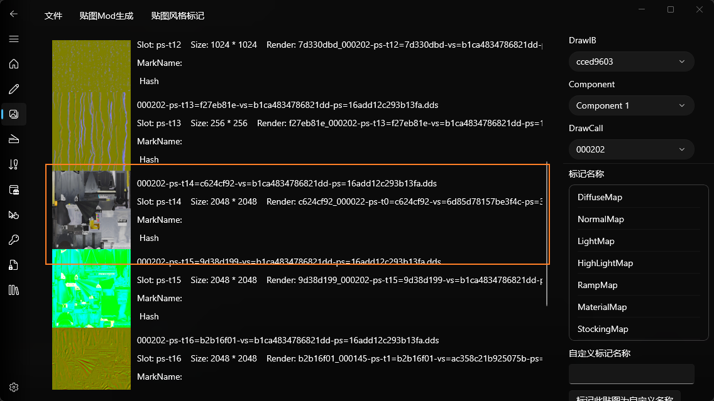
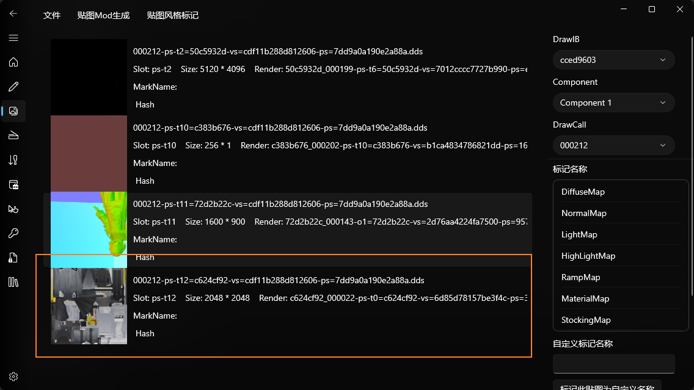
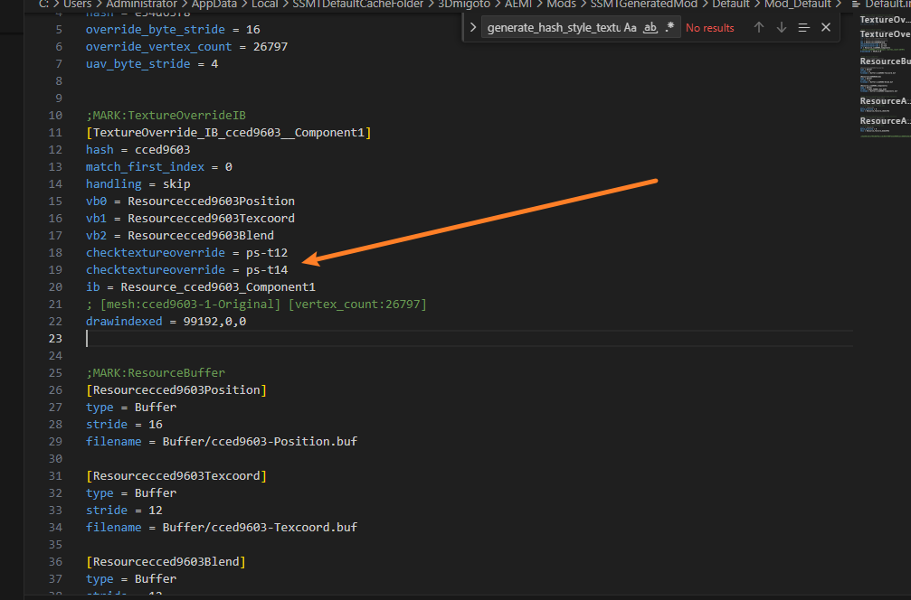
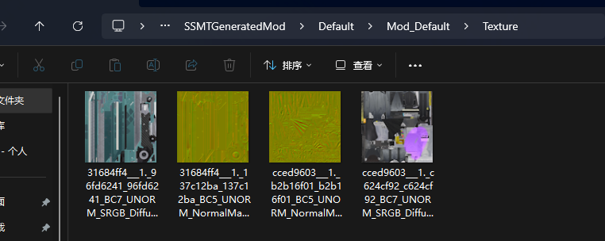
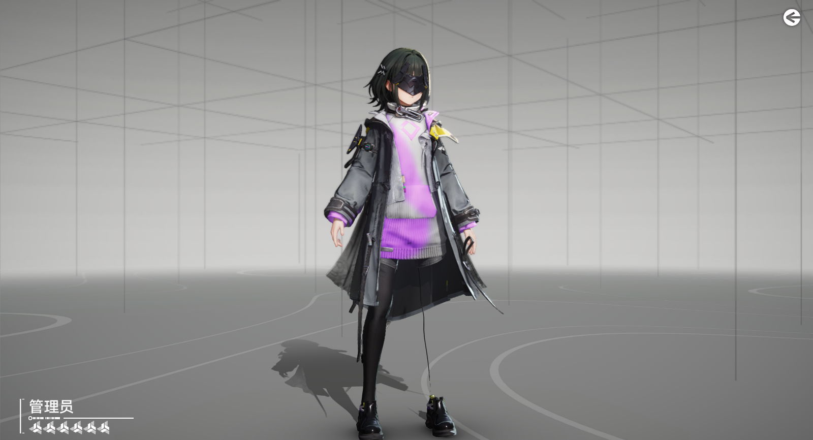

# Hash风格贴图无法生效问题

由于我们AEMI使用了手动Check架构

所以如果要让Hash风格贴图生效，需要在TextureOverrideIB下，将用到此贴图的槽位全部check一遍

同一张贴图在不同的DrawCall之间使用的槽位是不同的，如下图：

所以我们代码里要同时check ps-t12和ps-t14才能让这个DiffuseMap生效：

这里我们随便上个颜色：

成功生效了：

# 注意事项

- 终末地的法线贴图使用槽位风格可能会导致效果不正确的问题，因为法线在多个DrawCall之间出现了槽位变动，就像崩铁一样，所以需要使用Hash风格贴图

- 终末地所有贴图都推荐使用Hash风格贴图，因为会在槽位之间变动

- 不要使用槽位风格替换ps-t0和ps-t1，否则会导致游戏崩溃，因为这两个槽位的内容是Shader自动管理的，不能进行干预。

