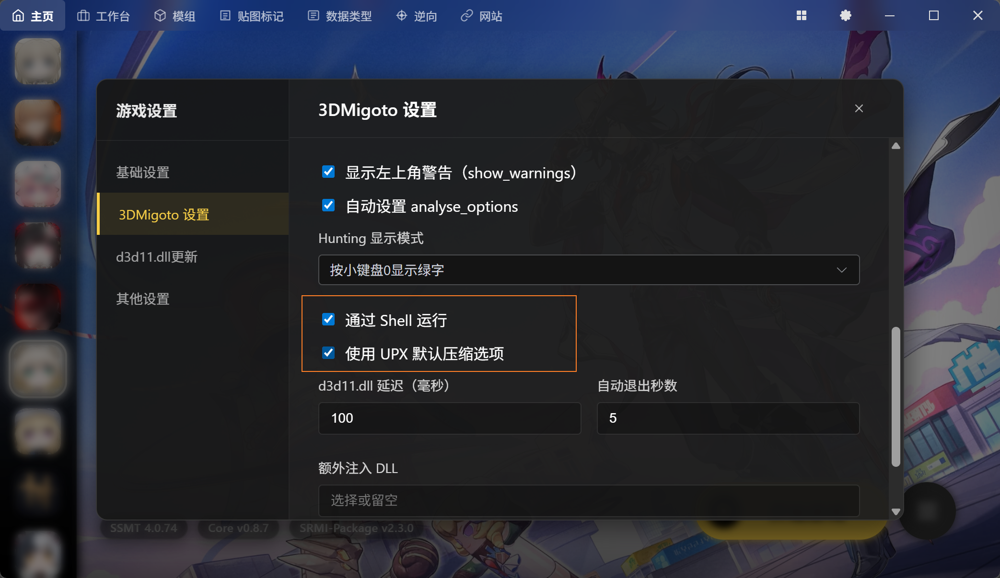

# SSMT4如何解决10612-4001等报错

## 游戏设置的3Dmigoto设置中勾选如下选项即可不报错

如仍然出现错误，可以取消勾选UPX加壳试试

## 原神最新10612-4001动态扫描连坐机制

目前原神是动态拉黑，即在某个人电脑上发现了作弊软件，例如飞天瞬移秒杀时停等等脚本。

如果此时检测到自身被注入了dll，不论是任何dll，都会触发扫盘 + 拉黑机制

会扫描当前用户所有可疑文件，挑选部分加入报错特征库

后续其它用户扫描到相同文件、相同文件夹结构后，也会导致无脑出现10612-4001报错

这里只是简单描述，实际上整个系统收集的信息远不止文件路径这一条

其本质上是一种对外挂、作弊软件的智能封杀，但是会导致误伤Mod，因为大部分时候这些开挂的玩家也会同时开着Mod

这个问题无法本质上解决，但是群友测试的方法是：

1.SSMT缓存文件夹移动到其它位置，不在同一个磁盘

2.SSMT缓存文件夹改名

3.SSMT缓存文件夹移动后，文件夹深度需发生变化，例如原本是`D:\\SSMTCacheFolder`，移动后：`C:\\Test\\ABCFoasd\\`

防止固定路径的扫描拉黑机制

## 如有其它发现

欢迎提交PR补充