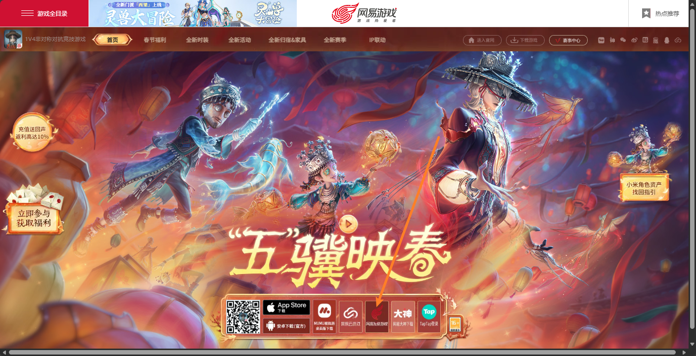
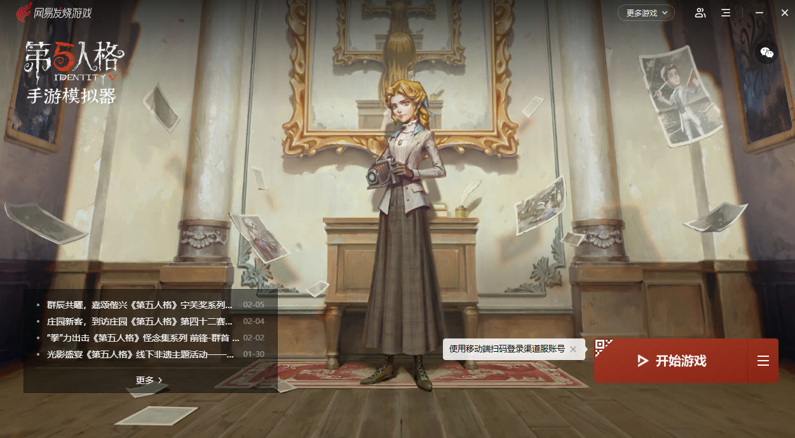
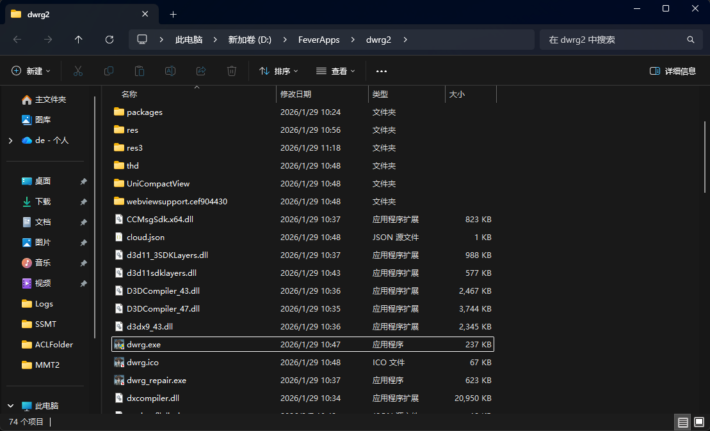
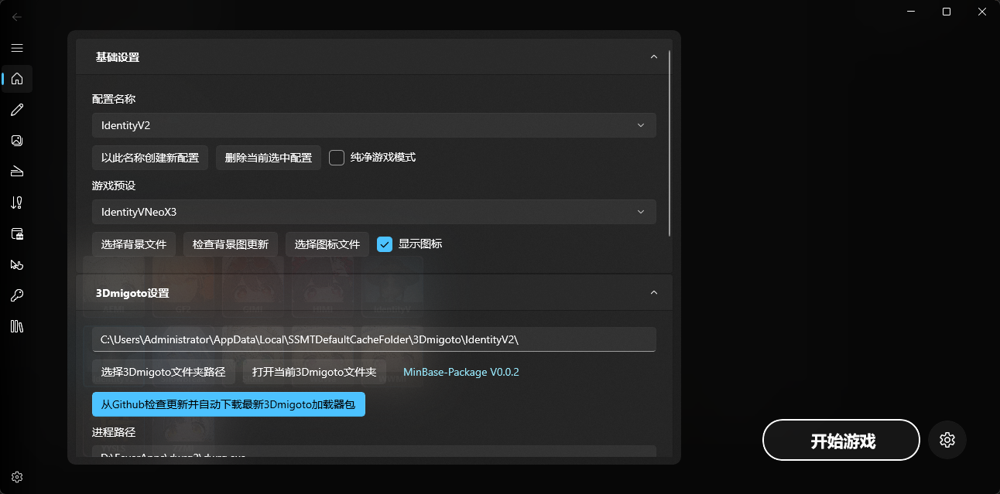
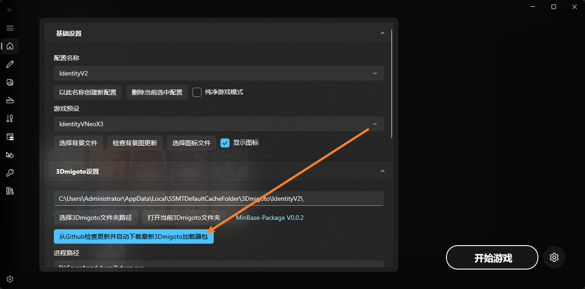
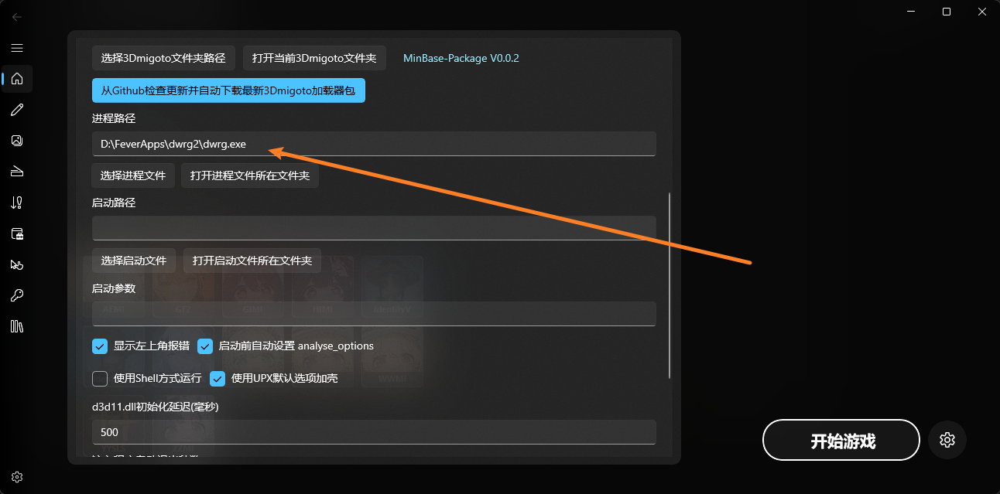
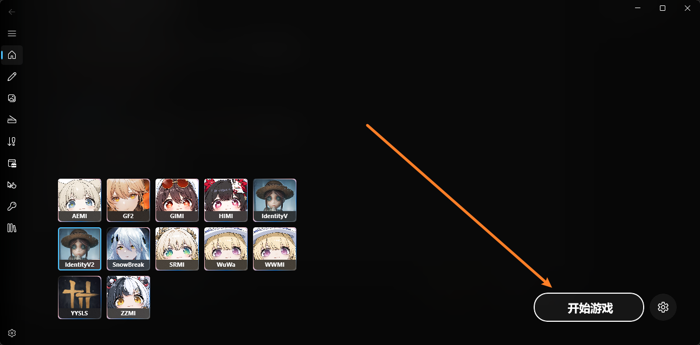
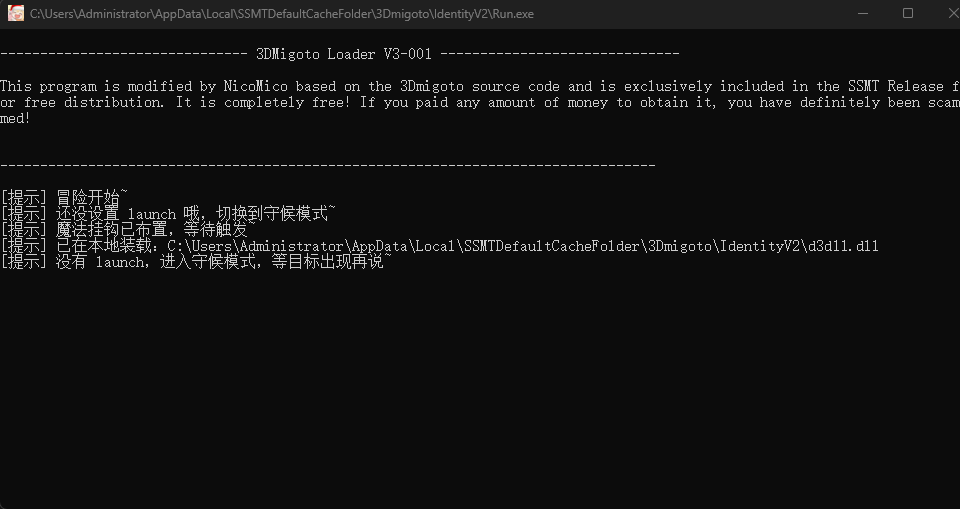
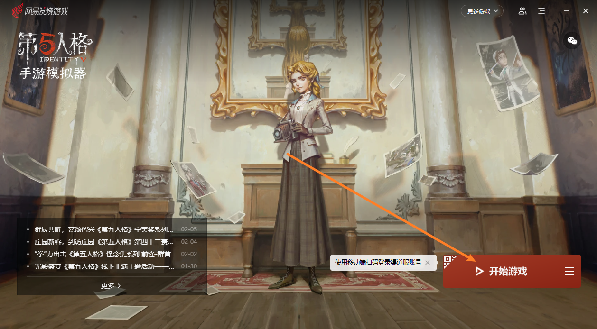
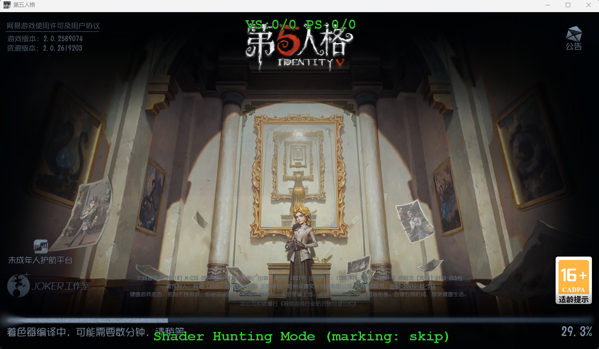

# 新版第五人格Mod制作基础

首先就是新版第五人格客户端更新到了NeoX3引擎，以及SSMT最近的更新需要同步一些常识。

开始之前确保你的SSMT和TheHerta3更新到最新版。

此文档更新日期：2026-2-7。

# (1)客户端下载

新版本需要在网易发烧平台下载：

下载之后长这样：

可以看到游戏的安装目录是这样：

这里的dwrg.exe就是我们的 进程路径 要填写的

# (2)SSMT配置

配置名称可以选自带的 `IdentityV2`

游戏预设选择 `IdentityVNeoX3`

3Dmigoto就用自带的这个按钮来下载：

进程路径就填写刚才的路径(改成你自己的 dwrg.exe 路径不要复制粘贴)：

`D:\FeverApps\dwrg2\dwrg.exe`

# (3)启动方法

引擎更新后，不能通过SSMT启动游戏了，所以`启动路径`要空着不能填写：

然后点击开始游戏，就会启动3Dmigoto：

然后从官方启动器启动游戏：

# (4)游戏内效果

成功注入的话，游戏内按小键盘0键就会开启绿字Hunting界面

然后剩下的步骤就是标准的SSMT操作流程了。

# (5) 开发反馈

工具仍在不断改进中，有问题可以找我反馈。

