# 🐛 版本更新后贴图炸了如何修复？

如图所示，这个 Mod 在游戏版本更新后，贴图出现了严重的错乱（炸了）：

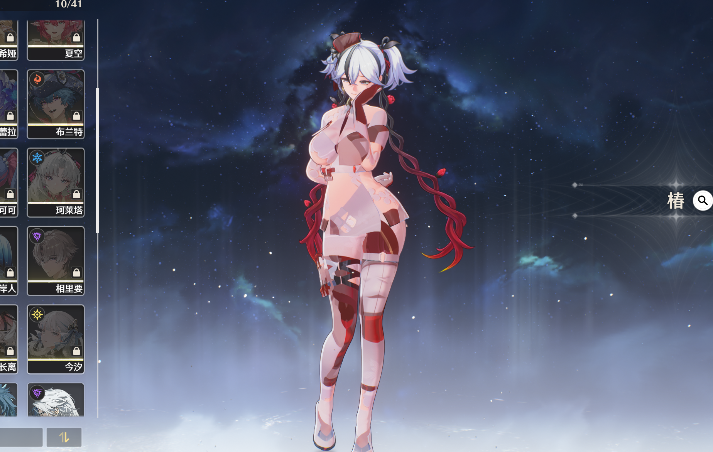

::: warning 💥 问题根源
本质上是由于 **游戏版本更新** 后，官方模型的贴图内容发生了变更，导致其 **Hash 值** 也随之改变。
:::

💡 **解决方案**：我们需要找到新的 Hash 值，并更新到 Mod 的配置文件中。

## 🛠️ 修复步骤

### 1. 寻找正确的 IB 值

首先，按 <kbd>F6</kbd> 关闭 Mod，然后按小键盘 <kbd>0</kbd> 键打开 **Hunting 界面**（绿字界面）。

接着按 <kbd>F8</kbd> 进行 Dump。Dump 完成后，使用小键盘 <kbd>7</kbd> 和 <kbd>8</kbd> 寻找导致这个角色消失的 IB 值。

::: danger ⚠️ 注意
一定 **不是** `8d45cfee` 这个 Hash 值！
:::

通常有两个 IB 会导致角色消失，我们需要选择 **另一个**。找到后，按小键盘 <kbd>9</kbd> 复制该 IB 值。

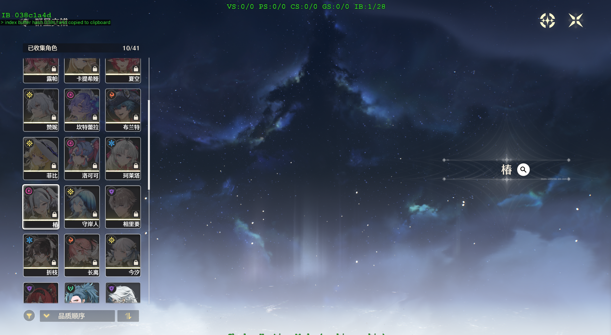

### 2. 提取 DedupedTextures

打开 **SSMT 工作台**，将刚才复制的 IB 值填写在下图所示位置：

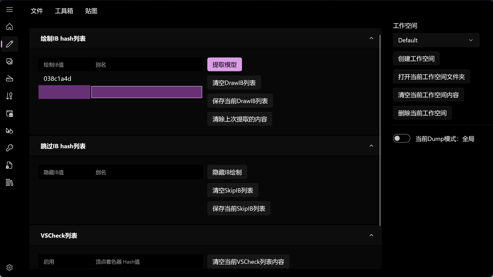

点击顶部菜单栏的 **`贴图`**，然后点击下方的 **`提取 DedupedTextures`** 按钮：

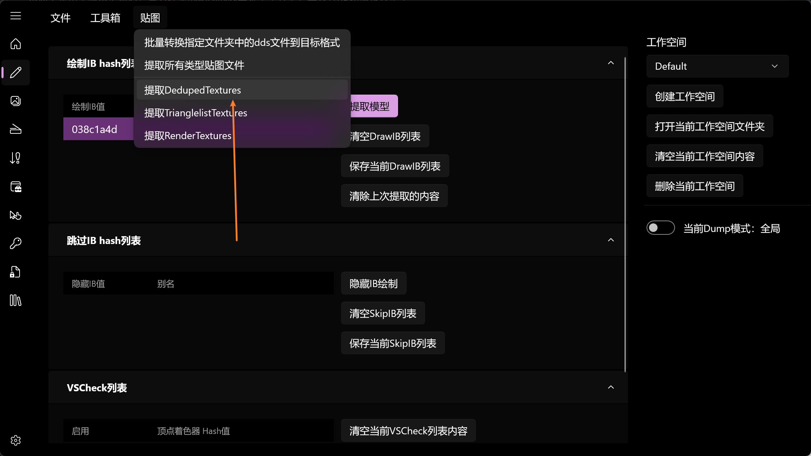

执行完毕后，会自动弹出当前工作空间文件夹：

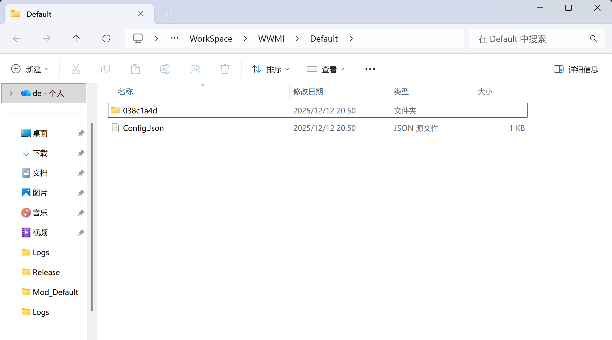

双击进入以我们填写的 **IB 值** 命名的文件夹：

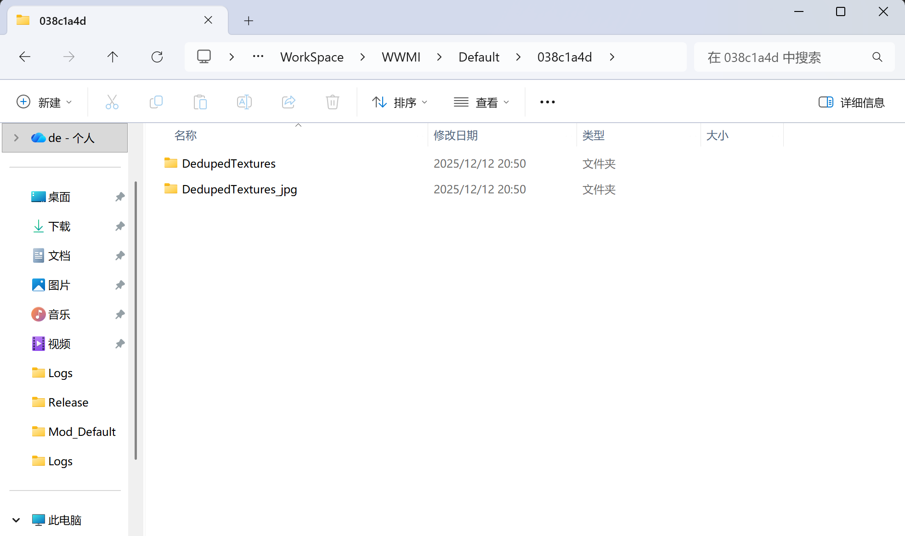

进入 `DedupedTextures` 文件夹：

这里面包含了当前 IB（也就是这个角色）用到的所有贴图文件：

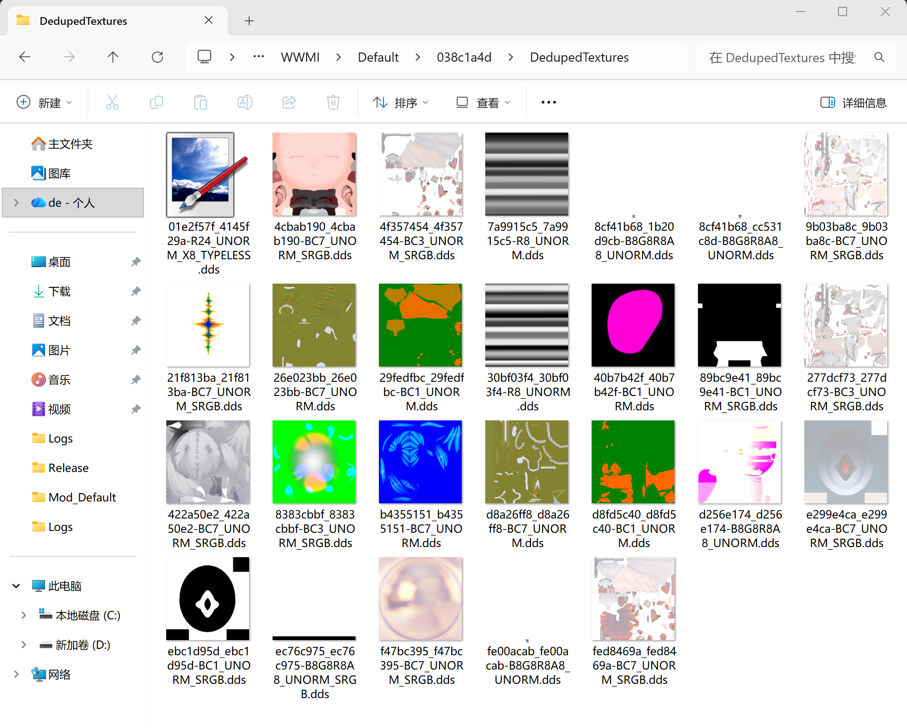

::: info 📝 贴图命名规则
`贴图本身的Hash值` **_** `贴图渲染时用到的Hash值` **_** `贴图格式`.dds
:::

我们只需要关注 贴图本身的 Hash 值 即可。

### 3. 对比并替换 Hash 值

此时，打开 Mod 的贴图文件夹：

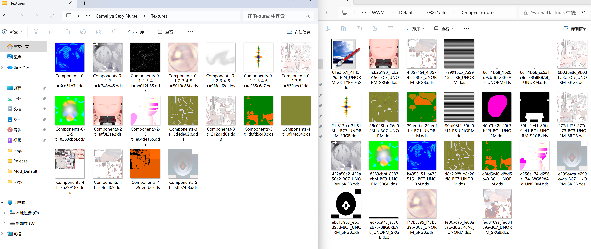

👀 **对比观察**：
左侧是 Mod 的贴图文件夹，右侧是我们刚刚提取出来的贴图文件。如果你熟悉这个 Mod，大概能看出左侧的贴图对应右侧的哪个文件。

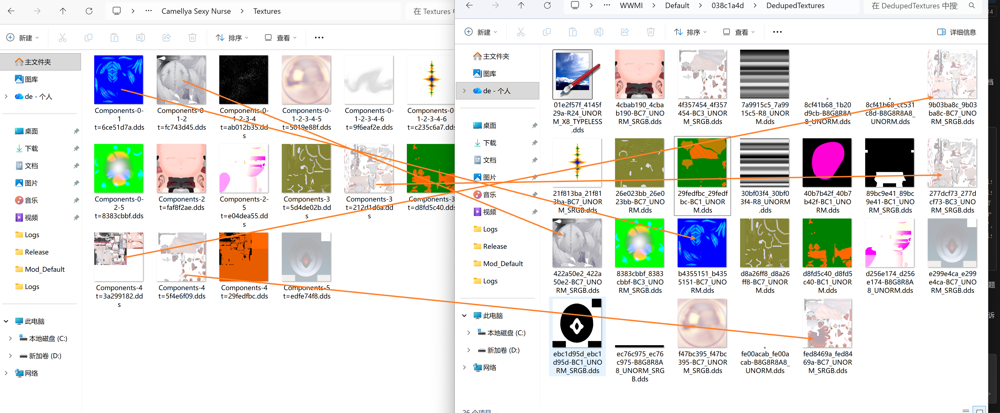

我们需要找到 **主要破损** 的贴图文件（例如身体部位的贴图）：

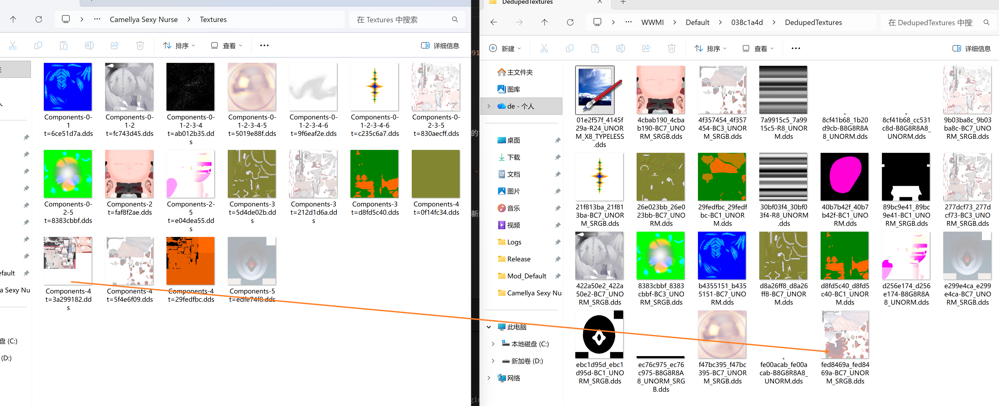

通过对比，我们找到了它对应的新 Hash 值是 fed8469a。

接下来，复制 Mod 中该贴图文件的文件名，例如：`Components-4 t=3a299182.dds`。

打开 Mod 的 `.ini` 配置文件，搜索这个文件名，找到其 `Resource` 声明：

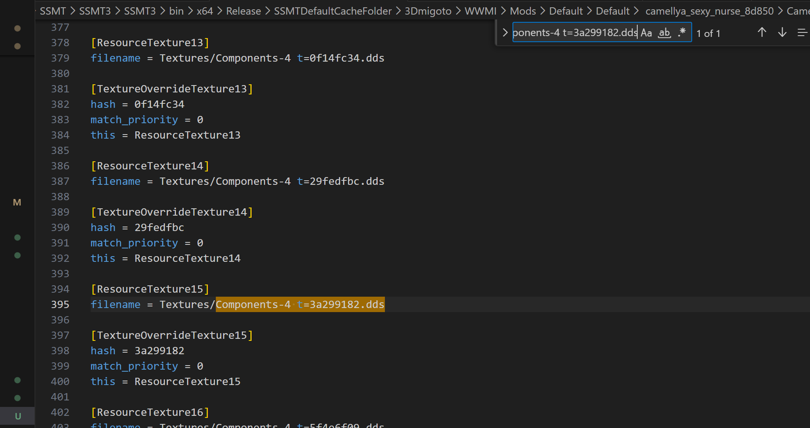

可以看到它的 Resource 声明为 `ResourceTexture15`。

现在，在 `.ini` 文件中搜索 `ResourceTexture15`，找到它对应的 `TextureOverride` 部分（通常就在附近）：

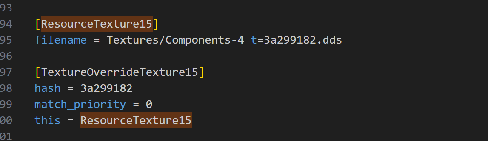

✏️ **修改 Hash 值**：
将这里的旧 Hash 值修改为我们在 `DedupedTextures` 文件夹中看到的新 Hash 值 fed8469a。

### 4. 验证修复结果

回到游戏中，按 <kbd>F10</kbd> 刷新 Mod：

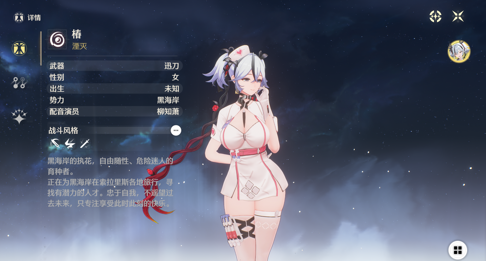

🎉 **大功告成！** 贴图已经成功修复。通常只有一两张贴图的 Hash 值会发生变化，所以修复过程非常快。

---

# 🚀 避免重复造轮子

🧠 **聪明的你一定发现了**：
既然修复过程只是替换 Hash 值，那么完全可以编写一个 Python 脚本来自动完成这个工作！

✅ **最佳实践**：
1.  **寻找现成脚本**：去 Mod 社区寻找是否有大佬发布了针对该角色的修复脚本。
2.  **一键修复**：下载并运行脚本，瞬间完成修复。
3.  **手动修复**：如果实在找不到脚本，再按照上述教程手动修复。

::: tip 💡 提示
本教程演示使用的是 **SSMT** 工具。如果你使用的是 **WWMI-Tools**，流程大同小异：
提取模型 -> 在模型的贴图文件夹里找贴图 -> 文件名结尾的 Hash 值即为新 Hash -> 替换 ini 中的值。
本质操作是一样的！
:::

