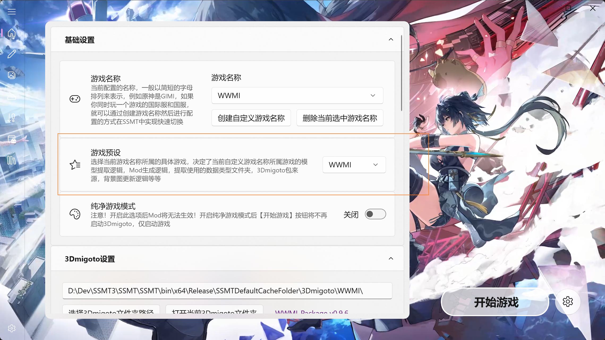
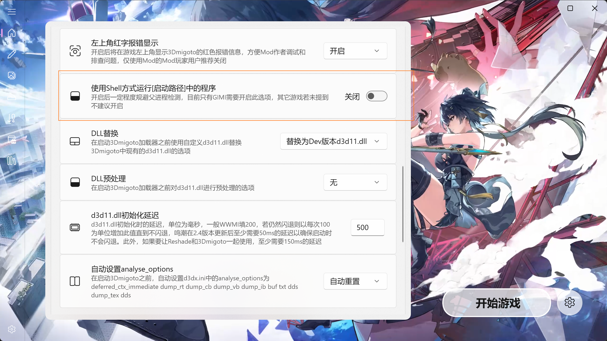

# ⚙️ 鸣潮如何正确配置实现一键启动

在 SSMT 主页配置中，游戏预设请选择 `WWMI`。



然后配置中**千万不要开启** `使用Shell启动`，如果你的`SSMT`没有此选项，请首先将`SSMT`更新至`V3.2.5`版本或以上：



## 📝 配置详情

### 1. 进程路径 

**示例：**
```text
C:\Program Files\Wuthering Waves\Wuthering Waves Game\Client\Binaries\Win64\Client-Win64-Shipping.exe
```

> ⚠️ **注意**
>
> *   这里的进程路径必须是你 **自己电脑上** 鸣潮安装目录下的 `Wuthering Waves Game\Client\Binaries\Win64\` 下面的 `Client-Win64-Shipping.exe`。
> *   必须填写 **完整路径**。
> *   如果偷懒只填写 `Client-Win64-Shipping.exe` 或者填错路径，会导致游戏 **白屏** 或 **透明**。

### 2. 启动路径 

**示例：**
```text
C:\Program Files\Wuthering Waves\Wuthering Waves Game\Wuthering Waves.exe
```

### 3. 启动参数 

```text
-dx11
```

> 💡 **小知识**
>
> 这里的启动参数 `-dx11` 为 **必填项**，否则无法正常加载 Mod。


