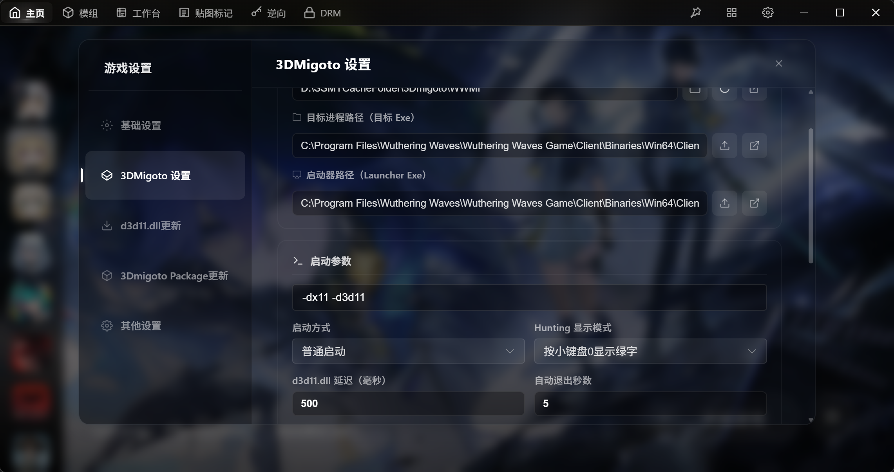
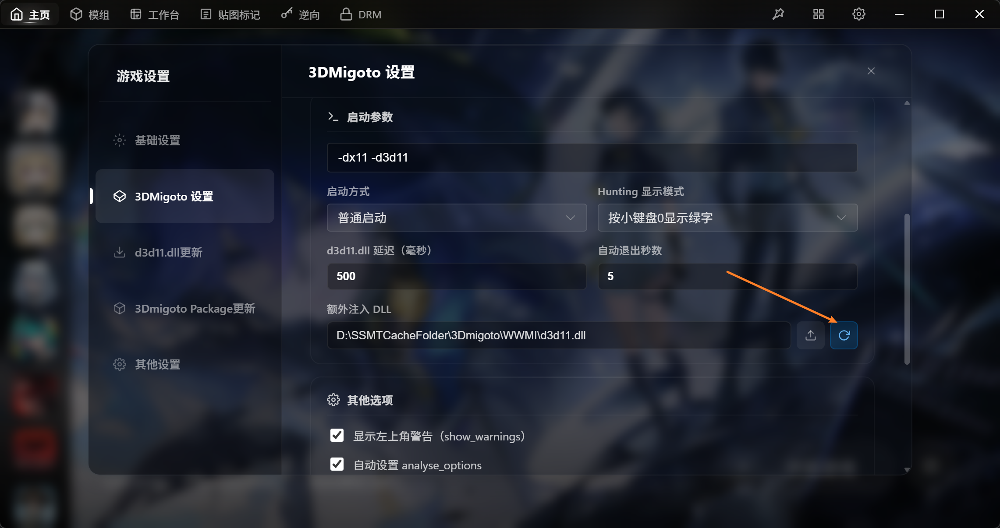
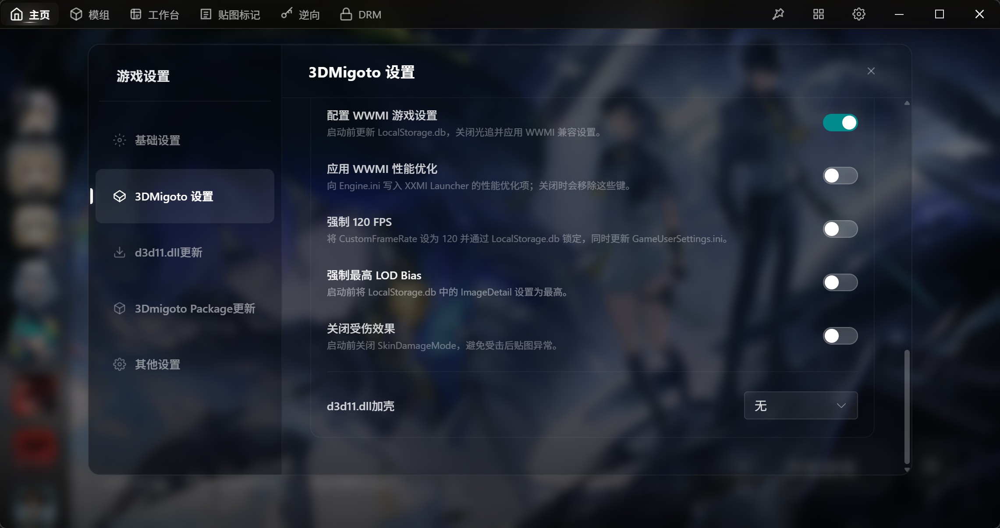

# ⚙️ 鸣潮如何正确配置实现一键启动

游戏预设选择 `WWMI`

目标进程路径 `C:\Program Files\Wuthering Waves\Wuthering Waves Game\Client\Binaries\Win64\Client-Win64-Shipping.exe`
(换成你自己的Client-Win64-Shipping.exe)

启动器路径 `C:\Program Files\Wuthering Waves\Wuthering Waves Game\Client\Binaries\Win64\Client-Win64-Shipping.exe`
(换成你自己的Client-Win64-Shipping.exe)

启动参数 `-dx11 -d3d11`

启动方式 `普通启动`

d3d11.dll延迟 `500` (500-2000左右，最低150，你的CPU越好就把这个数值调的越高)

额外注入dll `如图，点击刷新按钮自动设为当前3Dmigoto目录下的d3d11.dll`

目前已完美支持鸣潮Mod加载、鸣潮Mod制作、鸣潮Mod逆向全流程、以及各项XXMI Launcher的鸣潮附加功能（鸣潮全家桶）

此外，目前SSMT4 + TheHerta4可完美制作鸣潮Mod，遇到问题记得给我留言。