# 如何配置燕云十六声

这游戏玩的人比较少，所以目前只支持了30%左右，遇到问题记得反馈给我，我有空会去测试。

##  添加游戏到主页 
首先切换到游戏库页面，点击YYSLS的图标

YYSLS就是燕云十六声的拼音首字母简写大写

点击后会切换到该游戏，随后右键添加到收藏

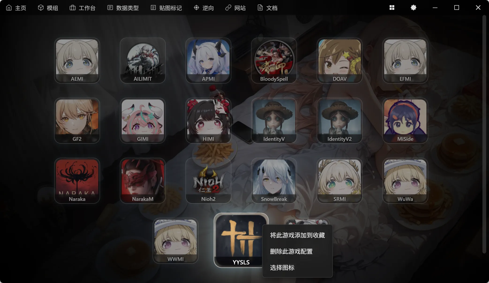

就会将此游戏添加到主页左侧常用列表，并跳转回主页：

## 顺手设置个背景图（仪式感）

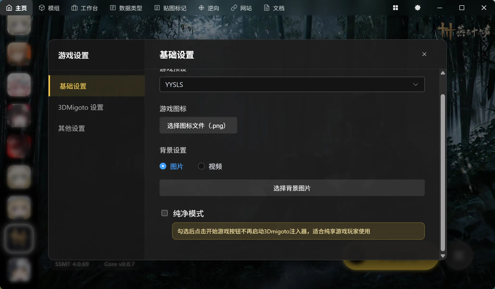

## 检查包更新

目前SSMT对YYSLS的支持，仍然处于内测阶段，所以使用的是MinBase-Package以及手动Check

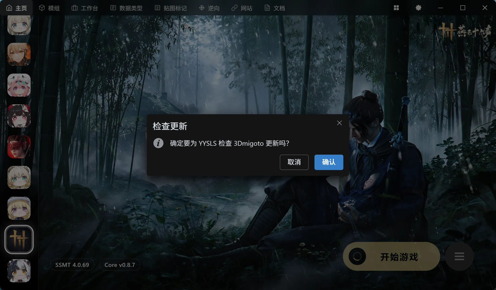

## 路径设置注意事项

YYSLS的路径填写和其他游戏不一样，需要特别注意

首先我们去启动器的设置那里，找到游戏安装目录：

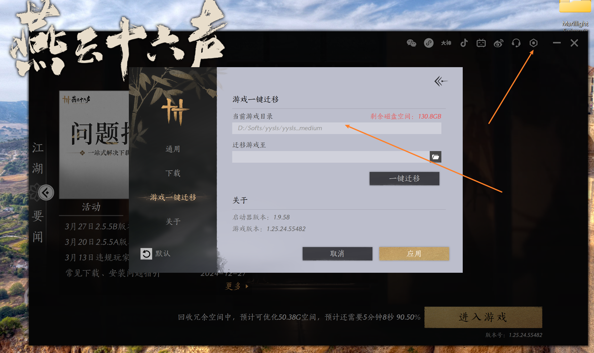

进入其Engine目录：

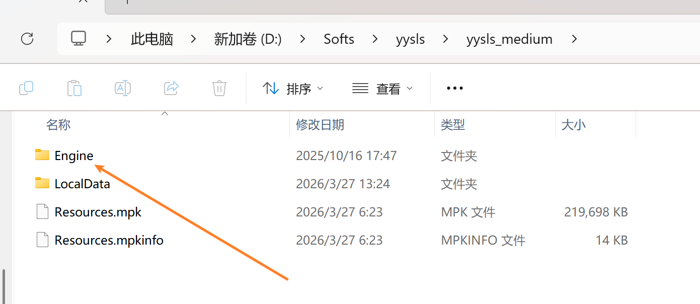

再进入Binaries目录：

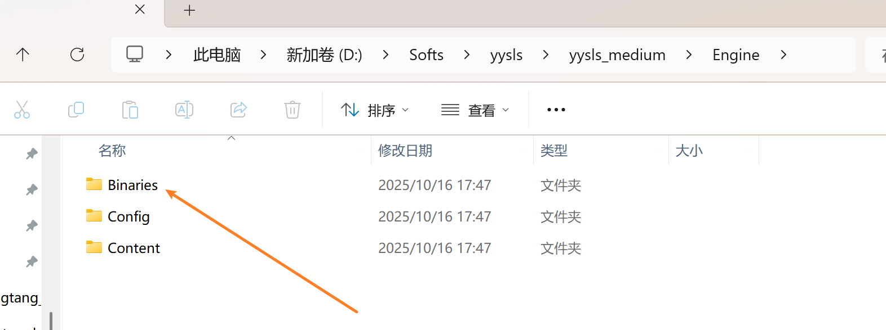

你会发现有Win64r和Win64rh两个文件夹：

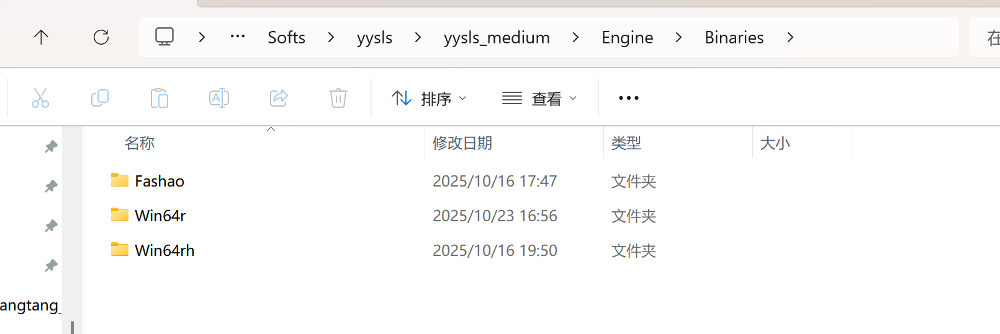

这俩文件夹下面，各有一个yysls.exe:

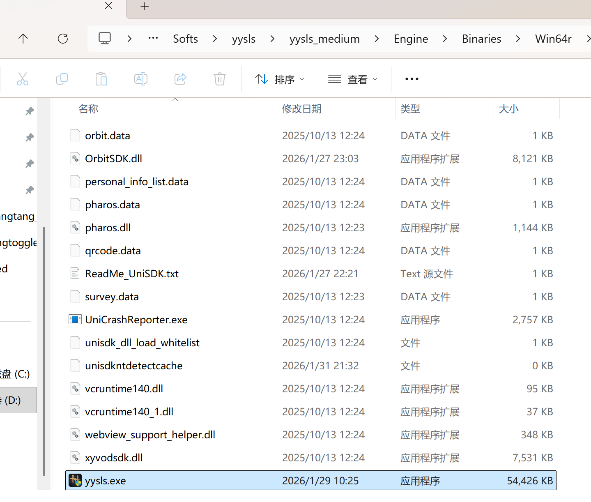

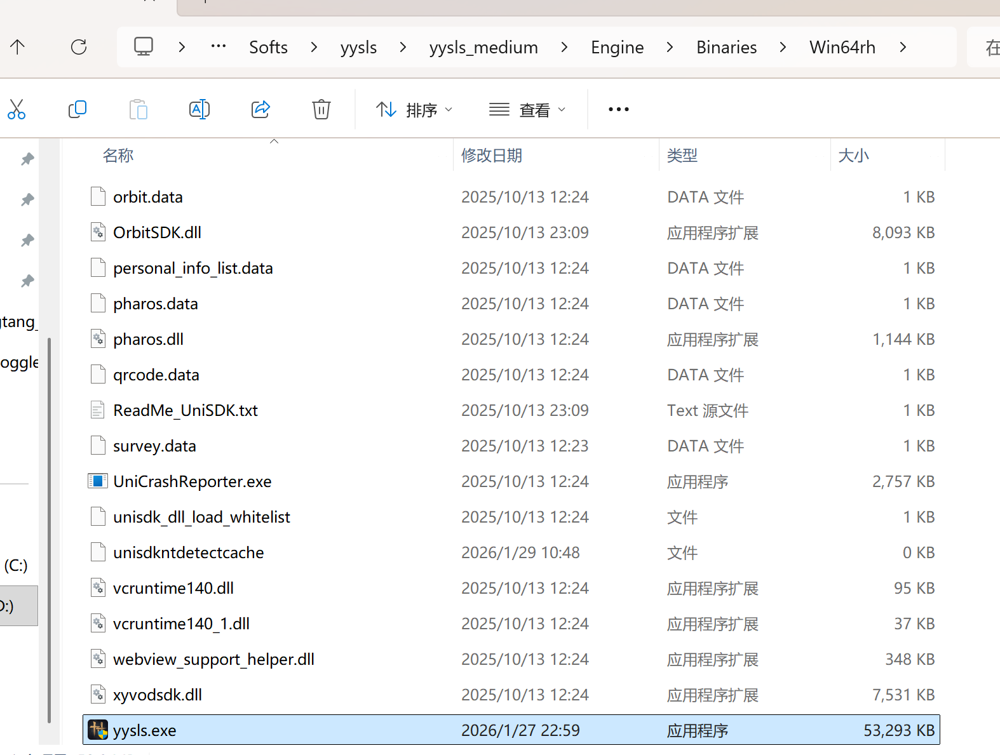

燕云最奇葩的点就是启动游戏时，它会随机启动其中一个，所以我们的进程路径有时候需要改变

这里我们进程填写为`Win64rh`的yysls.exe的路径：

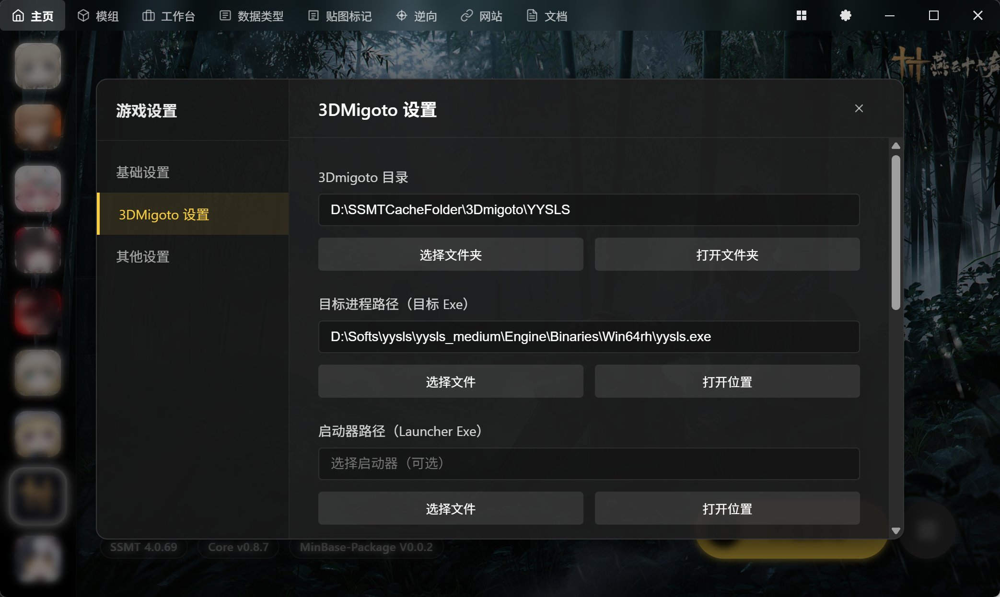

如果注入不了3Dmigoto，就换成`Win64r`的再试一次

启动路径空着不写，我们点击开始游戏后，启动了Run.exe后，直接去官方启动器那里启动游戏：

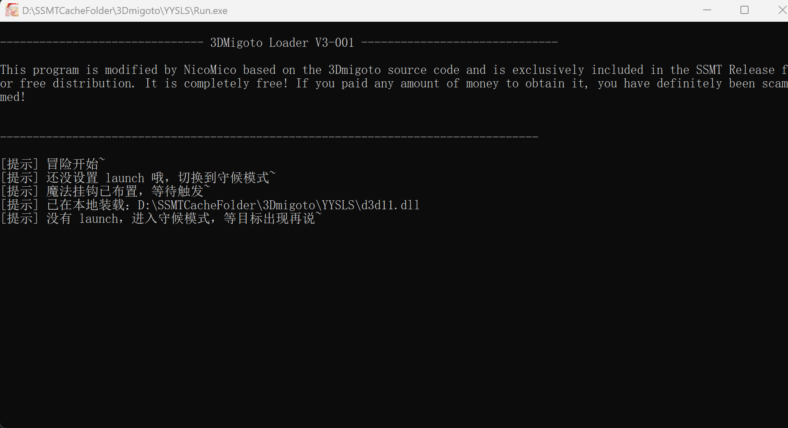

并且这里一定要展开设置来勾选DX11启动，否则一定是无法使用3Dmigoto的：

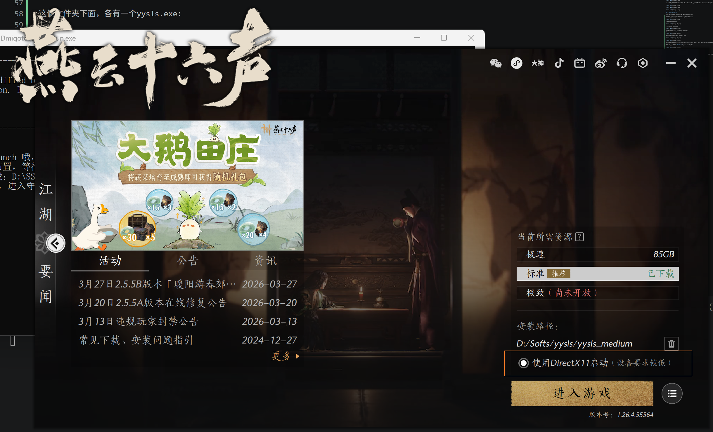

然后进入游戏，成功打开绿字就成功了，否则按上面说的，换路径再试一次

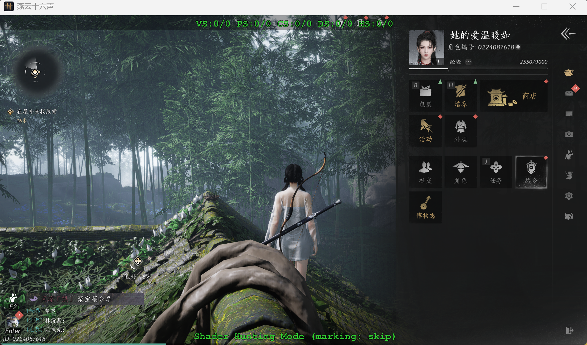

