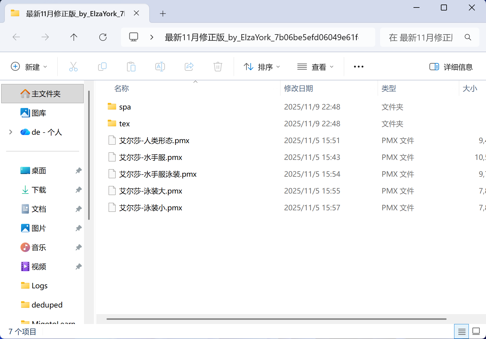
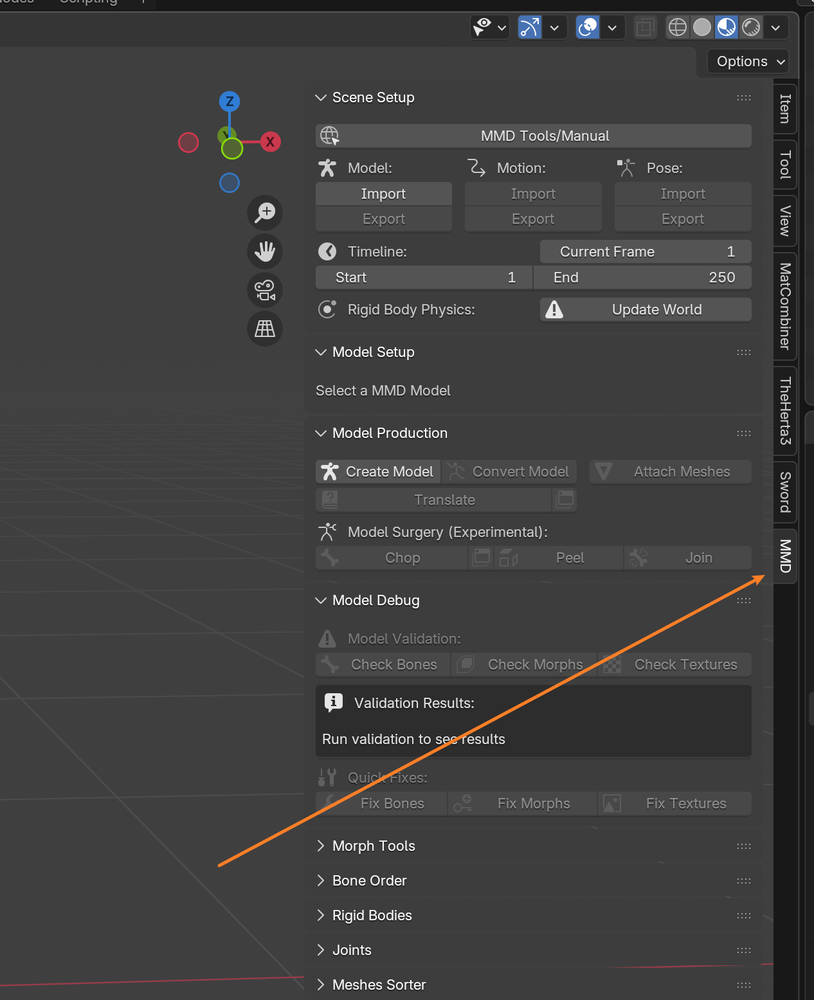
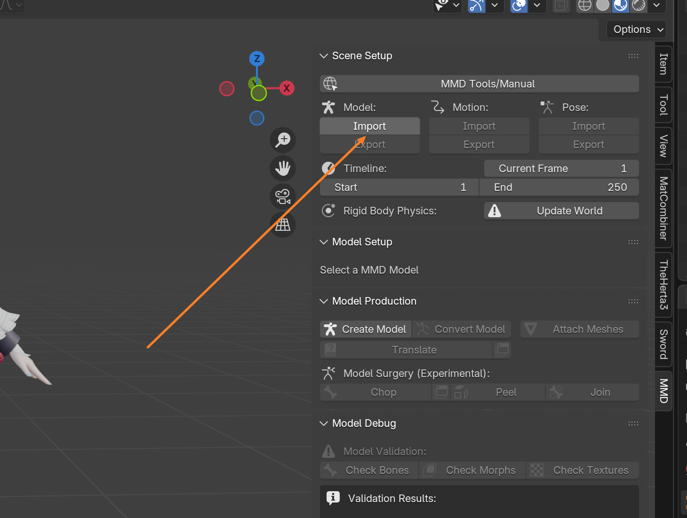
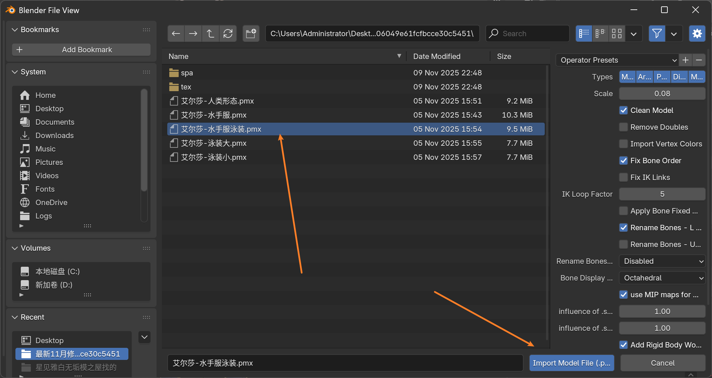
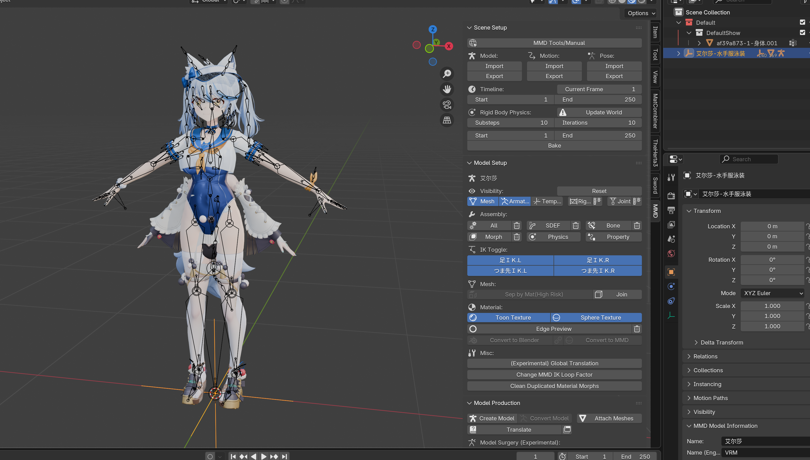

# 💃 将MMD模型转为Mod流程 - 准备篇

因为 新手 做 Mod 时，大部分都不会自己建模，所以这里用获取最方便的 MMD模型 来举例。

::: tip 💡 哪里找模型？
可以在 **模之屋** 找个模型跟练：[https://www.aplaybox.com/](https://www.aplaybox.com/)
:::

我们在实际制作的过程中，用什么模型都是可以的，所以制作 Mod 的前提是你熟练掌握 Blender 的模型处理技巧。

::: info ⏳ 时间分配
在大多数情况下，SSMT 与 TheHerta 在整个 Mod 制作过程中，只能占用你 **1%** 不到的时间。
在你熟练使用 SSMT 流程之后，**99%** 的时间都会花在 Blender 中。
:::

## 📦 准备好模型

模型下载完成之后打开里面一般会有 `.pmx` 格式的模型：

## 🧩 确保已安装MMD插件

目前我使用的是 Blender 4.5LTS 版本，已经安装了 MMD插件：

::: warning ⚠️ 注意
在开始下一步之前，确保你安装好了 MMD插件。
:::

## 📥 导入MMD模型

点击这个导入按钮，来导入 MMD模型。

选中模型后，点击 **导入**。

可以看到导入成功了！🎉

