# 💃 将MMD模型转为Mod流程 - 基础调整篇

## 🗑️ 移除joints和rigidbodies

导入后可以看到 MMD模型 有俩我们制作 Mod 用不到的东西。

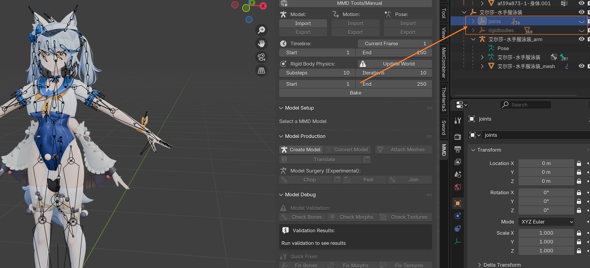

右键把它们 Delete Hierarchy (删除层级)。

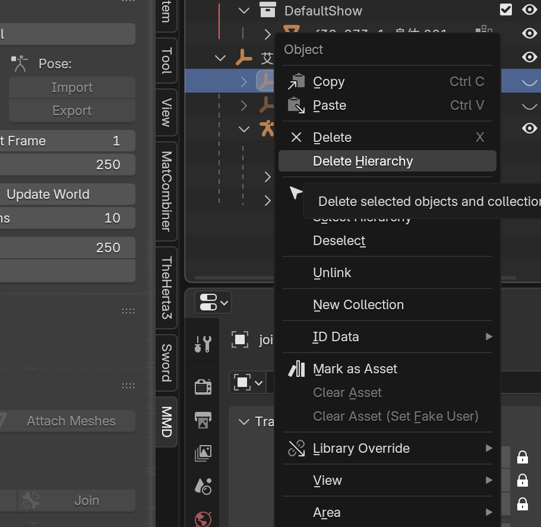

删除后如下，清爽多了：

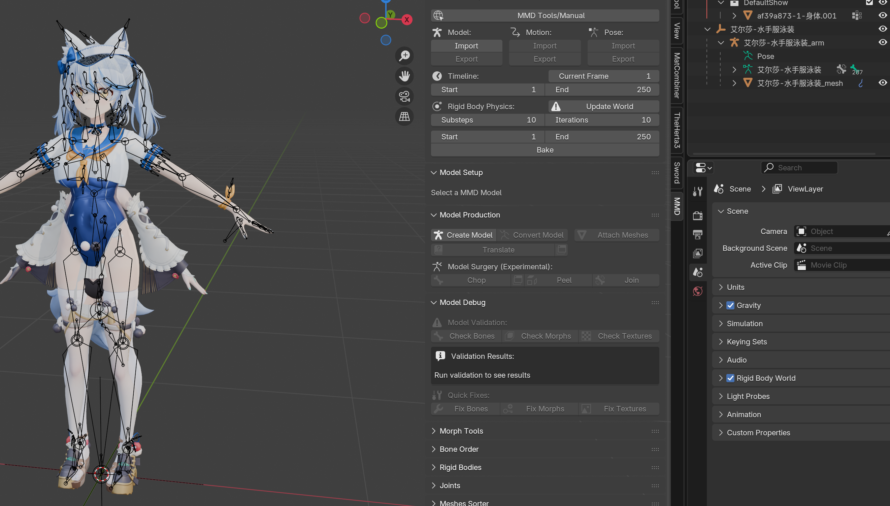

## 📏 调整整体大小

MMD模型 得选中这个坐标系图标一样的 **最外层的东西**，然后切换到 Scale (缩放) 模式，调整大小。

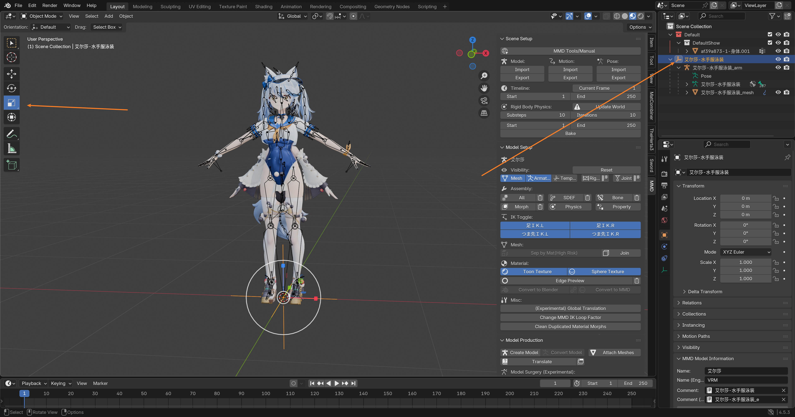

调整到和游戏 原模型 差不多大小就行了，确保 **肩膀** 的位置大概对上。

::: tip 🧠 灵活变通
这一步注意要 **随机应变**，因为不是所有的游戏模型都是标准的 MMD体型。
:::

随后点击 `Object` => `Apply` => `All Transforms`。

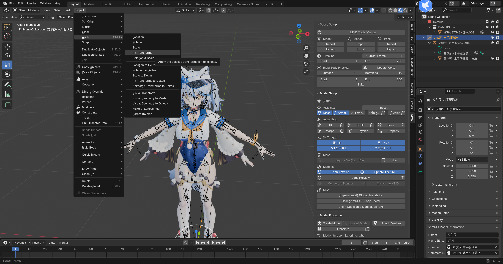

应用完成后，删除这个坐标系。

此时只剩下 **骨架** 和 **模型** 了：

## 🧘 姿态对齐

选中 **骨架**，进入 **姿态模式**，进入 **旋转模式**。

旋转右边的胳膊到和游戏 原模型 差不多的角度：

旋转完成后，右键选择 MMD Flip Pose。

这样左边的胳膊也就跟着对齐了，是不是很神奇？✨

如此这般，进行一系列 **缩放** 和 **旋转** 操作，直到 MMD模型 和 原模型 基本对齐。

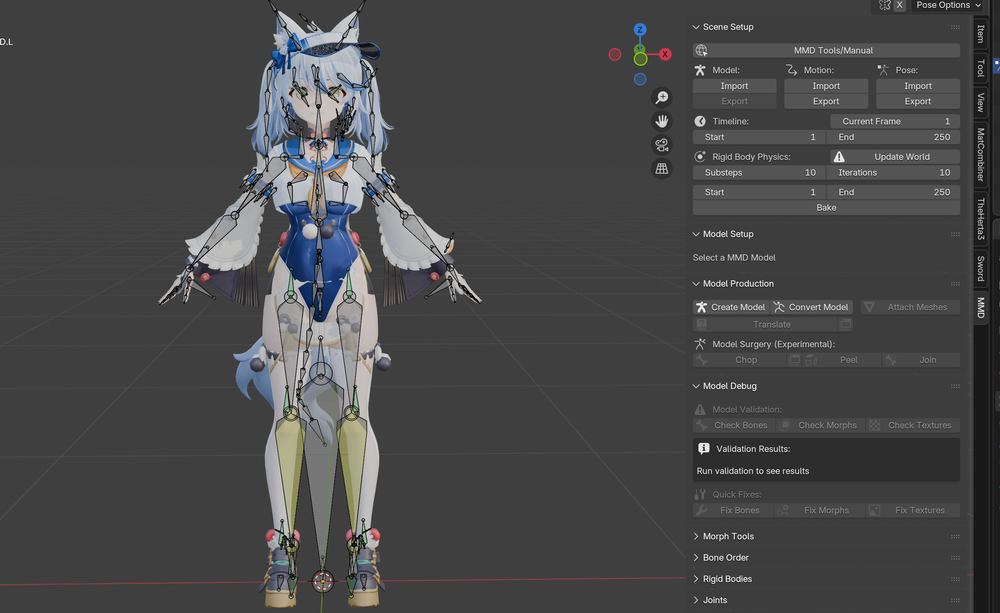

接下来切换到 **物体模式**，`Object` => `Apply` => `All Transforms`。

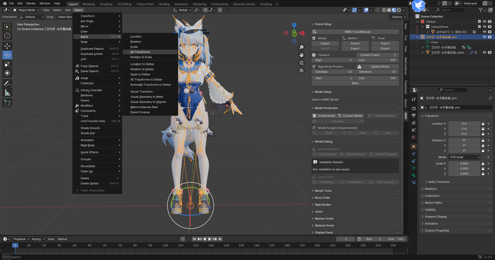

应用后，右侧属性变为基础状态：

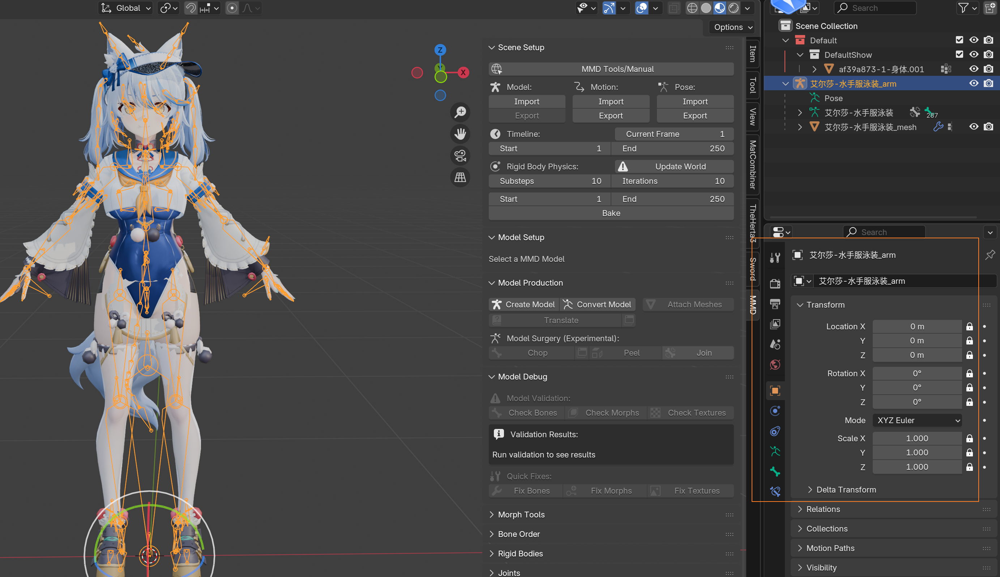

选中 MMD的模型，打开右侧 **数据面板**：

删除最下面两个锁定的 **顶点组**，一般名为 `mmd_edge_scale` 和 `mmd_vertex_color`。

然后应用所有的 **形态键**。

切换到 **修改器**，然后把它应用掉：

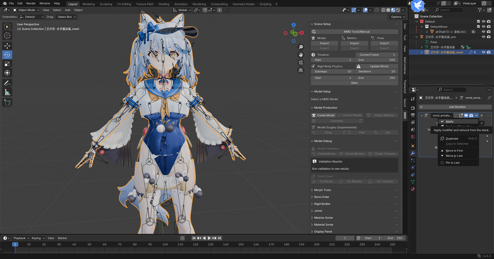

随后删除 **骨架**，仅保留 MMD模型：

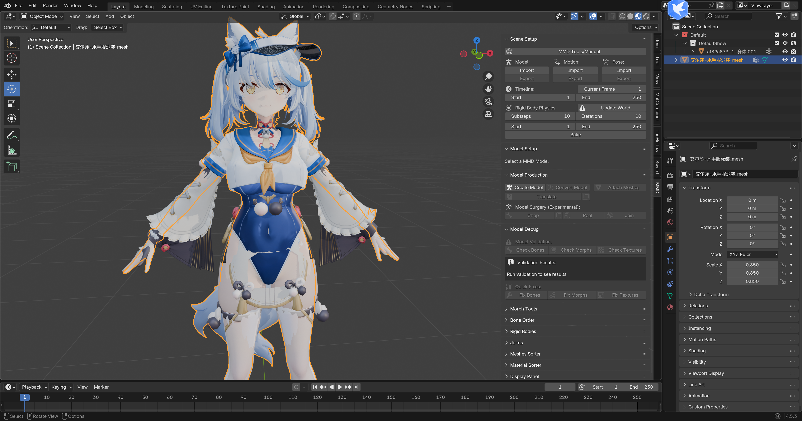

::: danger 🛑 关键步骤
这里我们 **必须** 再次 `Object` => `Apply` => `All Transforms`。
:::

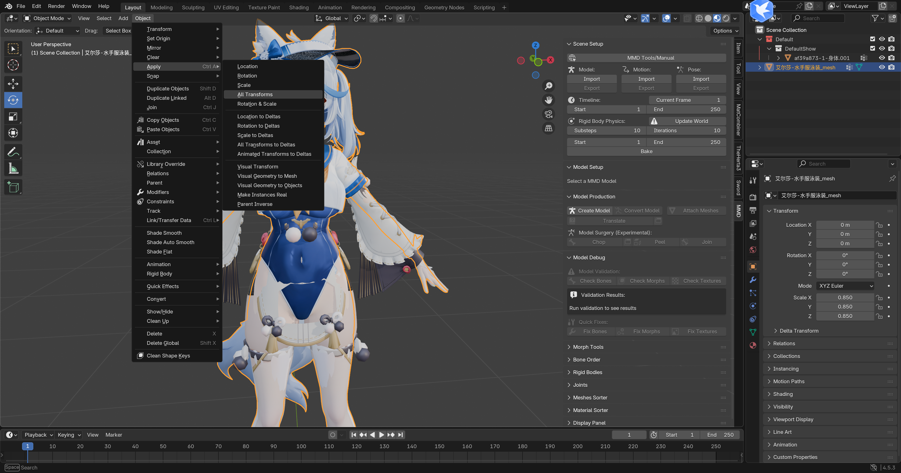

使得右侧属性面板恢复默认：

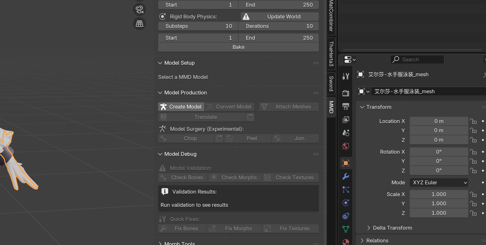

接下来保存一下 `.blend` 文件，并将这个 MMD模型 复制一份放到一个集合里作为 **备份**。

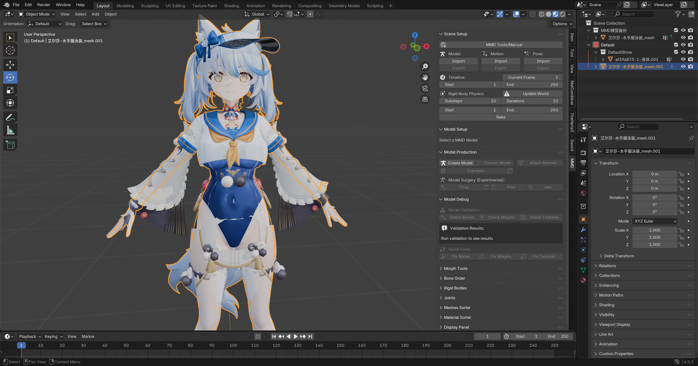

准备好就开始后面的步骤吧！🚀
