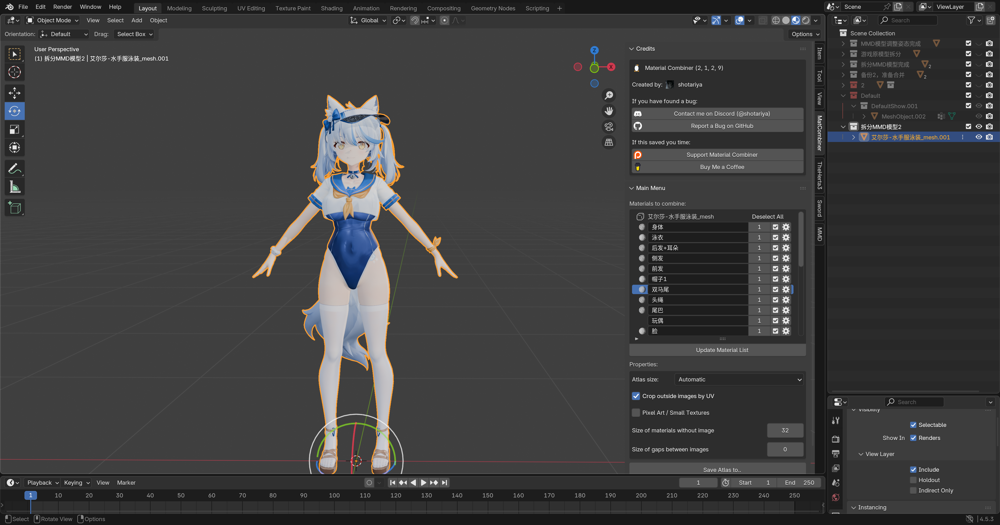
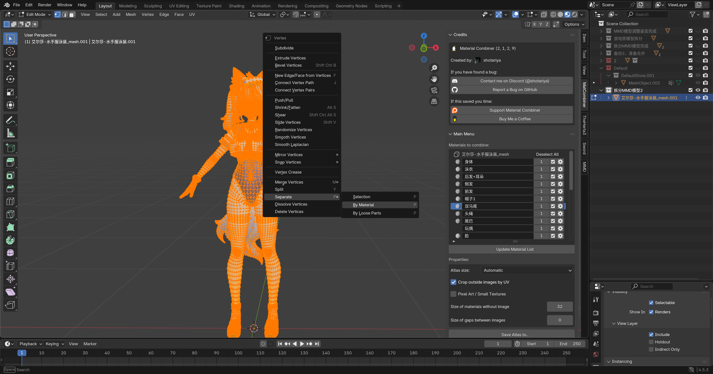
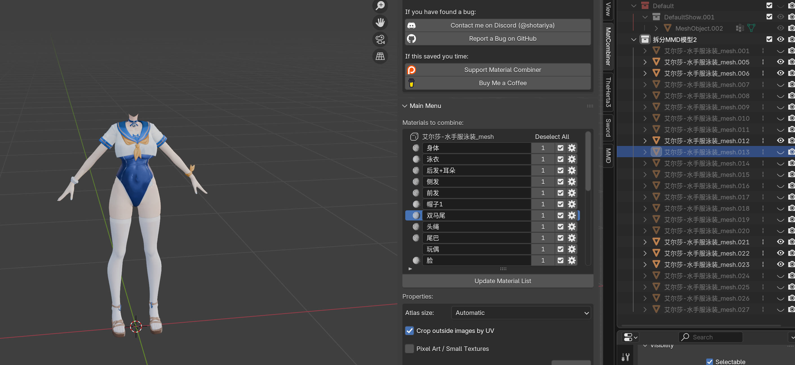
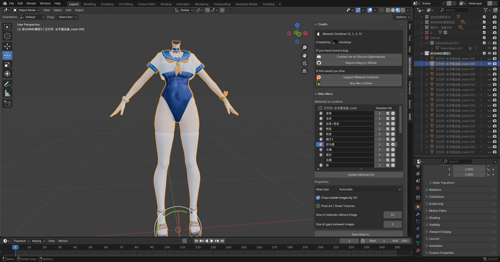

# 拆分MMD模型

上一步调整姿态完成后，这一步要进行模型的拆分了

因为我们现在制作Mod只用到了身体部分，所以我们需要把身体部分和头的部分拆分开来

选中模型，进入编辑模式，按A全选所有顶点，右键根据材质拆分：

然后把不需要的部分隐藏，这样就得到了我们需要的部分的模型：

随便选中其中一个，然后全选这些模型，然后Ctrl + J 合并到随便选中的那个上面：

拆分完成得到我们所需的身体模型后，进行下一步

