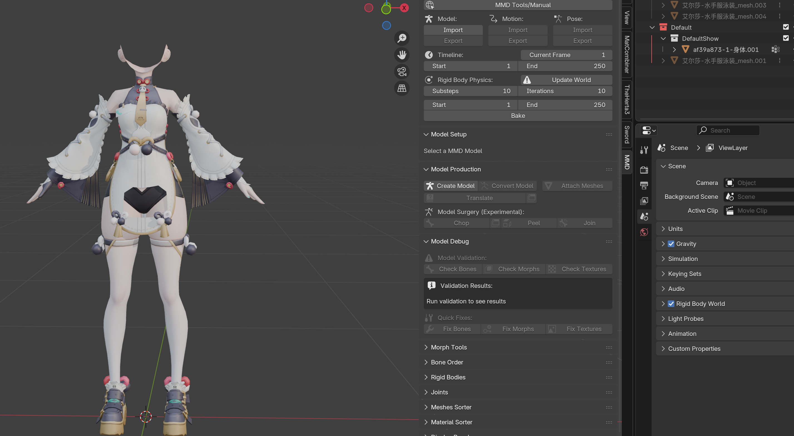
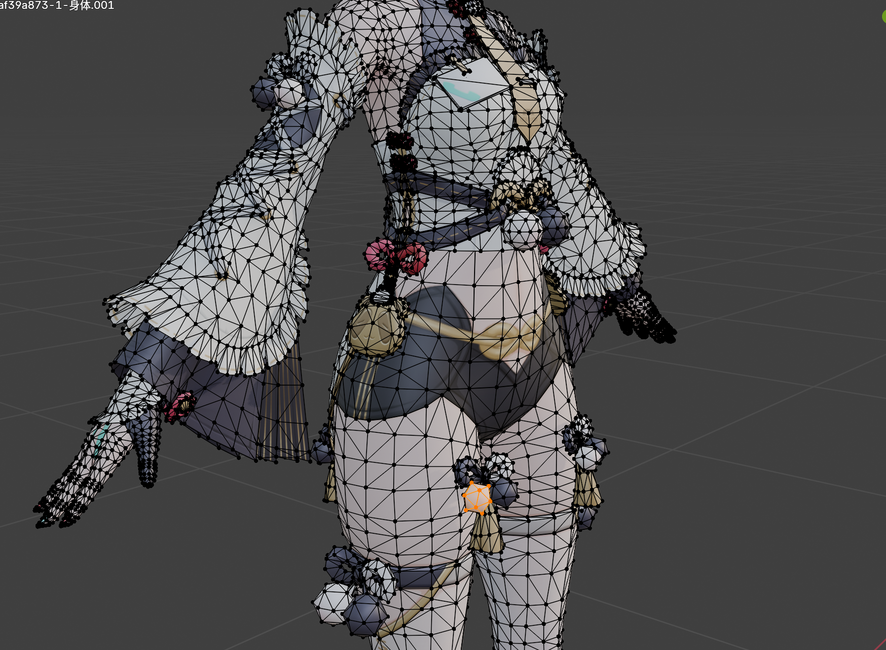
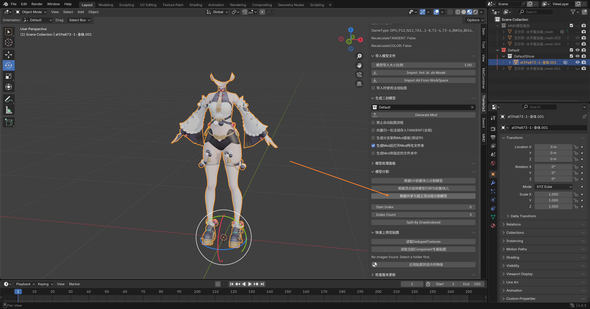
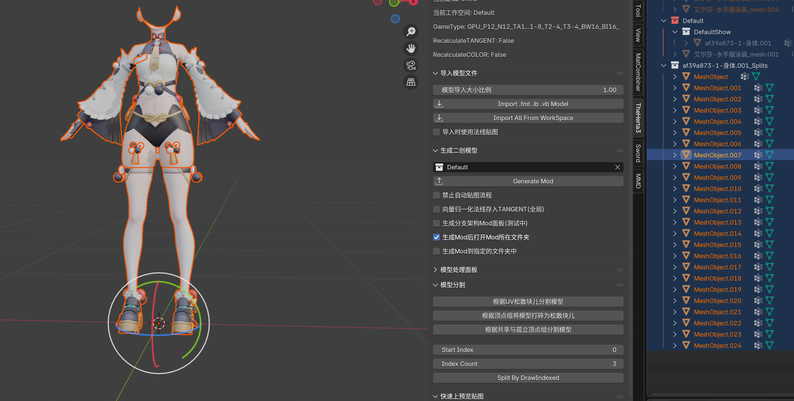
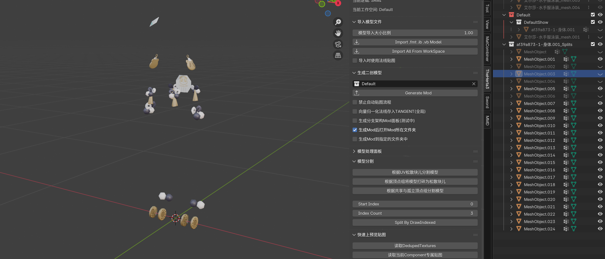
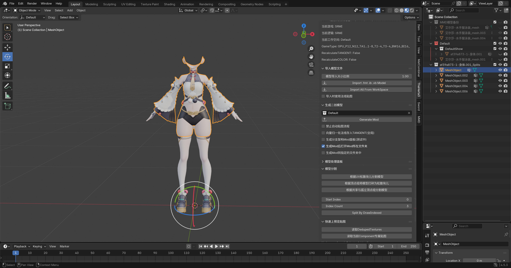
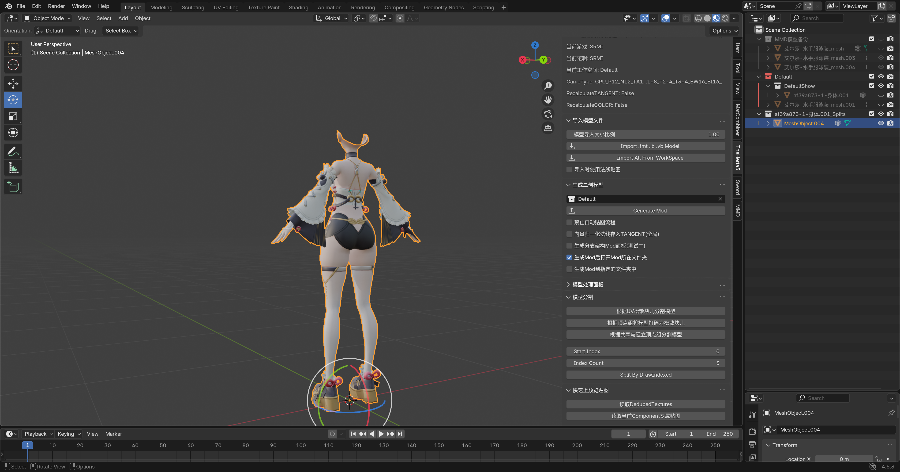

# 💃 将MMD模型转为Mod流程 - 原模型处理篇

## 🛠️ 原模型处理

接下来需要处理 原模型。

我们需要去掉裙子，以及边角料物件，因为我们现在做的这个泳装不需要做那些位置。

例如身上这些挂饰，因为具有额外的权重，所以要么删掉，要么分离并隐藏起来备用。

这里我偷懒，直接删掉了。😜

这里为了快速分割，我们使用 根据共享与孤立顶点组分割模型 这个功能：

出来一大堆分割开来的模型，我们把身体的主要部分组合在一起，小部件直接删掉：

先把身体主要部分隐藏，然后可以看到剩余的小部件：

把小部件删掉，隐藏的身体显示回来：

然后把身体碎片组合到一起，再手动删掉一些没有被分割出来的小部件，因为这个算法有时候不是太好用。

到这里 原模型 就处理完成了，记得 **备份** 一份，然后开始后面的步骤。
