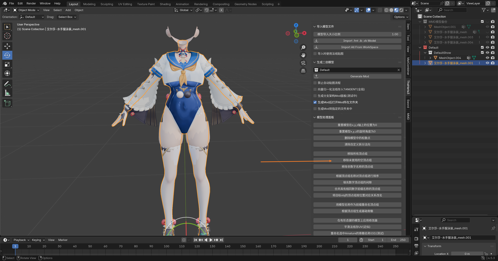
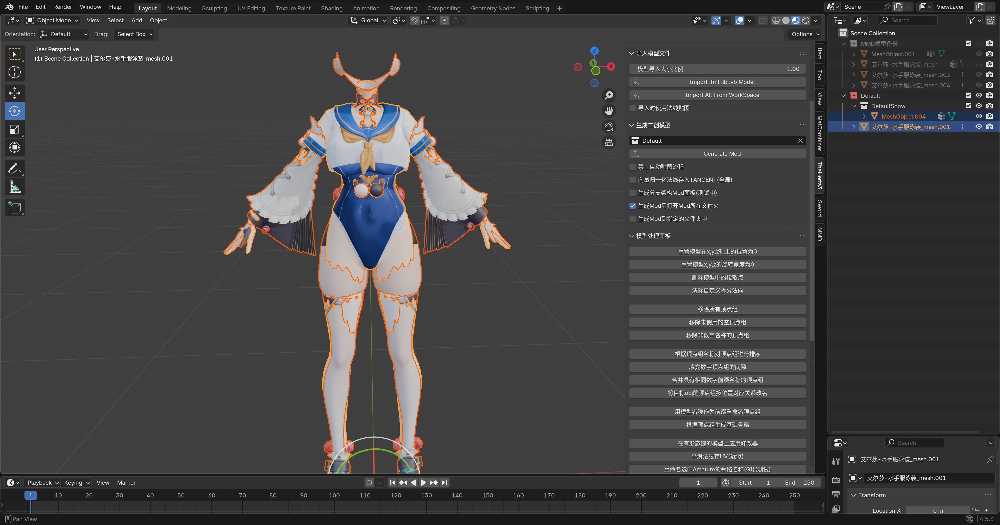
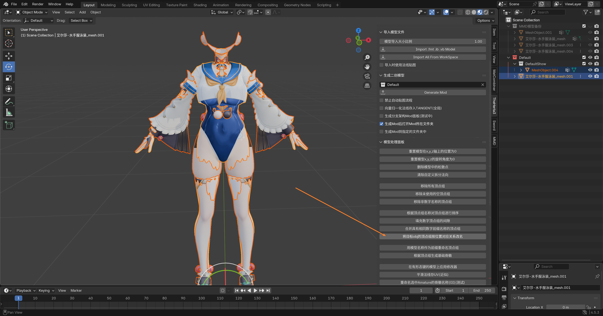
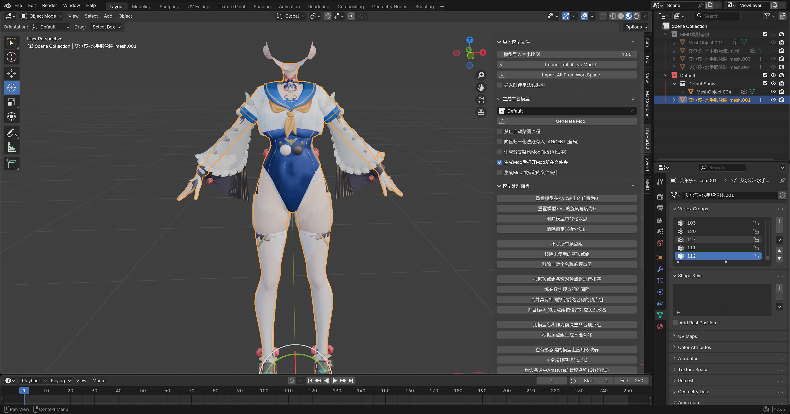
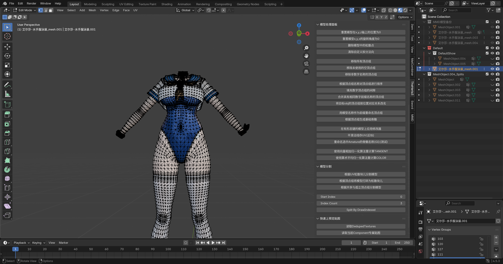

# 💃 将MMD模型转为Mod流程 - 顶点组自动改名篇

## 🏷️ 顶点组自动改名法

没错，我要开始 **偷懒** 了，你作为萌新，我建议你也先学会 **偷懒** 的方法。😴

所以我们直接从 **偷懒大法** 开始演示。

先分别选中两个模型，点击 移除未使用的空顶点组。

把处理好的两个模型都显示出来，然后按住 <kbd>Ctrl</kbd>，先选中 游戏原模型，再选中你的 MMD模型，**注意先后顺序哦**！

然后点击 将目标obj的顶点组按位置对应关系改名。

执行完成后，选中我们的 MMD模型，可以看到 **顶点组名称** 都被改过了：

此时我们需要删掉 MMD模型 的手部，使用 游戏原模型 的手作为手，偷懒省去刷手的权重。

以及脖子，直接偷懒用 原模型 的脖子，防止对不上脖子接缝。

::: tip 💡 经验之谈
反正你第一次做 Mod，能 **偷懒** 就 **偷懒**，能 **简化** 就 **简化**。
:::

