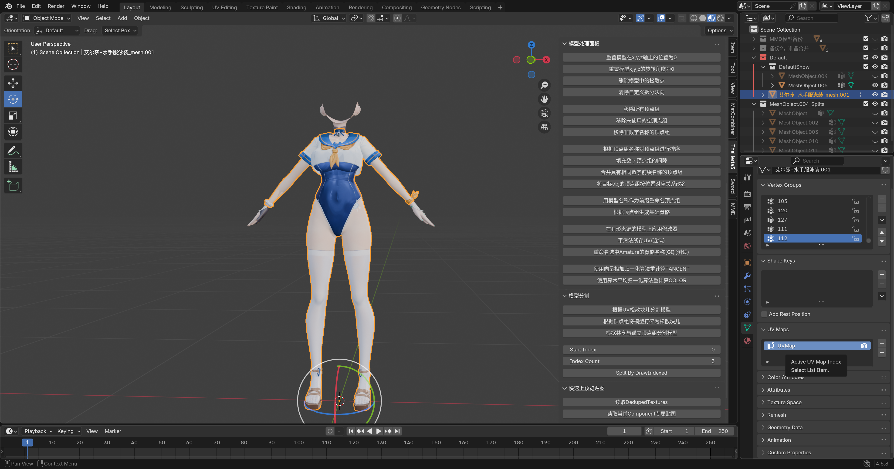
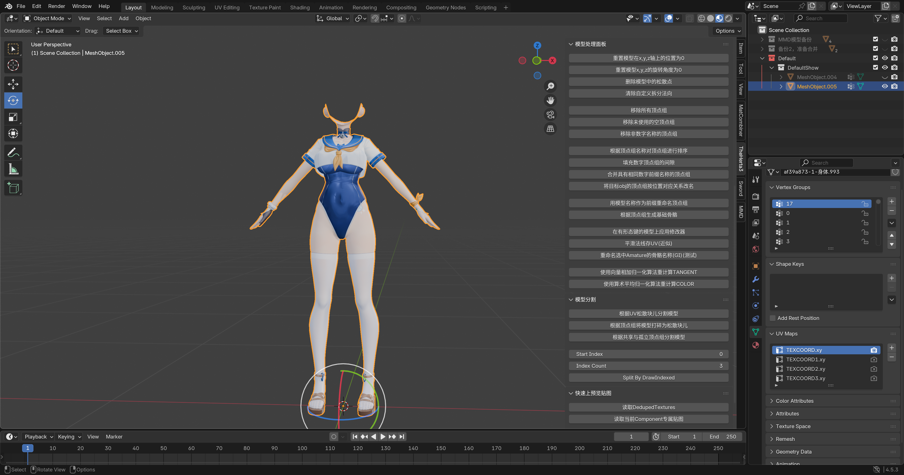
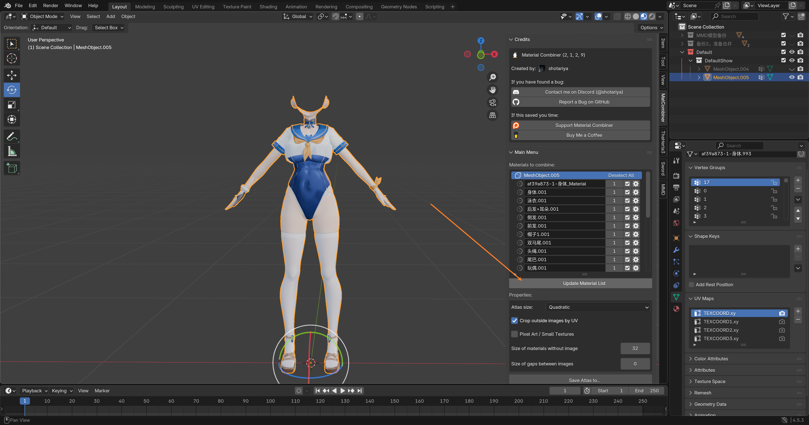
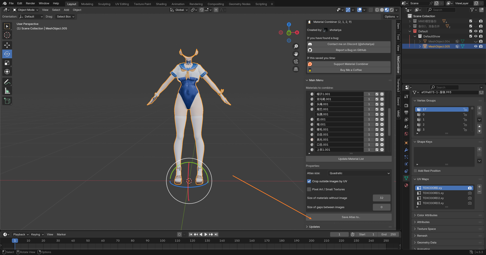
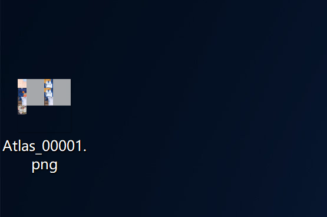
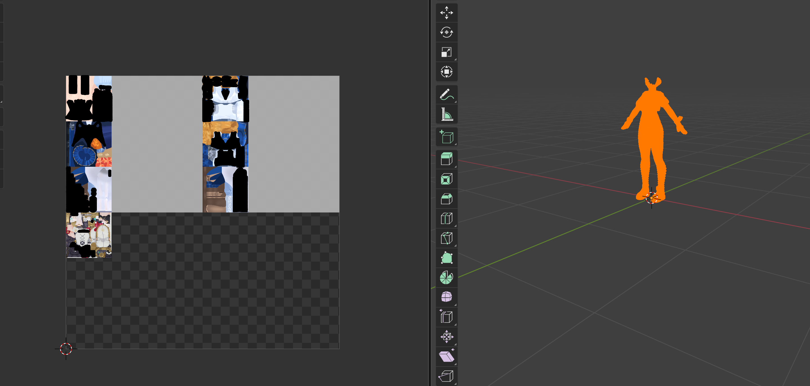

# 💃 将MMD模型转为Mod流程 - 合并篇

## 🔗 合并模型

在合并 MMD模型 和 游戏原模型 之前，需要给 MMD模型 的 **UV** 改名。

改名为 `TEXCOORD.xy`。

随后合并到 游戏原模型 上：

## 🎨 合并贴图

此时打开 Material Combiner 插件（萌新偷懒法，懒得手动拼接了）。

点击 **Generate Material List**。

然后此时我们点击 **Save Atlas To**。

将合并的图片保存到桌面：

此时我们去 **UV** 里查看，就能看到它变成一张大图了：

虽然空间占用很难看，不过我们无所谓了，这就是 **偷懒的代价**。🤷‍♂️
