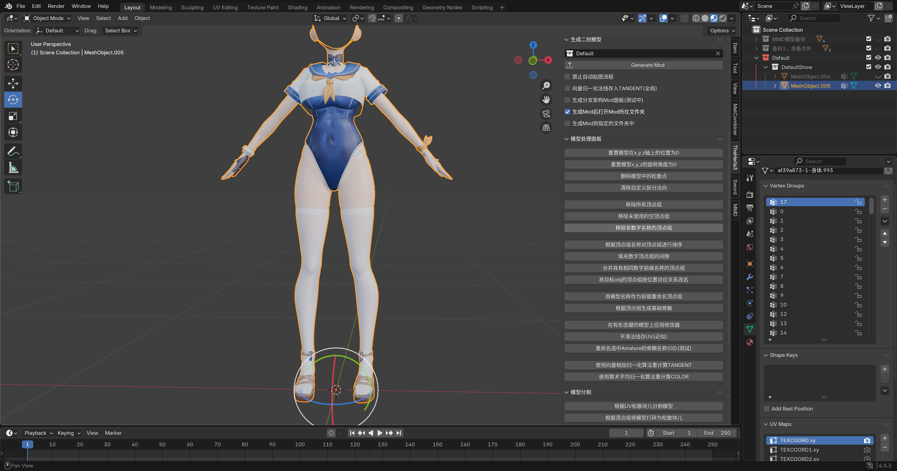
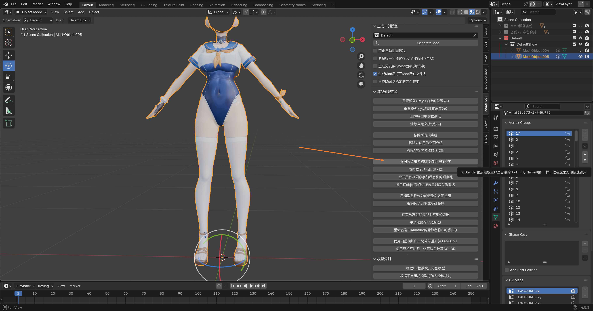
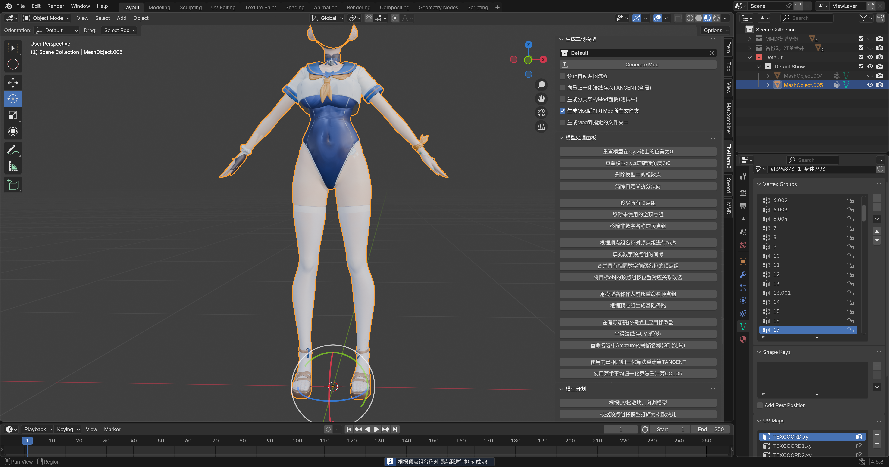
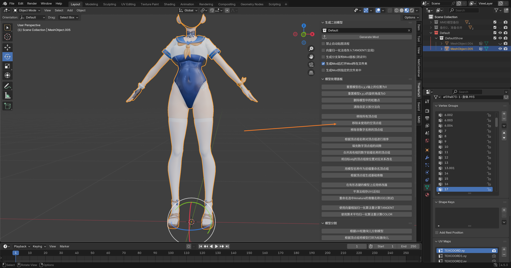
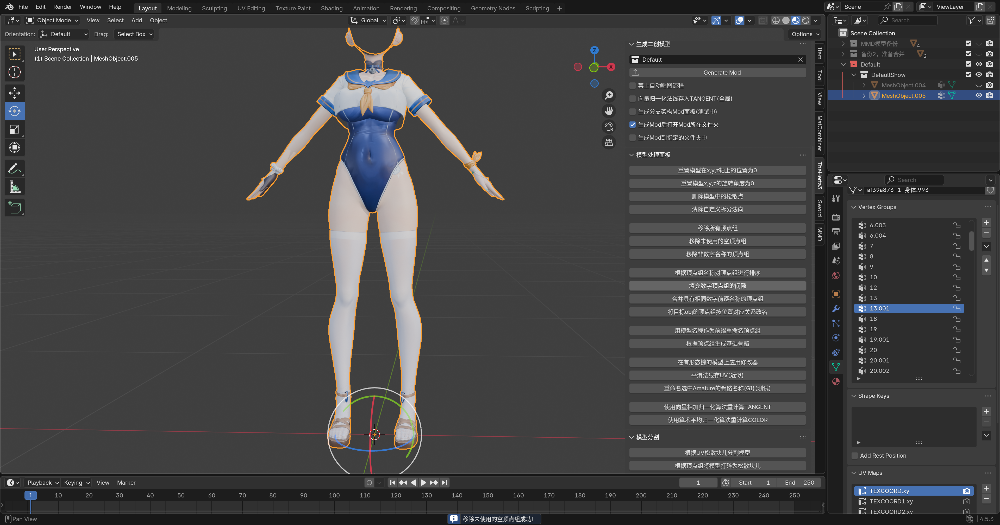
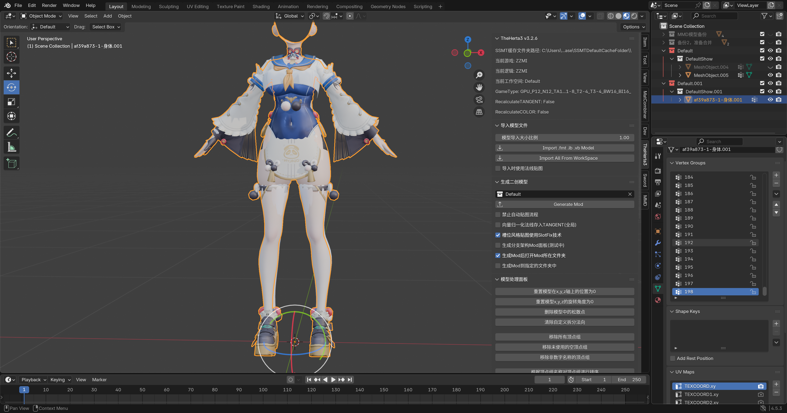
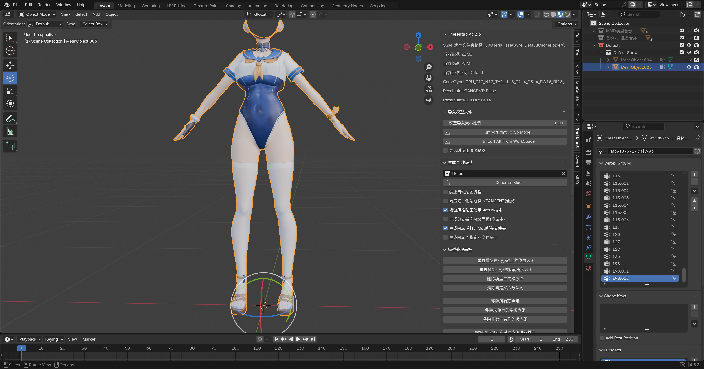
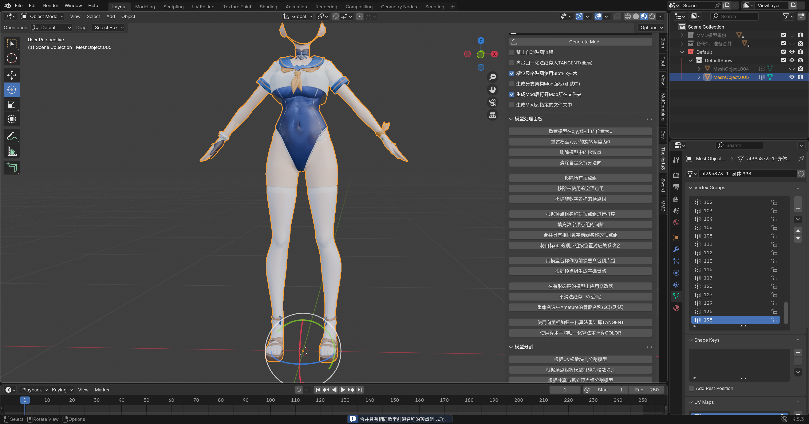
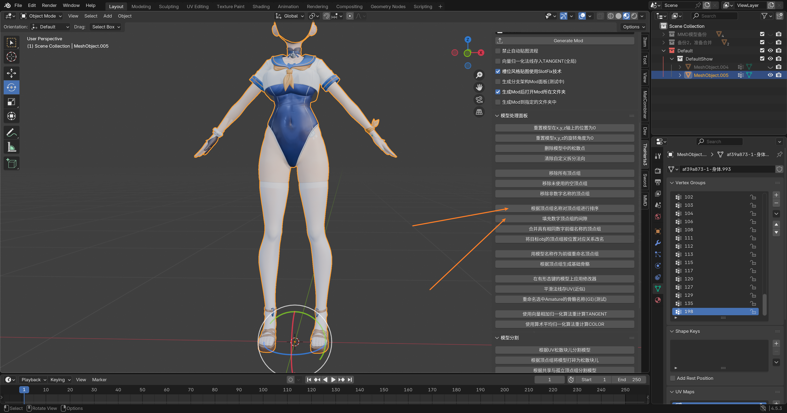
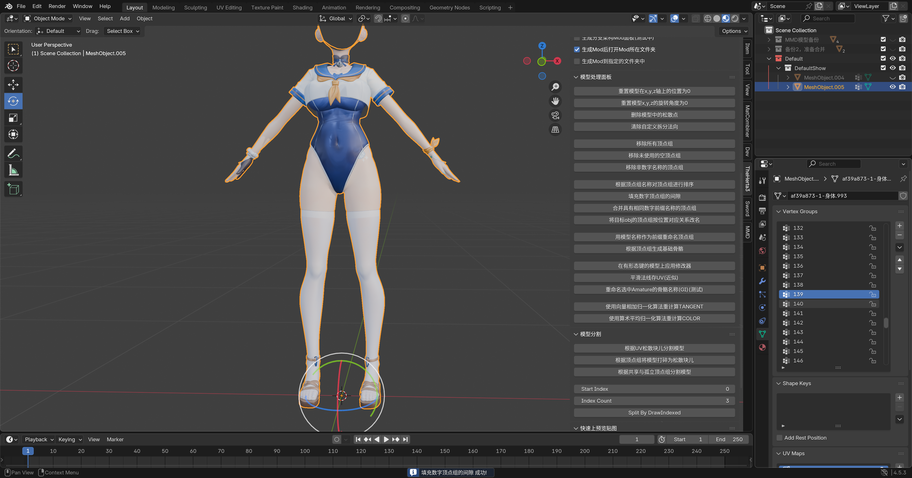

# 💃 将MMD模型转为Mod流程 - 顶点组处理篇

## 🔢 处理顶点组顺序和数量

可以看到现在 **顶点组** 的顺序和数量都是不对的。

点击 **排序** 一下：

排序完成发现有很多 `.001` 什么的，现在我们 **移除一下未使用的顶点组**：

少了很多！

现在我们看一下 游戏原模型 一共有多少个 **顶点组**：

最大顶点组名称为 `198`，我们再看看我们处理好的模型有多少个顶点组？不够 `198` 的话，我们创建一个名为 `198` 的顶点组出来，如果够的话就不管了：

接下来点击 合并具有相同数字前缀名称的顶点组。

合并完成之后就没有 `.001` `.002` 这种的了：

然后我们先 **排序** 一下，然后再点击 填充数字顶点组的间隙。

可以看到 **顶点组** 是按顺序递增的了：

---

**📅 更新日期**: 2025年12月18日

::: warning ⚠️ 免责声明
本文档内容仅用于 **学习交流目的**，仅供参考。请勿将本文档内容用于任何 **商业目的**。作者不对因使用本文档内容而产生的任何后果承担责任。本文档部分内容由 **AI** 生成，仅供参考。
:::
