# 处理贴图大小问题

上一节内容中，我们处理完贴图之后发现，合并出来的atlas贴图实在是太大了，导致转换为dds格式之后体积过于巨大的问题

本节内容就是来处理一下这个贴图大小问题。

让我们时光倒流，回到使用Material Combiner合并贴图的前一刻：

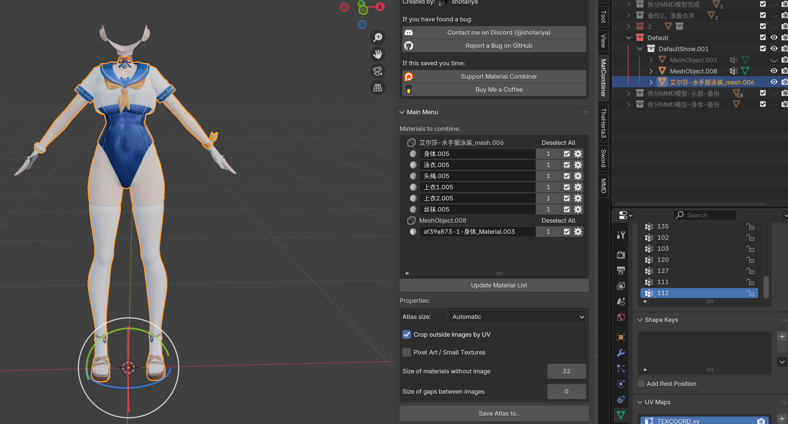

此时我们需要分别去查看每个贴图的内容是什么，为什么它们会那么大？

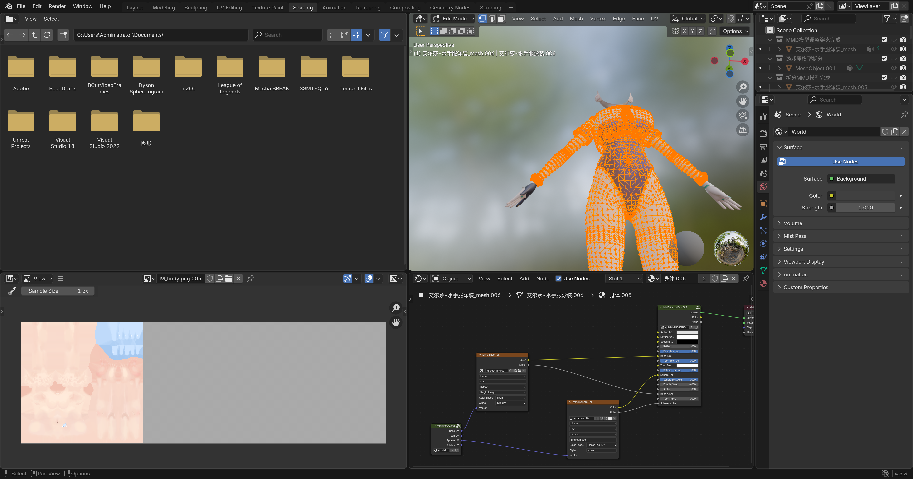

一看，我去，这玩意简直巨大，所以此时我们要打开MMD模型的原始文件夹，看看有没有合适的贴图能换一下，一般都会有：

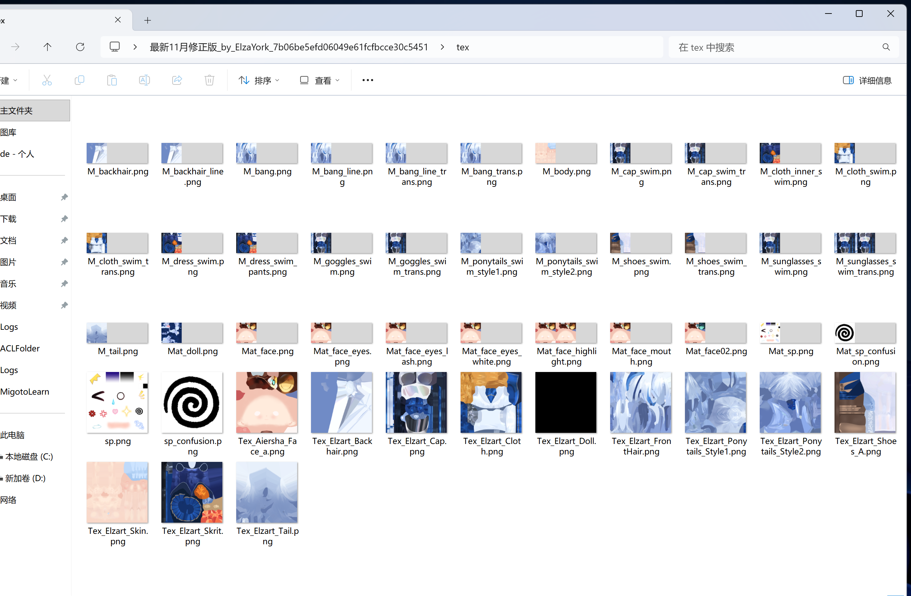

同时我们要把多个部位如果用到了相同的材质贴图的话，也要换成相同的材质才行，来避免这样的一个部位的贴图重复出现的问题：
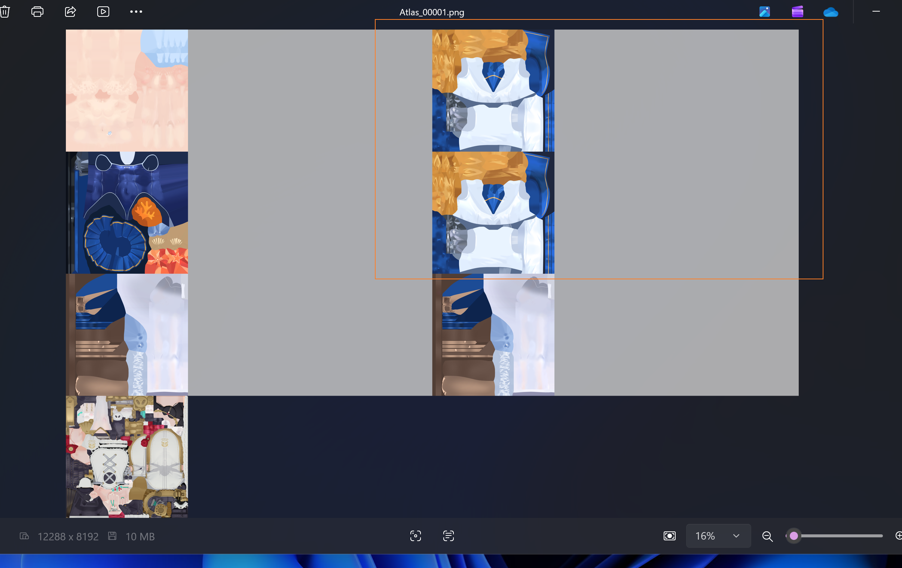

# MMD贴图预处理减少贴图体积步骤

如果不处理贴图的话，最终产生的贴图体积会巨大：

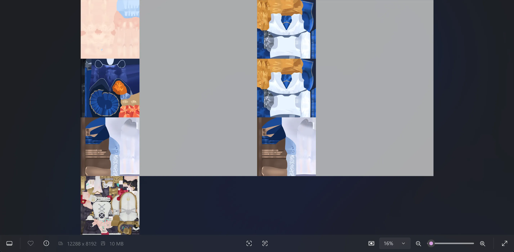

- 贴图体积巨大，转为dds后翻10倍
- 重复贴图浪费资源

## 先按照材质分割MMD模型

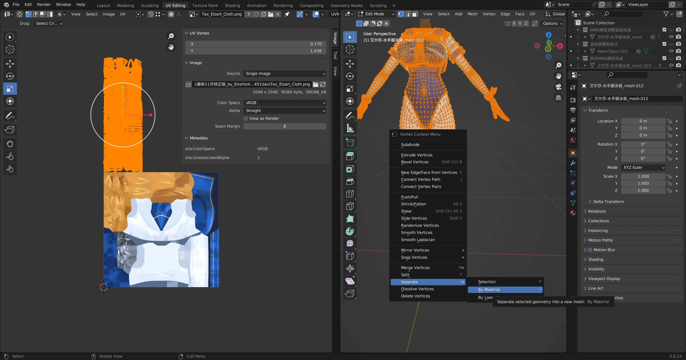

如果不分割，后面的UV调整会非常难

后面的步骤是对所有的按材质分离出来的模型，都进行调整的。

## 贴图换源

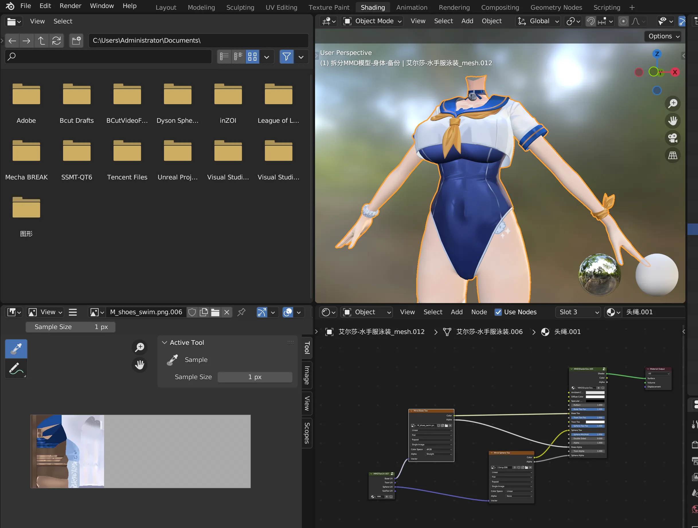

如图很明显，可以换成下面的去掉灰度图的图：

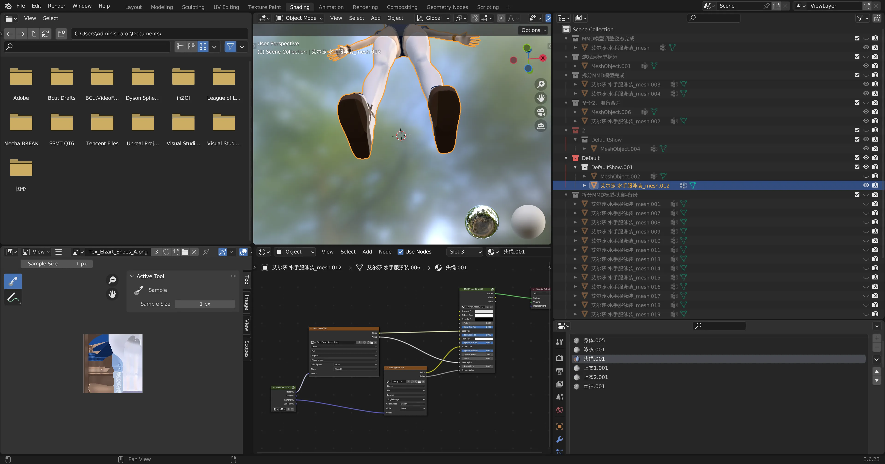

然后顺便去掉所有的连接，因为制作Mod只需要这个diffuse贴图连接到材质输出就行了：

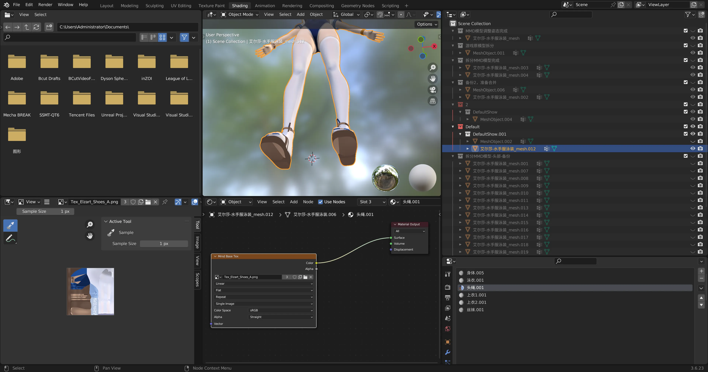

## 手动修复UV

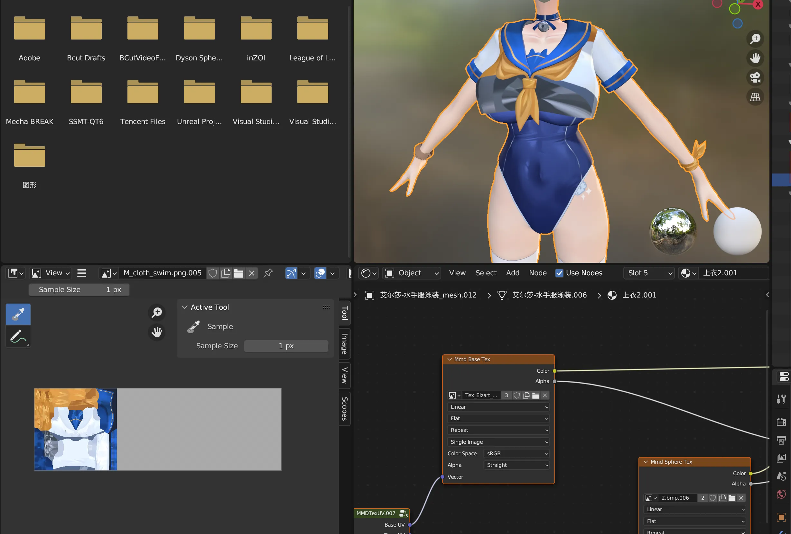

部分上衣换完贴图之后，UV不正确，此时去查看UV，发现UV飞起来了：

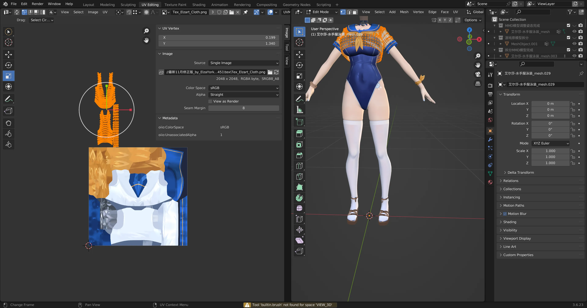

此时我们手动调整它的大小和位置到正确的位置

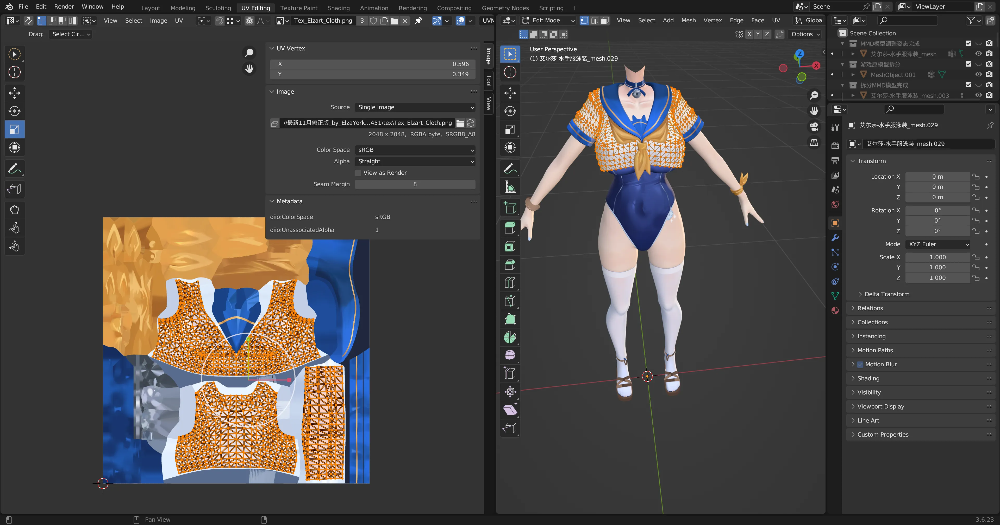

## 总结

其实这个步骤应该在最开始的MMD模型处理步骤就做好的，但是由于我是第一次做Mod没有经验，只能边摸索边产出一个垃圾教程了，后面再改进吧。