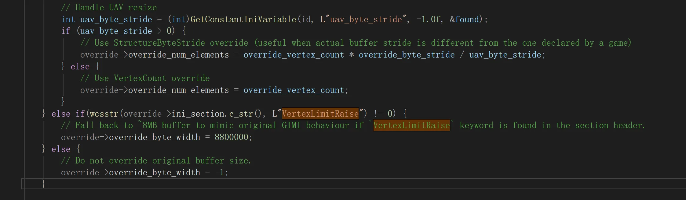

# 默认顶点数量突破问题

对于VertexLimitRaise语法，我们要突破到15200000，而不是GIMI默认的8800000

不过现在的主流语法已经变成了下面三个参数结合使用来控制
- override_vertex_count
- override_byte_stride
- uav_byte_stride

但是由于历史遗留问题，古董ini只有简单的VertexLimitRaise后缀来决定是否提升顶点数的设计

此时如果不改大一点，就会导致部分Mod无法加载

