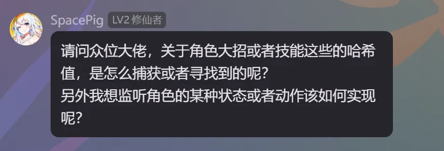

# 🎯 如何获取技能的 Hash 值

## 📸 技能 Hash 获取方法

关于角色大招或技能这些的 **Hash** 如何获取，一般有以下几种办法：

### 方法一：暂停游戏获取

1. 在释放技能的瞬间按 `Esc` 暂停游戏。
2. 同时通过小键盘 `7` 和 `8` 切换 **IB** 隐藏掉菜单界面。
3. 可以把这个 **IB** 做成单纯的 `handling = skip` 的隐藏 **Mod**，最好是设置一个按键开关，这样就可以在时停的时候透过菜单 **UI** 界面看到技能或者大招瞬间的效果。
4. 然后小键盘 `7` 和 `8` 找 **IB** 值即可。

### 方法二：Dump 帧分析

有些技能或大招的释放场景无法暂停，此时可以：

1. 瞬间按小键盘 `0` 打开绿字（如果已经打开就不需要重复打开了）。
2. 然后按小键盘 `+` 重置 **Hunting** 界面。
3. 按 `F8` 进行 **Dump**。
4. 去 `F8` **Dump** 下来的 **FrameAnalysis** 文件列表中逐个贴图文件去查看，判断哪个是大招或者技能用到的贴图文件。
5. 然后去找对应的 **DrawCallIndex**（也就是前面的数字），然后去找对应的 `-ib=` 的文件的 **IB** 的 **Hash** 值就行了。

## 👀 监听角色状态或动作

要监听角色某种状态或动作：

1. **找到触发条件**：找到那个角色的状态或动作时，特别出现的东西，比如特别出现了一种特效，一种贴图等等。
2. **获取 Hash 值**：找到那个 **Hash** 值。
3. **编写逻辑**：写 `ini` 逻辑，在那个 **Hash** 出现时把激活变量设为 `1`，然后在你的 **Mod** 里判断这个激活变量为 `1` 时执行某种逻辑。

> 💡 **提示**：这些方法适用于各种游戏中的技能特效和状态监听，结合 **Hunting** 模式可以精确捕获目标 **IB**。
