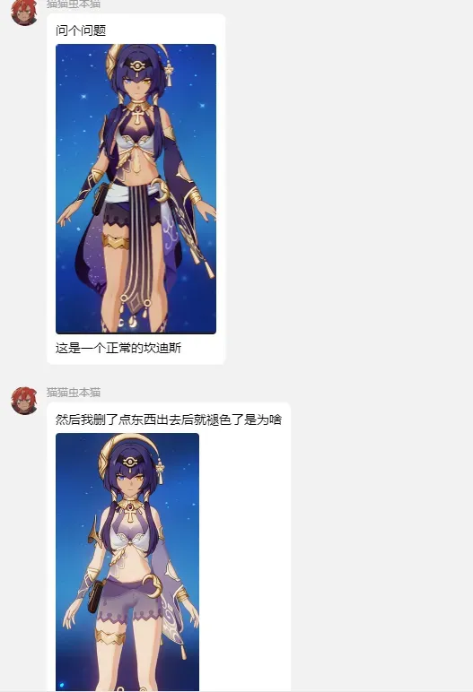
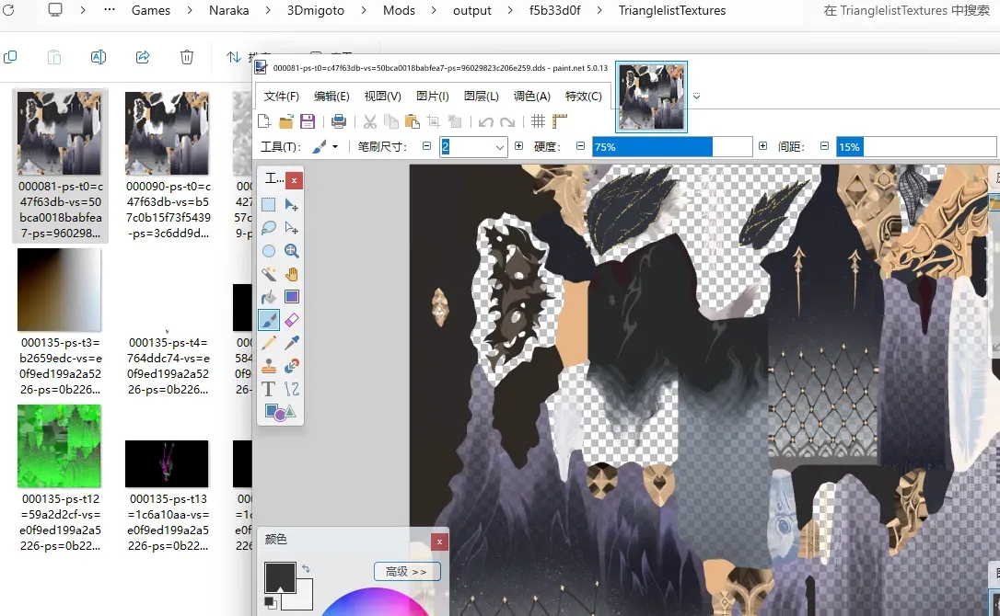
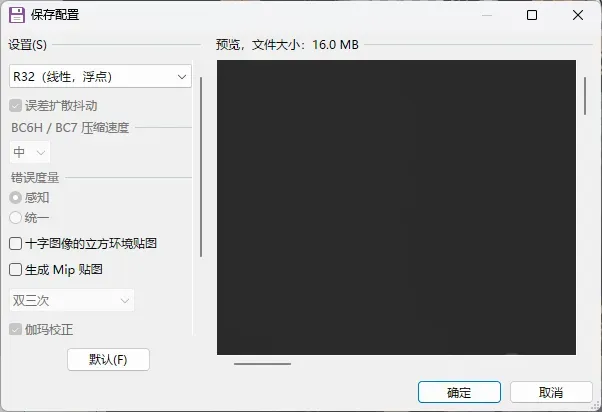
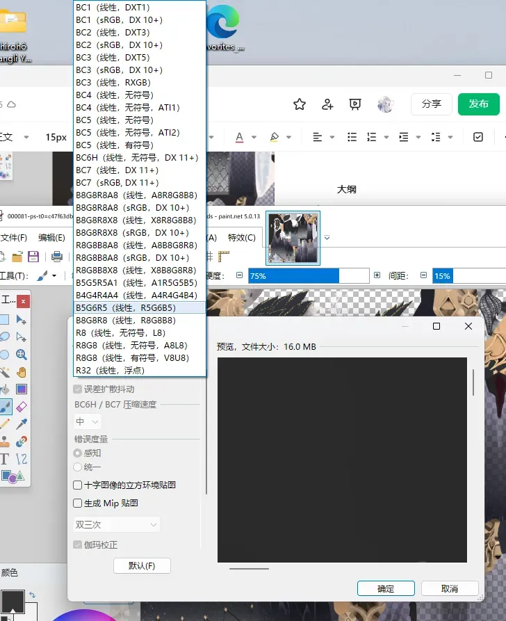
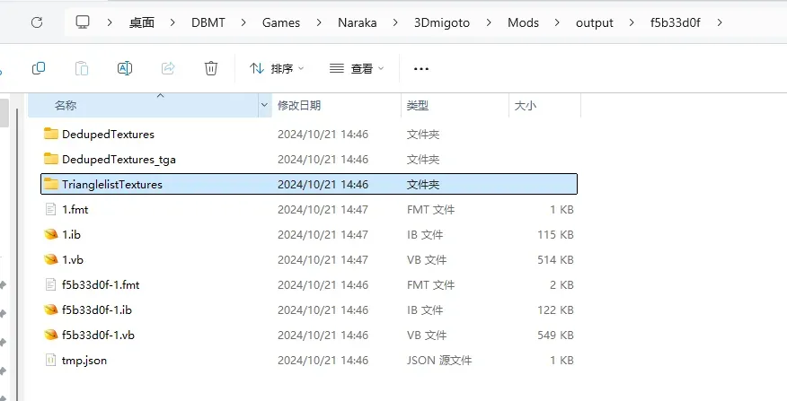
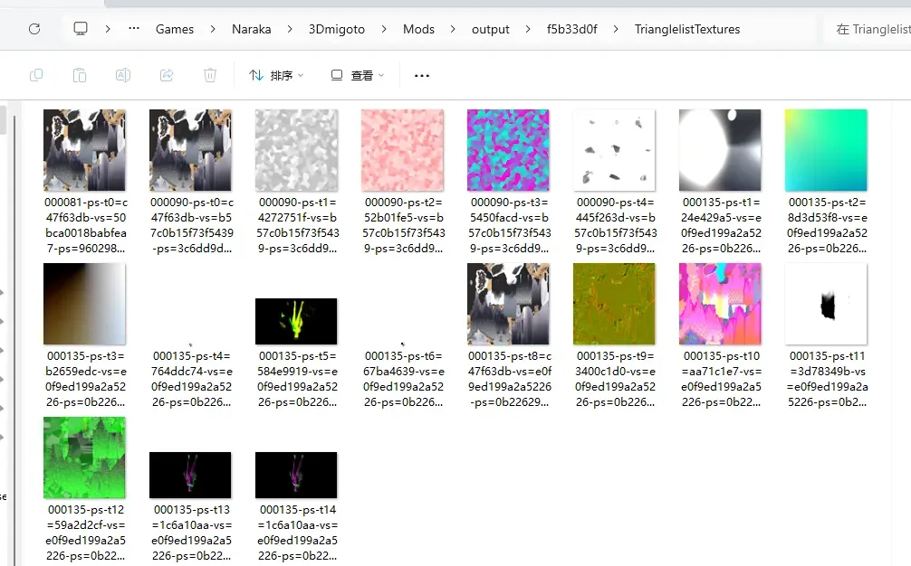
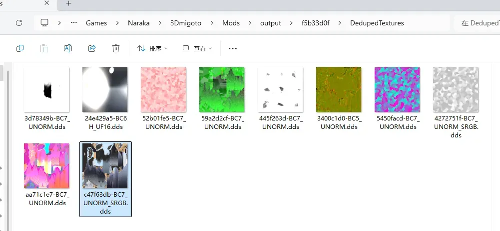
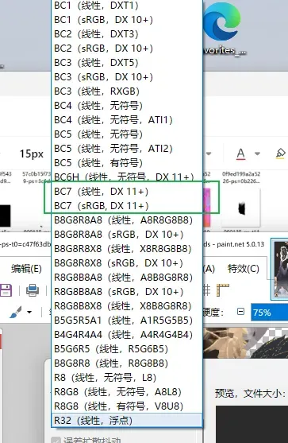

# 🔧 贴图格式导致色差问题

在 3Dmigoto 的 Mod 制作中，我们修改贴图后，如果保存的格式不对，就很有可能导致贴图颜色变化或者无法正常加载贴图，例如：

> **原因**: 因为修改了贴图之后，格式可能默认保存为线性 UNORM 了，和游戏原本使用的 SRGB 格式不一样，导致 Shader 读取的信息不一样，所以导致出现色差问题。

## 📋 DDS 贴图格式有哪些？

**.dds 格式的贴图**，其编码格式有很多，以 Paint.NET 为例，我们随便打开一个贴图：

点击 **另存为**，保存为 DDS 格式：

在保存配置的左上角，可以设置贴图的格式，我们来看看 DDS 有哪些格式：

可以看到贴图的格式还是很多的，这是因为 DirectX 经过这么多年的发展，不断迭代新的格式。那么我们如何确定一个贴图该使用哪种格式呢？

## 🔍 如何确定一个 DDS 贴图该使用哪种格式？

首先打开我们的 **output 文件夹** 中的 hash 值命名的文件夹：

你会发现，有三个贴图文件夹：

- **DedupedTextures**
- **DedupedTextures_tga**
- **TrianglelistTextures**

其中 **TrianglelistTextures** 中装着你提取用的这个 DrawIB 渲染模型所用到的所有贴图：

然后打开 **DedupedTextures** 文件夹，你会发现重复的贴图不见了，每个贴图都是独一无二的，在其中找到你要看格式的那张贴图：

它的名称是：`c47f63db-BC7_UNORM_SRGB.dds`

- **BC7** 对应我们 Paint.NET 里保存时的 BC7：

- **UNORM_SRGB** 代表它使用的是 sRGB 格式的贴图，此时你只要选择 Paint.NET 里的 **BC7 (sRGB, DX11+)** 就行了。
- 如果贴图的格式是 UNORM 结尾没有 _SRGB 的话，你就选 **BC7 (线性, DX11+)** 即可。

因为 3Dmigoto 是 DX11 的 Mod 工具，所以 99% 的贴图格式都是 DX11+ 的，具体是线性还是 sRGB 就用我们上面的方法判断即可。

> **解决方案**: 以后遇到贴图色差问题，可以检查一下贴图的格式是否正确，如果不正确的话，手动另存为正确的格式，然后替换不正确格式的贴图即可。