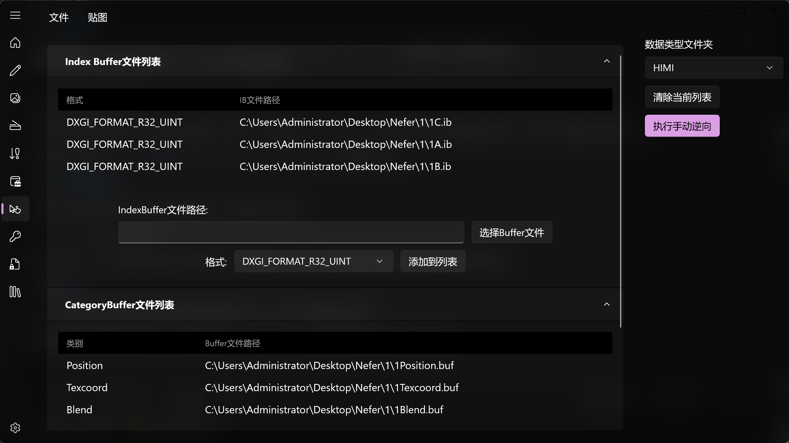
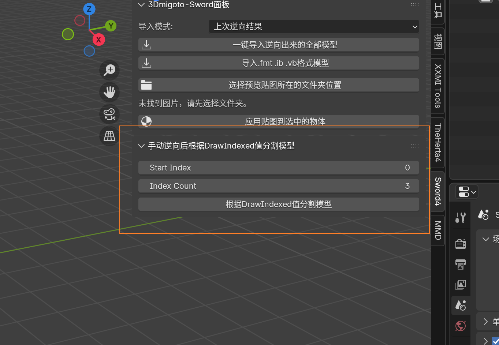

# 🖐️ 手动逆向功能

手动逆向功能是最强大的 Mod 逆向功能，没有之一。

使用手动逆向功能，可以在全自动逆向被特殊 `ini` 写法导致失效时，仍然能够进行 Mod 逆向，并且其上限只取决于用户的操作，不会受到一键逆向的上限影响。

## 🛠️ 操作方法

手动逆向要填入 `Index Buffer File List` 和 `Category buffer File List`，全程拖拽，操作简单方便。

## ⚠️ 缺点与解决方案

手动逆向的缺点就是没有办法自动拆分模型，如果 Mod 是由多个 `drawindexed` 构成的则逆向出的模型仍然是一个整体，需要手动进行拆分。

此时我们可以使用 **Herta 插件** 中的 `Split By DrawIndexed` 功能进行拆分。

## 🧩 数据类型缺失

如果手动逆向功能没有找到对应的数据类型，则会弹出提示。

此时可以把 Mod 文件发我联系我添加数据类型，当然也有可能是你没有选对游戏预设导致的。

## 📝 总结

总之，灵活应用手动逆向功能可以解决你遇到的很多 Mod 无法一键逆向的问题。

比如带有面板可调整的形态键 Mod 或者使用 `Slider Impact` 制作的多切换形态键 Mod 等等。

