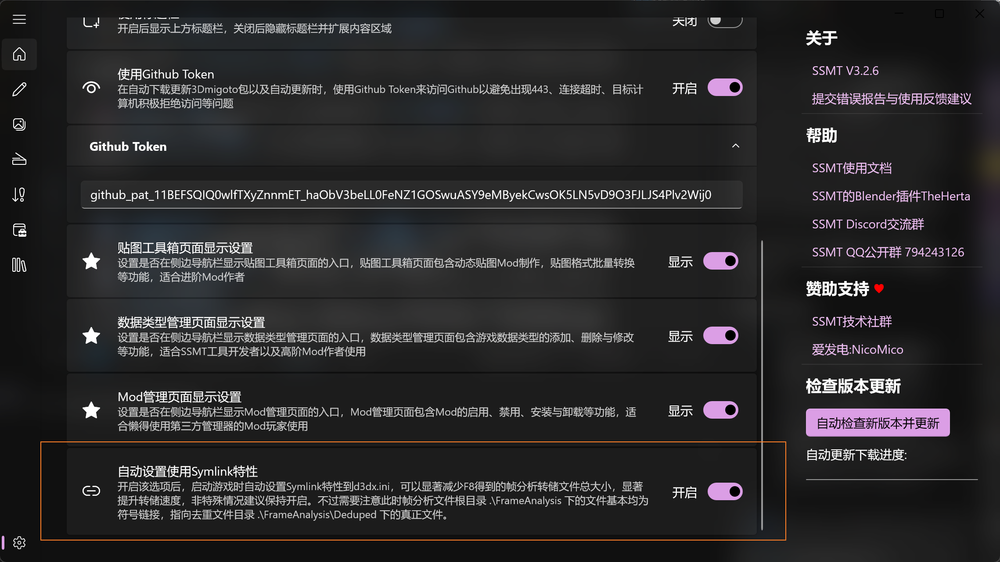
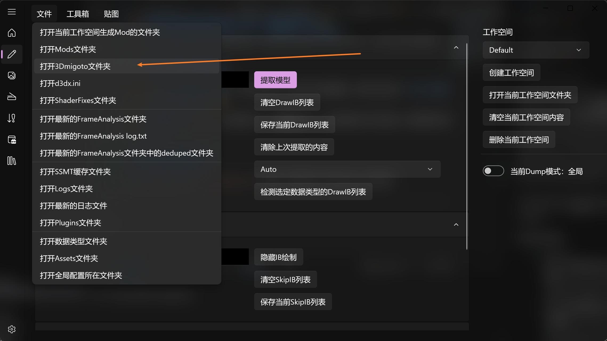
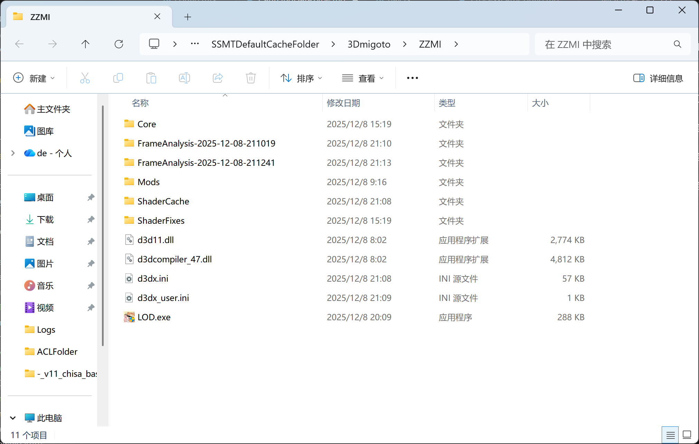
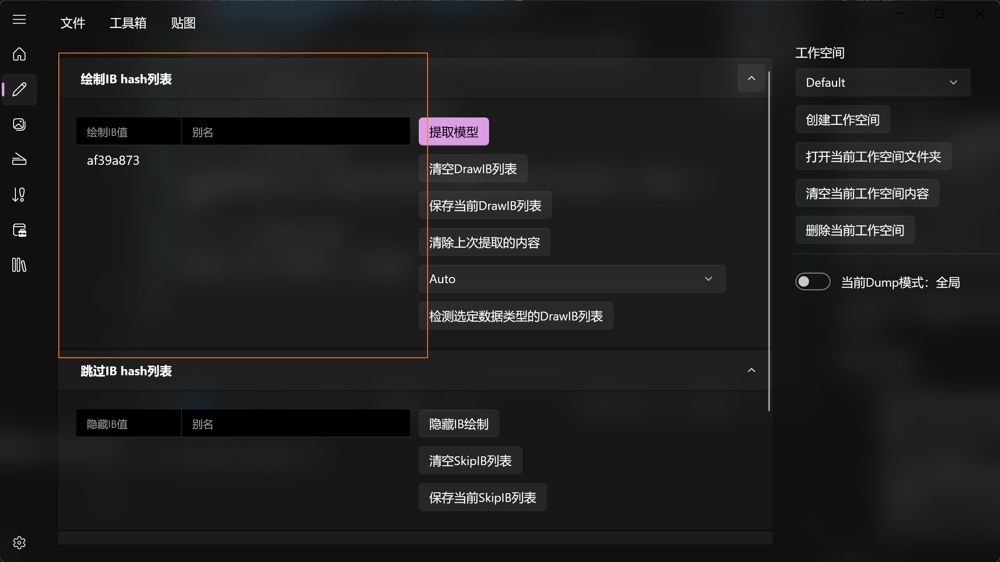

# 🌈 提取模型提示“找不到数据类型”？别慌！🚑

嘿，各位 Mod 制作大师们！👋 
在使用 **SSMT** 提取模型时，如果屏幕上弹出了 **❌ “找不到数据类型”** 的红色警报，先别急着砸键盘！⌨️💥
这篇 **✨ 急救指南 ✨** 就是为你准备的！让我们一步步解决它！

---

## 📦 第1步：准备 FrameAnalysis (Dump)

为了让我能分析出新的数据类型，你需要把游戏运行时的 **FrameAnalysis** 数据发给我。
⚠️ **注意：** 这个文件夹通常 **超级大**！😱

### ⚡ 瘦身秘籍：如何让 Dump 文件变小？

在按下 `F8` 进行 Dump 之前，请务必尝试以下 **减肥操**：

1.  **🎯 减少 IB 总数 (⭐⭐⭐⭐⭐ 关键！)**
    *   屏幕上渲染的东西越少，IB 就越少，Dump 出来的文件就越小，速度也越快！
    *   **操作技巧**：
        *   按 **小键盘 `+` 号**，把绿字界面还原到初始状态。
        *   **🙄 抬头看天** ☁️，或者找个角落面壁。
        *   让视野里 **只有** 你想提取的那个模型。
        *   🚫 尽量避开复杂的场景和特效。

2.  **🔗 开启 Symlink (⭐⭐⭐⭐ 强烈推荐)**
    *   这个功能是神器！能显著减少文件体积并提升速度。**一定要开！**
    *   

---

## 📨 第2步：打包发送给我

准备好数据后，请按照以下步骤打包：

### 1️⃣ 📂 找到 FrameAnalysis 文件夹
点击 SSMT3 界面上的 **“📂 打开 3Dmigoto 文件夹”**。

你会看到 `FrameAnalysis` 文件夹：

### 2️⃣ 📦 压缩最新的一次 Dump
找到里面 **🕒 时间最新** 的那个文件夹（对应你刚刚提取失败的那次），把它压缩成 `.rar` 格式。

注意必须是.rar格式，否则如果你开启了Symlink特性，压缩后的大小可能会比原本的大小还要大。

### 3️⃣ 📤 别忘了 IB 列表
回到 SSMT3 工作台，把填写的 **所有 `IB` 列表** 也一起发给我。

### 4️⃣ 📝 附上关键信息
发送给我时，请备注：
*   🎮 **游戏名称**（原神 / 星铁 / 绝区零？）
*   🖼️ **模型描述**（例如：“流萤的头发部分”）
*   🚀 **传送方式**（建议使用 **QQ 闪传**，因为文件可能很大！）

> 🛑 **重要警告**：
> *   **绝对不要** 擅自删除 FrameAnalysis 文件夹里的文件来“减重”，这会导致数据损坏！💥

---

## 🎁 第3步：等待我更新SSMT

等我测试完更新SSMT添加了这个数据类型之后，你那边更新一下SSMT就能使用了

