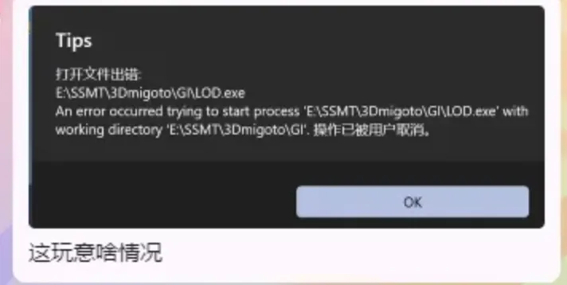
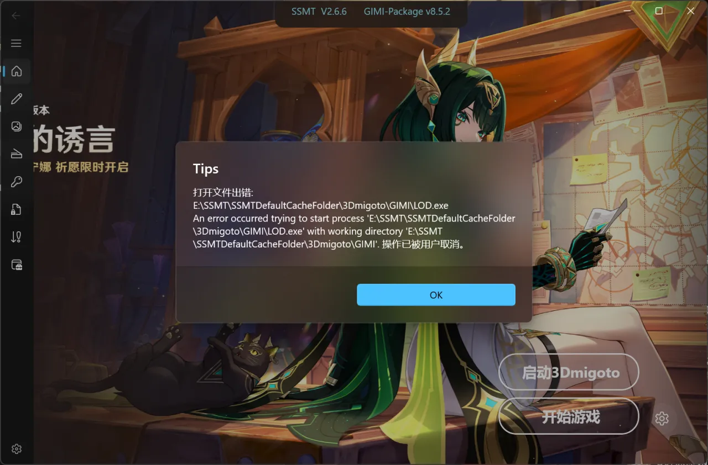
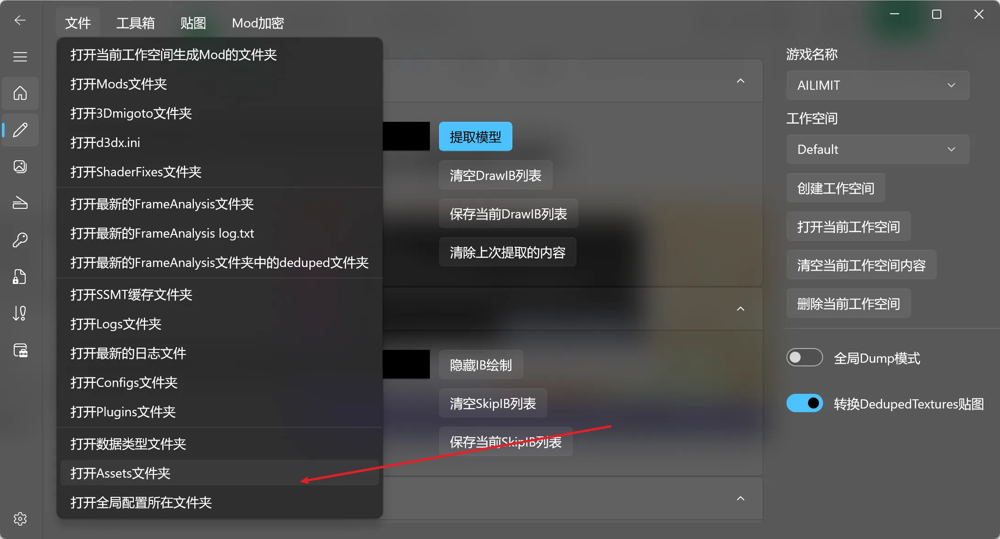
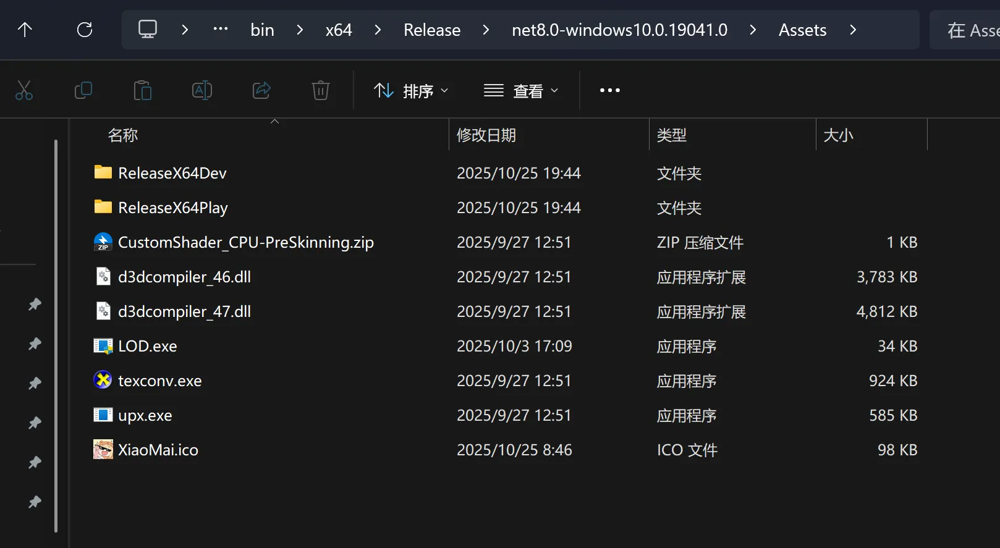

# 🚫 无法打开 LOD.exe

## 📝 问题描述

## 🛠️ 解决方案

### 方案一：彻底关闭 SmartScreen

请先关闭微软的 **Smart Screen**，防止无法启动注入器。

> ⚠️ **注意**：设置 → 隐私和安全性 → Windows 安全中心 → 应用和浏览器控制 → 基于声誉的保护设置。

### 方案二：手动运行一次以添加信任

缺点是可能每次更新 SSMT 都会导致这个问题，都得手动运行一次添加信任。

#### 1. 打开 Assets 文件夹

#### 2. 运行一下 LOD.exe 然后关闭

没错就这么简单，然后问题就解决了。因为你不运行一下，系统不认识这个程序，就会默认拦截其权限。