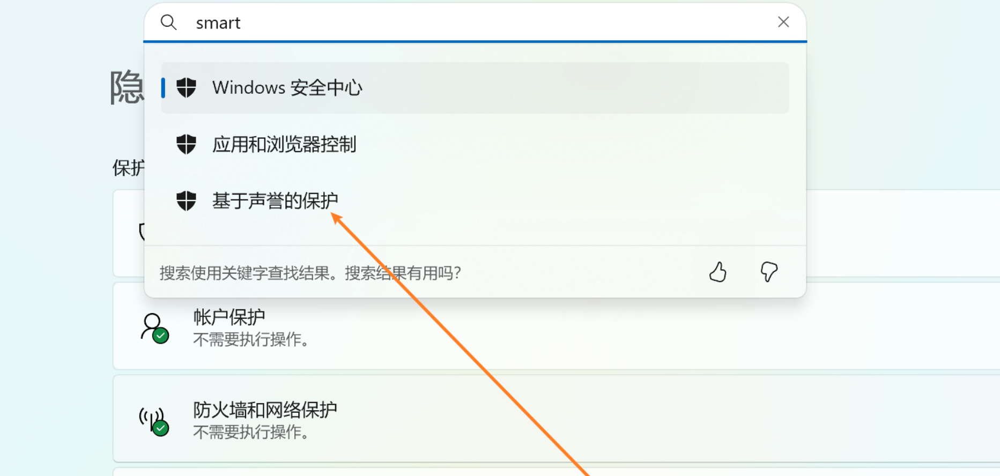
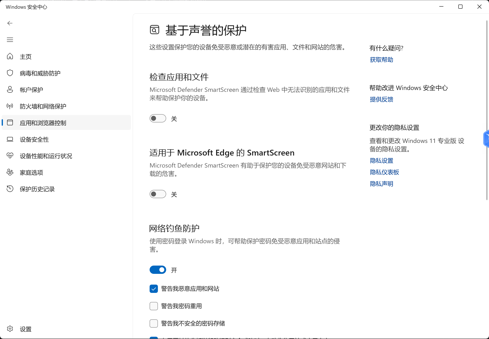
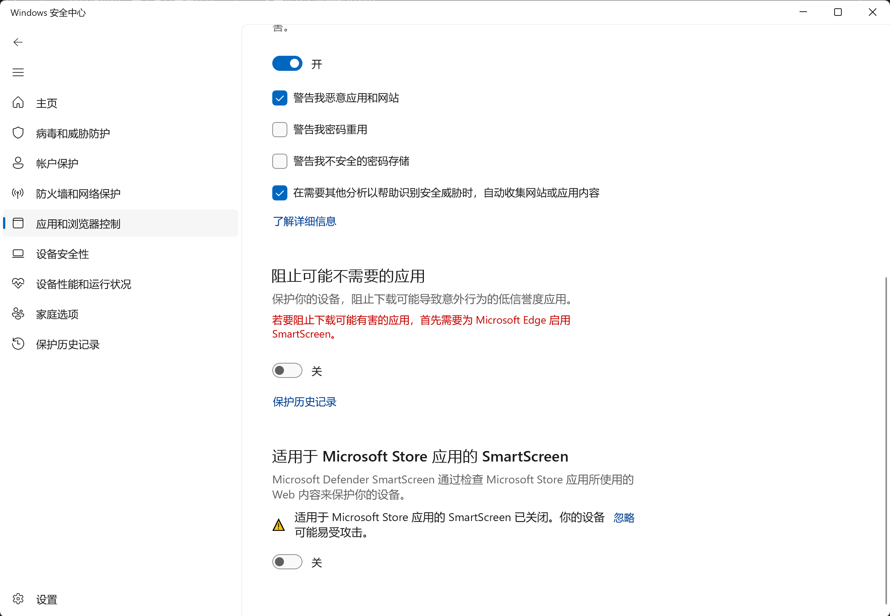

# 无法使用3Dmigoto注入器问题

SSMT4使用Run.exe来注入3Dmigoto到目标进程，它本身是基于原始3Dmigoto仓库的注入器魔改增强得到的。

由于包含注入代码，且并未长期单独包含在Github的发布页，所以未被微软SmartScreen收录

所以100%会被微软的Smart Screen拦截，导致我们在点击开始游戏按钮后，无法启动3Dmigoto注入器，也就是Run.exe

解决这个问题有两种方式：

## 1.彻底关闭Smart Screen，即基于声誉的保护

设置中搜索smart，即可出现：

点击后，将其关闭：

## 2.手动运行一次SSMT4安装目录下的resources目录下的Run.exe

第一次运行会弹出提示说不认识这个文件，无脑运行就可以了

然后后面都不会再出现Run.exe运行被自动拦截问题

但是由于每次SSMT4更新时，都会把resources下面的内容覆盖掉，

所以如果Run.exe的内容发生了变化或者更新后，就需要重新执行这个步骤

所以推荐第一种方式。

## 3.如果实在不信任SSMT4的注入器😂

你也可以将3Dmigoto目录选择为其它启动器，例如XXMI Launcher下面的3Dmigoto目录

随后每次启动时，都使用XXMI Launcher启动，SSMT仅用于模型提取和Mod管理等等其它功能

SSMT的设计是专门为Mod作者优化过的，所以灵活性拉满，你可以自由选择搭配方式。

另外，Run.exe这个注入器是开源的，源码就在：https://github.com/StarBobis/SSMT/tree/main/3Dmigoto-Injector-V2

有条件可自行编译后，替换resources目录下原本的Run.exe来使用

另外，如果有条件且强迫症驱使，你可以自行使用IDA Pro反编译Run.exe验证其执行流程与安全性。

