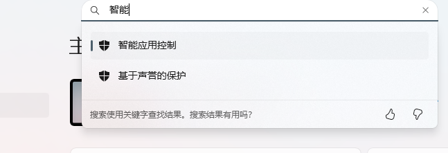
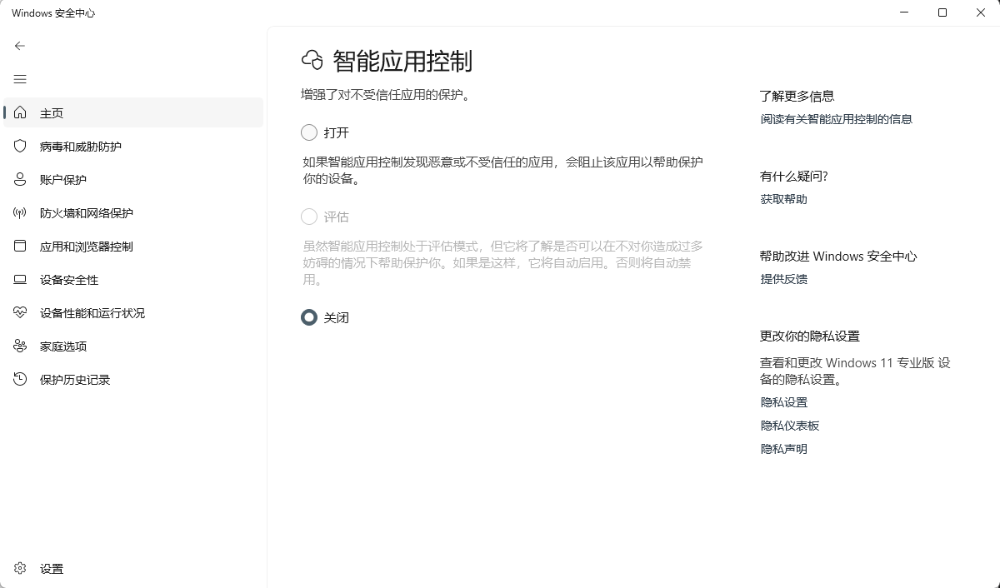

# 无法使用3Dmigoto注入器问题

SSMT4使用Run.exe来注入3Dmigoto到目标进程，它本身是基于原始3Dmigoto仓库的注入器魔改增强得到的。

由于包含注入代码，且并未长期单独包含在Github的发布页，所以未被微软SmartScreen收录

所以100%会被微软的Smart Screen拦截，导致我们在点击开始游戏按钮后，无法启动3Dmigoto注入器，也就是Run.exe，看起来就像是点击开始游戏按钮后，直接启动了游戏一样，没有显示3Dmigoto注入器的启动窗口

## 彻底关闭基于声誉的保护（关闭Smart Screen）

设置中搜索smart，即可出现：

点击后，将其关闭：

## 关闭智能应用控制

打开设置，搜索：智能应用控制：

随后将其关闭，防止SSMT的程序被误杀导致无法正常使用

## 手动运行一次SSMT4安装目录下的resources目录下的Run.exe

第一次运行会弹出提示说不认识这个文件，无脑运行就可以了

然后后面都不会再出现Run.exe运行被自动拦截问题

但是由于每次SSMT4更新时，都会把resources下面的内容覆盖掉，

所以如果Run.exe的内容发生了变化或者更新后，就需要重新执行这个步骤

所以推荐第一种方式。

