# 下载并安装
SSMT可以在Github下载并安装：

首先我们打开Github地址：

https://github.com/StarBobis/SSMT4-Alpha

点击右下角的Releases：

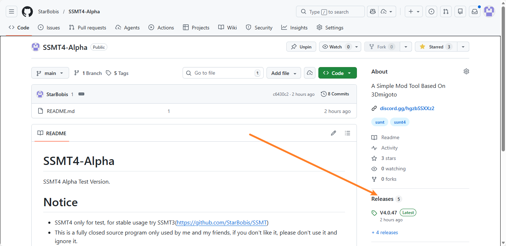

然后出来的页面，下载最新版的exe安装包：

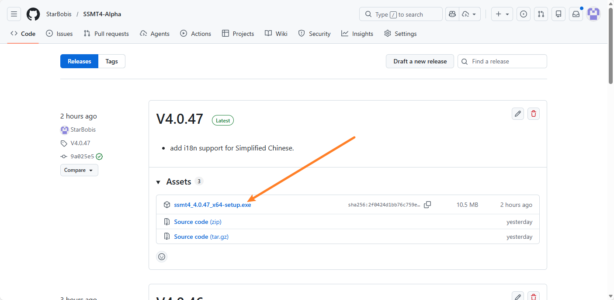

下载完成后双击打开进行安装：

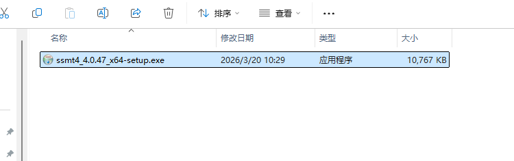

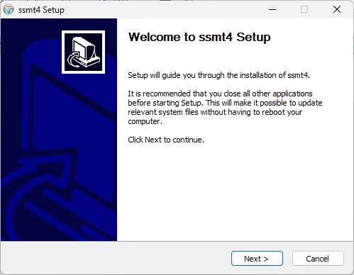

然后一路下一步即可：

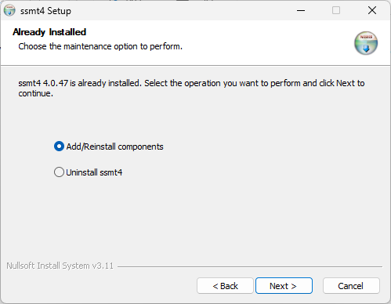

需要注意的是，如果安装新版本时，它会提示你是否先卸载旧版本，此时最好是先卸载旧版本并且勾选这个选项：

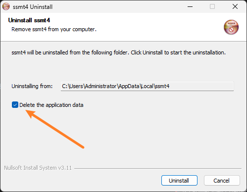

避免旧的配置文件影响到新版本

然后一路下一步安装即可：

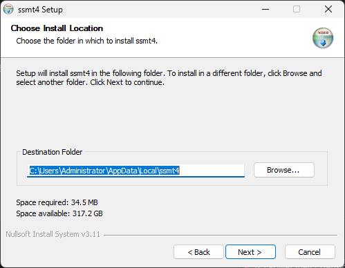

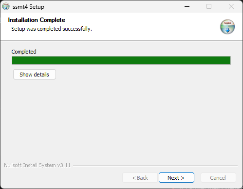

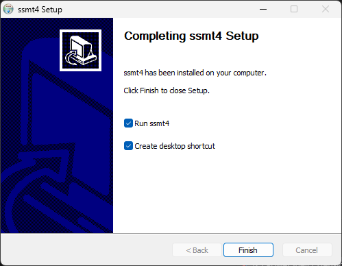

安装完成后就可以正常使用了：

# 设置缓存文件夹位置

安装成功后，建议将SSMT缓存文件夹位置设置为空间充足的位置，例如我这里设置到了D盘下的一个文件夹中

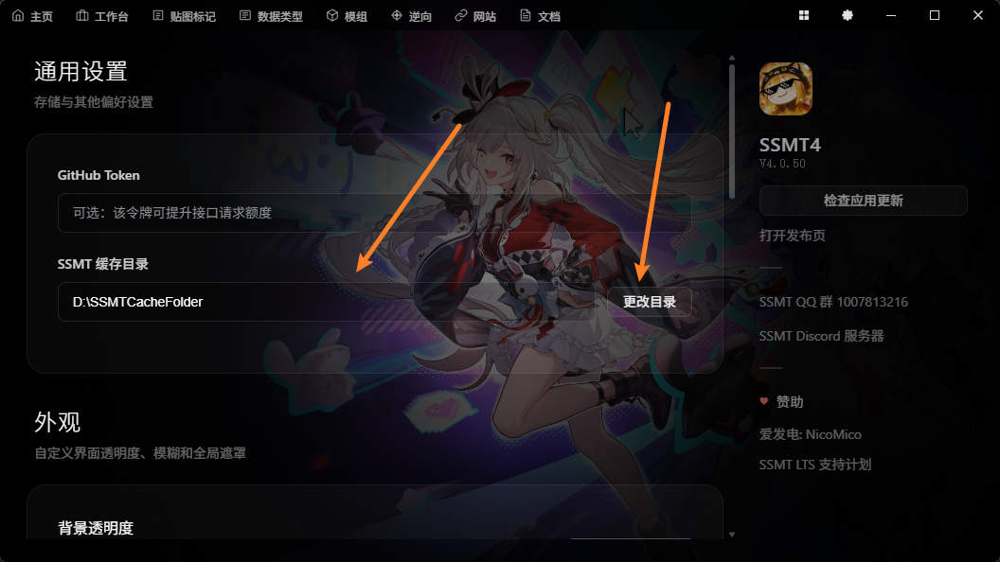

设置完成后，后续版本更新无需重复设置，安装新版本也会自动读取并使用这个路径

# 设置语言

设置页面最下方可以选择语言偏好，目前支持 英文 和 简体中文 两种

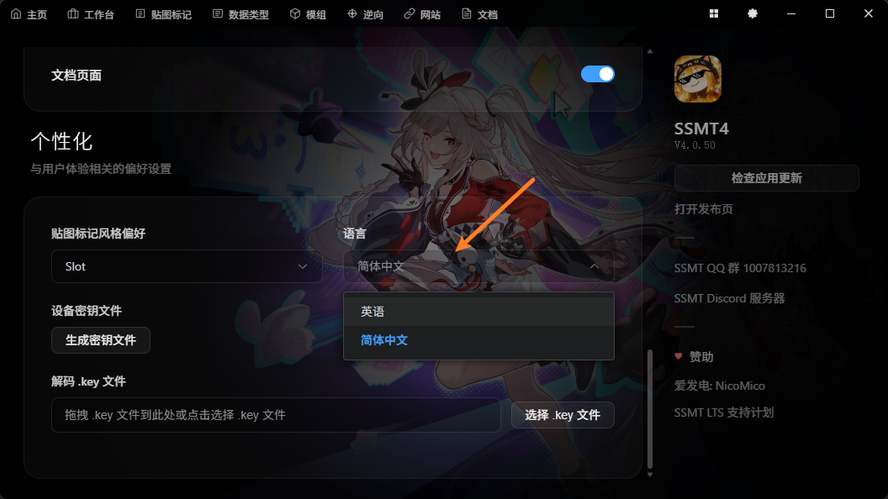

点击后立即生效：

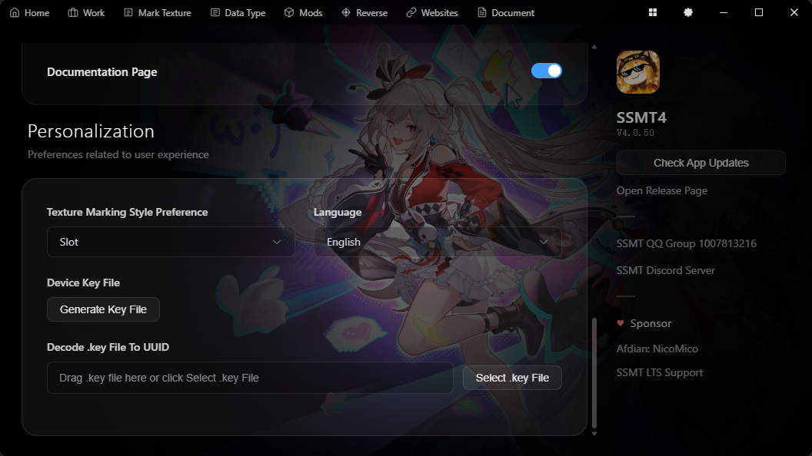

方便不同文化背景人群使用

# 选择你需要的页面

可以看到设置页面可以控制标题栏显示的页面

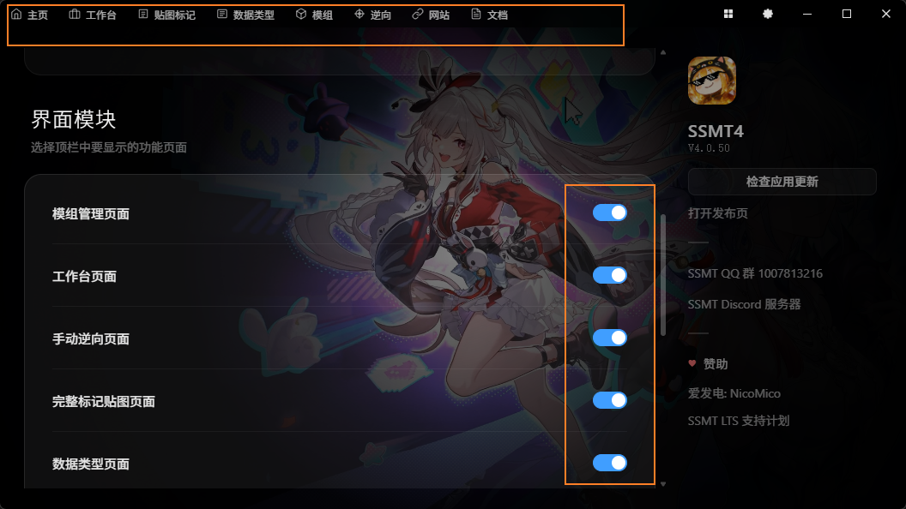

如果你使用SSMT只是为了当作启动器和Mod管理器，则可以像这样将其他页面全部隐藏：

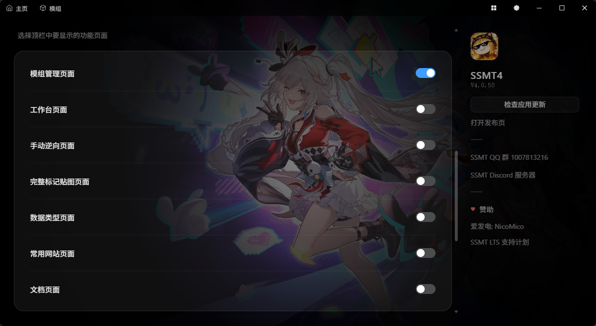

除了主页之外的页面都可以自由控制，标题栏的页面支持拖拽排序：

比如这里按住 数据类型 拖拽到 贴图标记 上，松手就完成了排序：

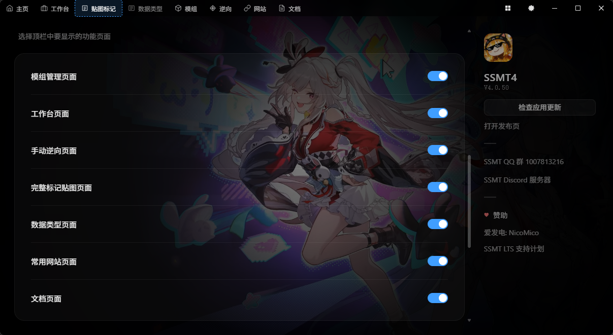

排序后：

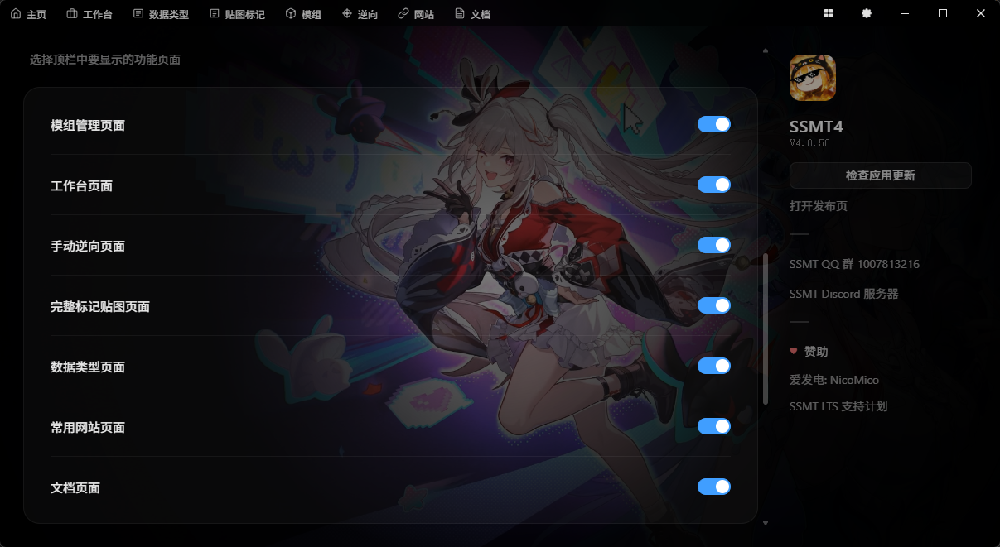

# 设置背景

部分用户可能会觉得默认的背景不好看，或者太黑了，可以自由调整：

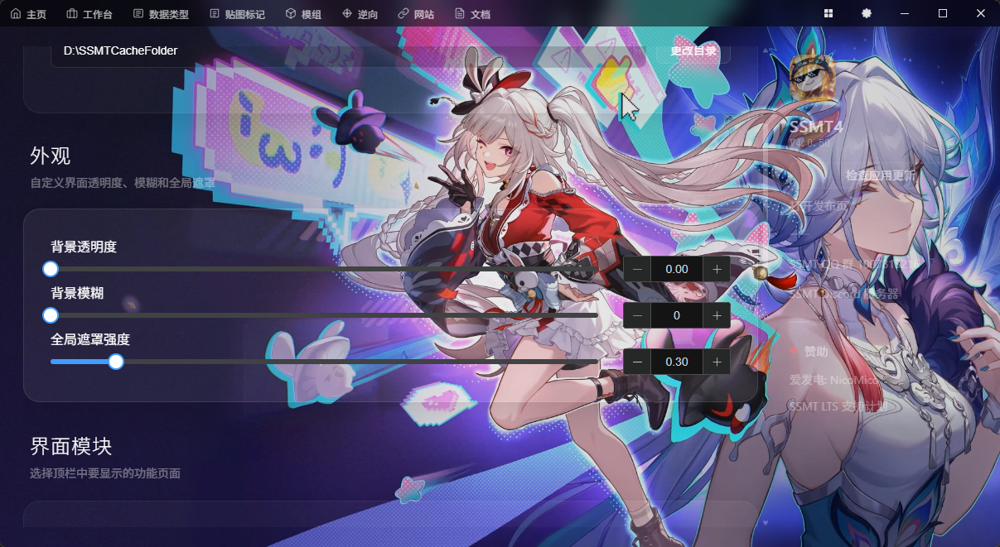

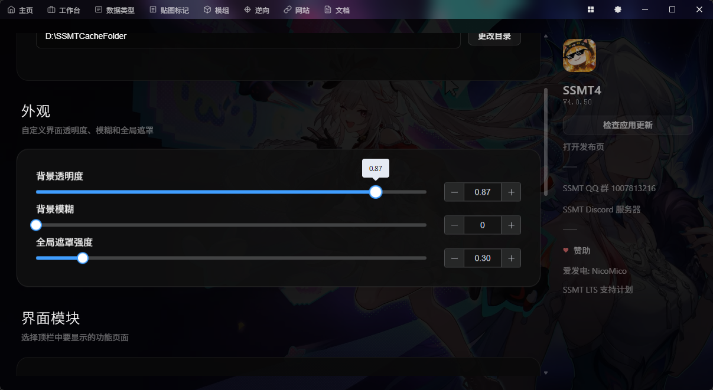

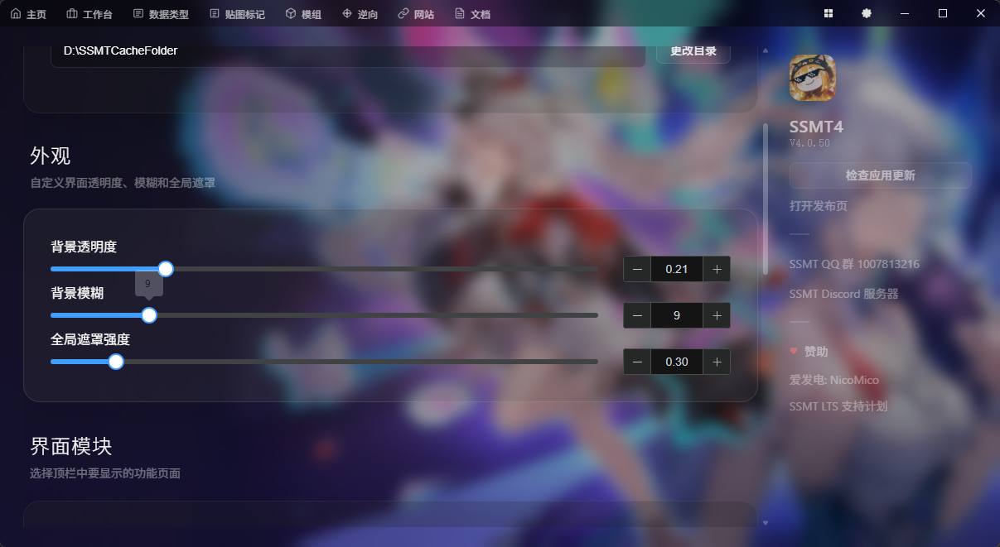

# 版本更新

如果你的网络能够正常联通Github，可以点击 检查应用更新 按钮来全自动进行更新：

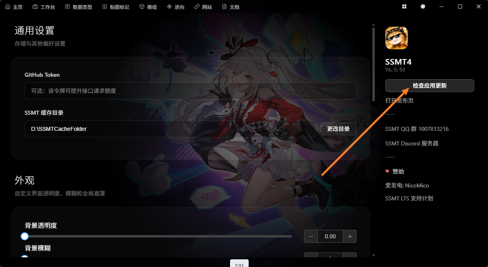

或者也可以去Github页面手动下载后安装，很灵活

