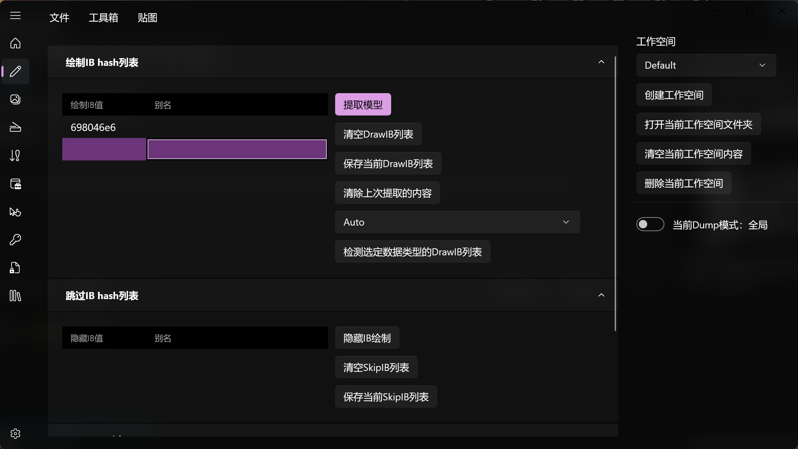
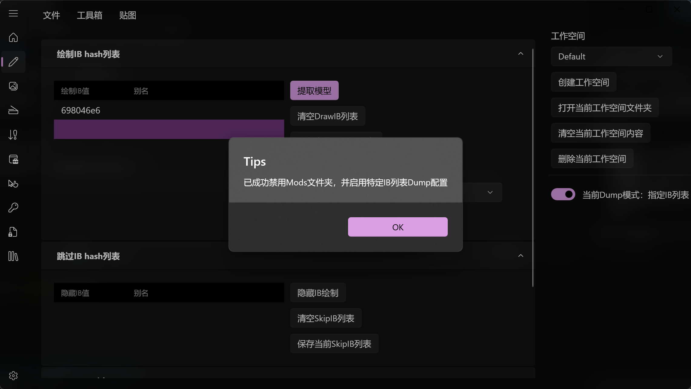
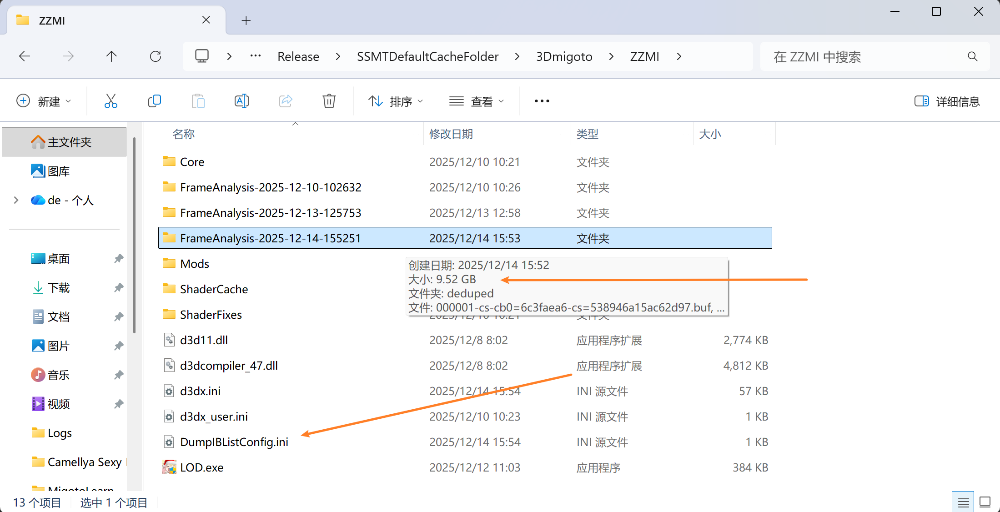
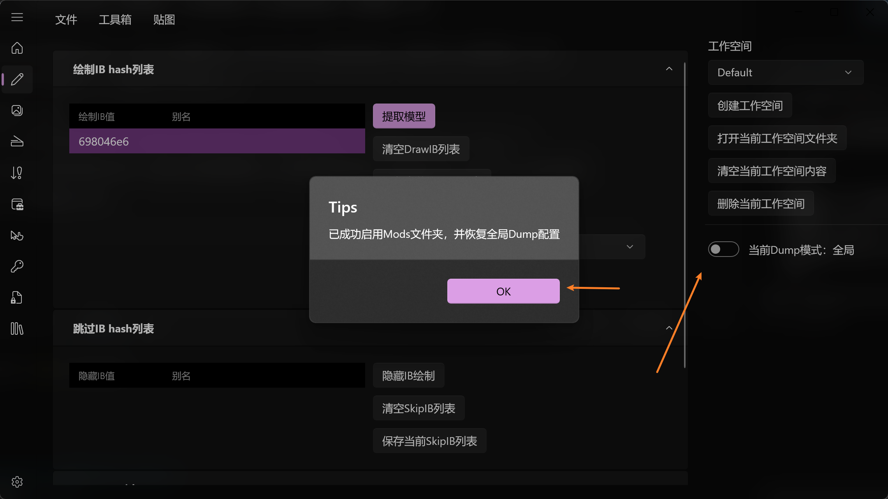
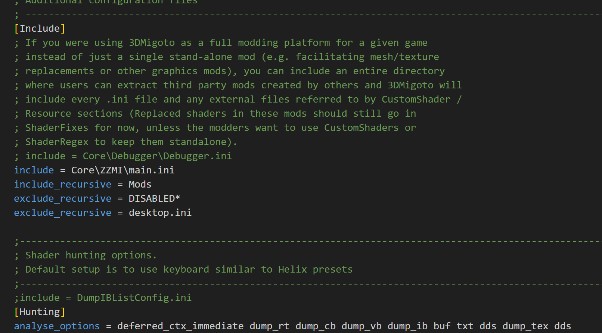
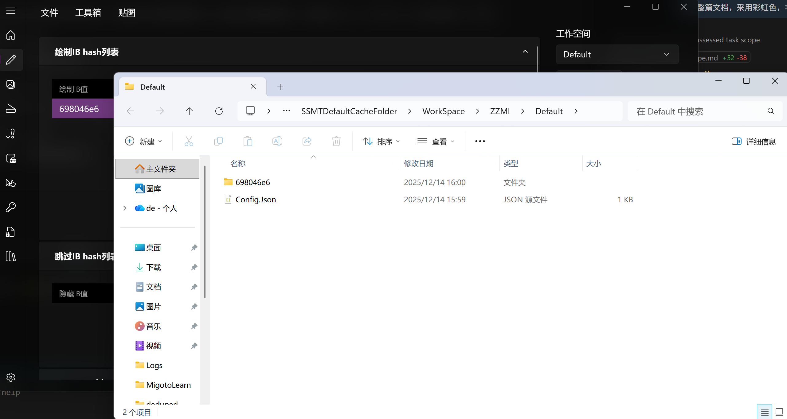
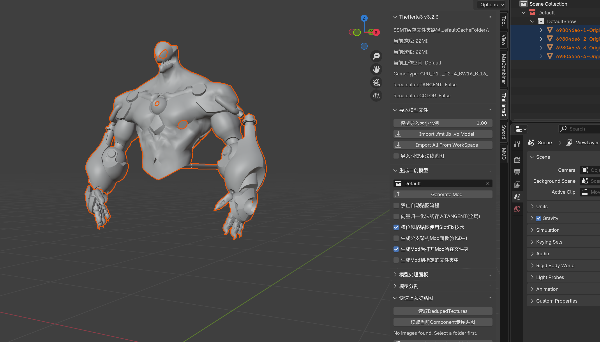

# 🌌 赛博瘦身术：指定 IB 列表 Dump 终极指南 🌈

## 💥 遭遇数据风暴？

在 **ZZZ (绝区零)** 等高算力消耗的游戏中，当你试图捕获（Dump）场景中的某个 NPC 时，是否遇到过这种绝望？😫

*   👀 已经抬头看天，试图避开纷扰...
*   🧹 视野内杂物已清空...
*   🔗 **Symlink** 加速引擎已启动...
*   ➕ 绿字界面已还原...

**⚠️ 警告：** 依然有 **200+** 个 IB 在视网膜上跳动！
**⚠️ 警告：** Dump 进程卡死 **10分钟**！
**⚠️ 警告：** 硬盘瞬间被 **30G** 垃圾数据填满！💥

常规的“瘦身技巧”已失效，我们需要启动 **重型武器** 了。🛠️

✨ **隆重登场：指定 IB 列表 Dump 功能 (Targeted IB Dump Protocol)** ✨
*(此黑科技同样适用于 GIMI, SRMI, HIMI, ZZMI, WWMI 全系列宇宙)*

---

## 🚀 启动：精准打击模式

### 1️⃣ 🎯 锁定目标 (Target Lock)
首先，在绿字海洋中找到你要 Dump 的 NPC 的 **IB Hash**，将其复制。

### 2️⃣ 💾 注入数据 (Data Injection)
将 Hash 粘贴到 SSMT 工作台的 **IB 列表** 区域。

### 3️⃣ 🔛 激活协议 (Activate Protocol)
点击右侧的 **“指定 IB 列表 Dump”** 开关。🔴 ➡️ 🟢

### 4️⃣ ⚡ 执行提取 (Execute)
1.  在弹出的提示框中点击 **确定**。
2.  回到游戏，按 **`F10`** 刷新配置 (Reload Config)。🔄
3.  按 **`+`** 还原绿字界面。
4.  按下 **`F8`** —— **见证奇迹的时刻！** ✨

---

## 📊 战果分析 (Result Analysis)

*   📉 **体积暴减**：从 **30G** ➡️ **9G** (甚至更小！)
*   ⚡ **极速响应**：从 **10分钟** ➡️ **1分钟** (速度提升 **1000%** 🚀)

此时，你的 `3Dmigoto` 目录下会生成一个临时的战术文件：`DumpIBListConfig.ini`。

---

## 🛑 紧急：系统复原 (System Restore)

**⚠️ 这一步至关重要！请勿跳过！⚠️**

该功能的原理是生成 `DumpIBListConfig.ini` 并 **强制禁用所有 Mods** (通过修改 `d3dx.ini` 的 include 部分)，以确保只提取目标数据。

**任务完成后，必须手动关闭开关以恢复常态：**

1.  点击开关 **关闭** 指定 IB Dump 模式。🟢 ➡️ 🔴

    

2.  确认 `d3dx.ini` 已恢复正常。

    

3.  返回工作台，**正常提取模型**。

    

4.  导入 Blender，继续你的创作之旅！🎨

    

---

## 📝 核心备忘录 (Core Memo)

*   🔴 **复原警告**：Dump 结束后 **必须关闭开关**！否则你的 Mods 将全部失效（被系统屏蔽），游戏会变成原版画质。
*   💎 **高阶技巧**：善用此功能，不仅能 **极大提高效率**，还能 **拯救你的 SSD 寿命**。
*   🏆 **大师认证**：这是每一位高阶 Mod 作者都在使用的 **秘密武器**。

**Stay Cyber, Stay Efficient. 😎**