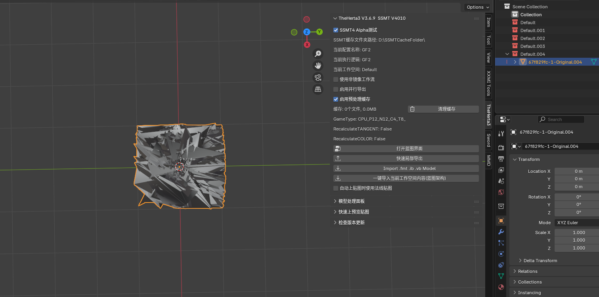
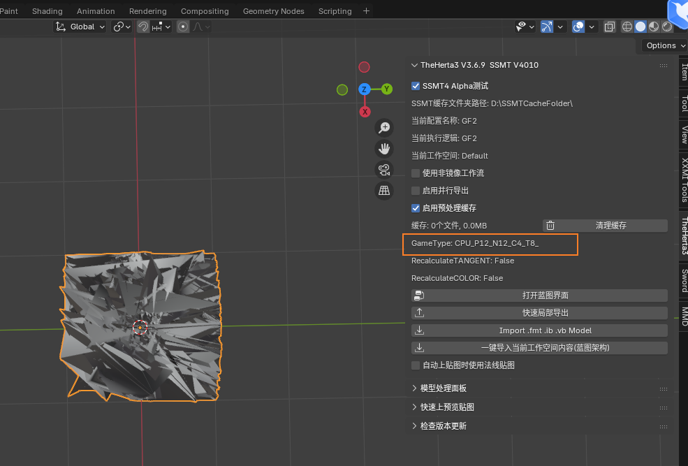
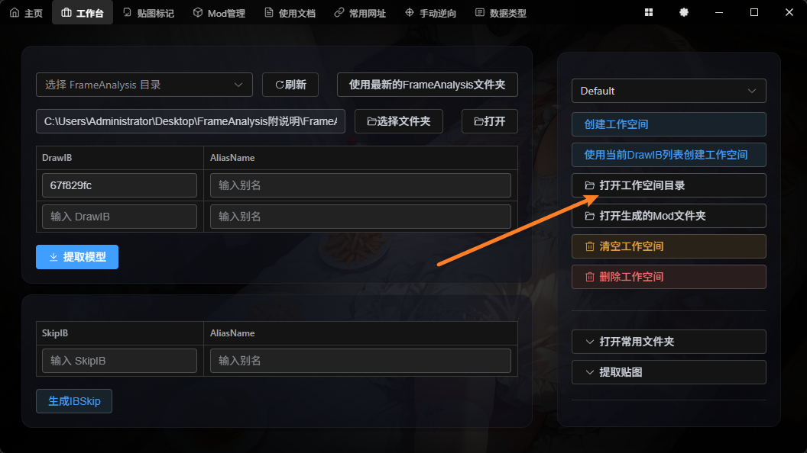
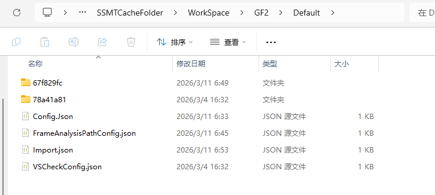
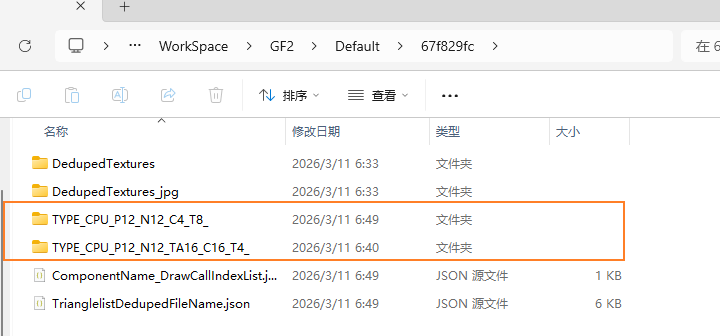
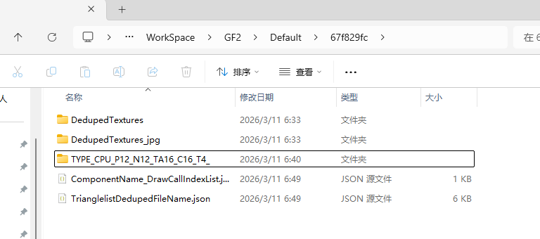
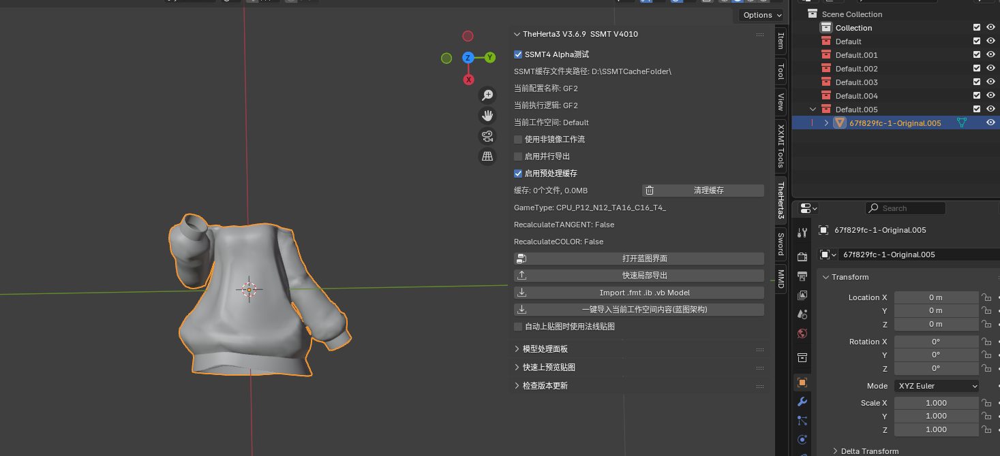

# 提取模型有多个数据类型

SSMT的提取模型方法是遍历识别每一种可能的数据类型，所以有时候可能会错误的识别到多种数据类型。

以GF2举例，提取模型后，直接导入发现模型炸了：

此时我们可以看到，面板上显示的数据类型是：

CPU_P12_N12_C4_T8_

此时我们返回SSMT，点击打开工作空间目录：

然后可以看到DrawIB为名称的文件夹

我们此时的DrawIB是：67f829fc，点进去，可以看到有两个数据类型文件夹：

所有的数据类型文件夹都是以TYPE_开头的，CPU-PreSkinning类型是TYPE_CPU_开头，GPU-PreSkinning类型是TYPE_GPU_开头

此时我们只需要删除这个错误的数据类型 CPU_P12_N12_C4_T8_ 为名称的文件夹：

然后重新一键导入：

可以看到，模型正常了。

提取出来有多个数据类型的情况有多种，有些很明显，会导致模型炸裂

有些则不明显，只是UV有错误

所以不管是提取游戏原模型，还是逆向Mod后导入模型，在SSMT的操作规范流程中都要先检查模型是否完整可用，再进行后续的操作。

如果模型有问题，第一时间应该想到是不是数据类型错误，并尝试换个数据类型。

实在解决不了，或者没有正确的数据类型，可以在数据类型页面添加，或者不会的话也可以找我来添加。
