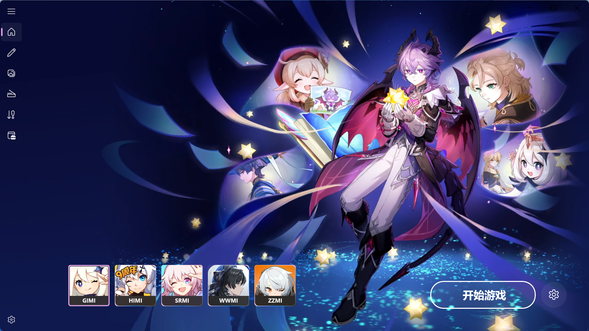
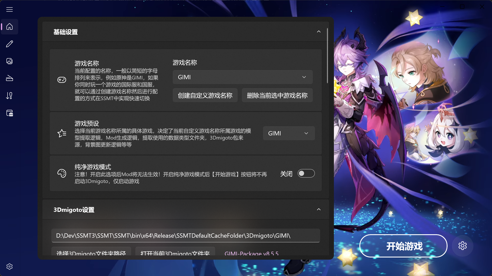
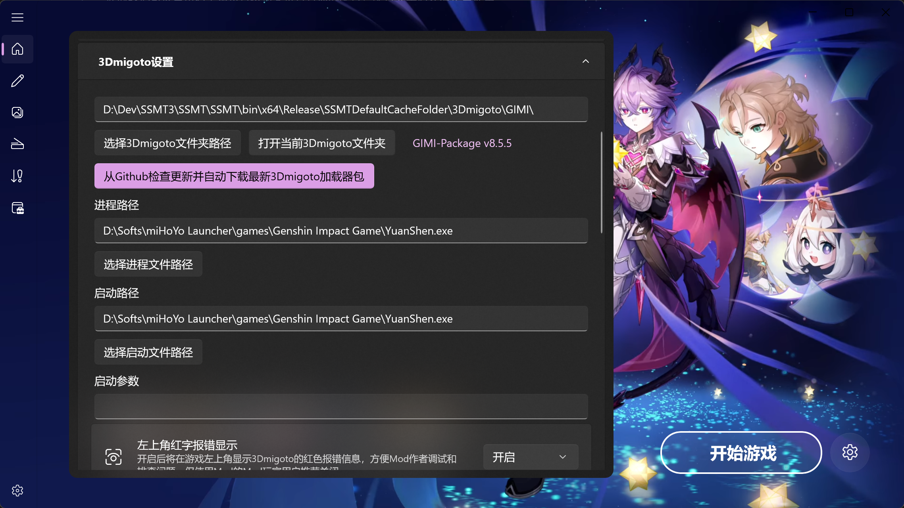
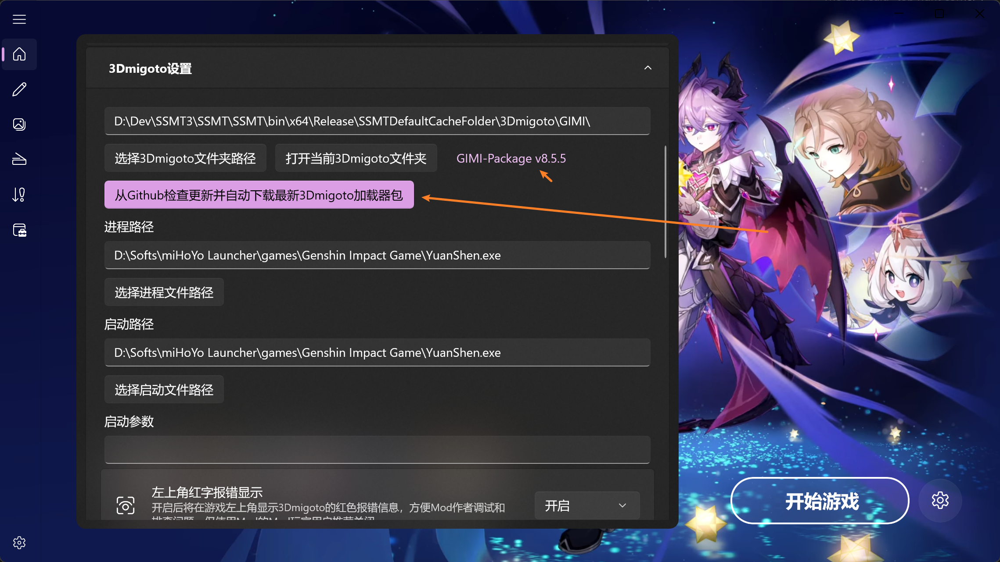
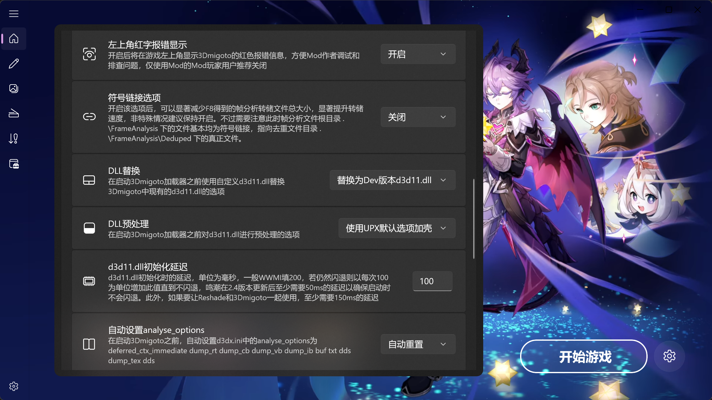
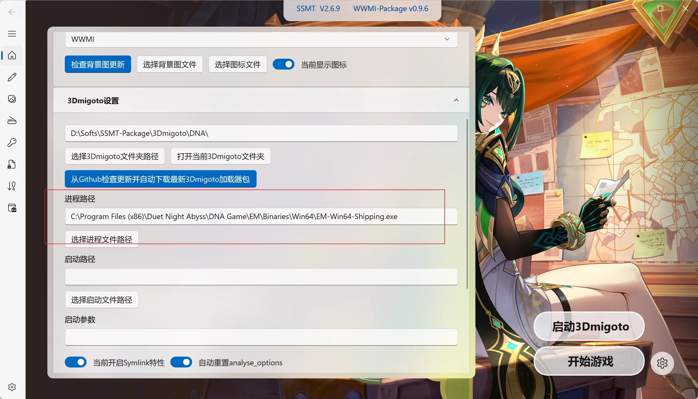
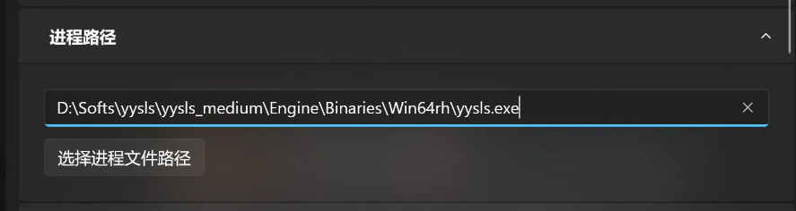
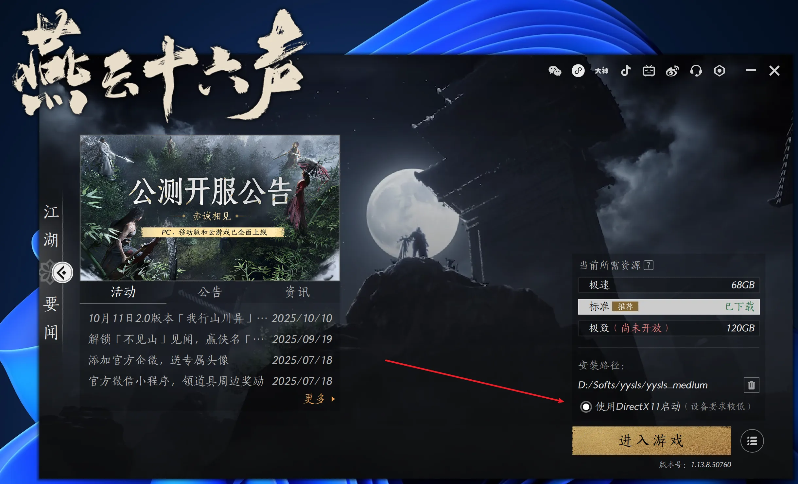
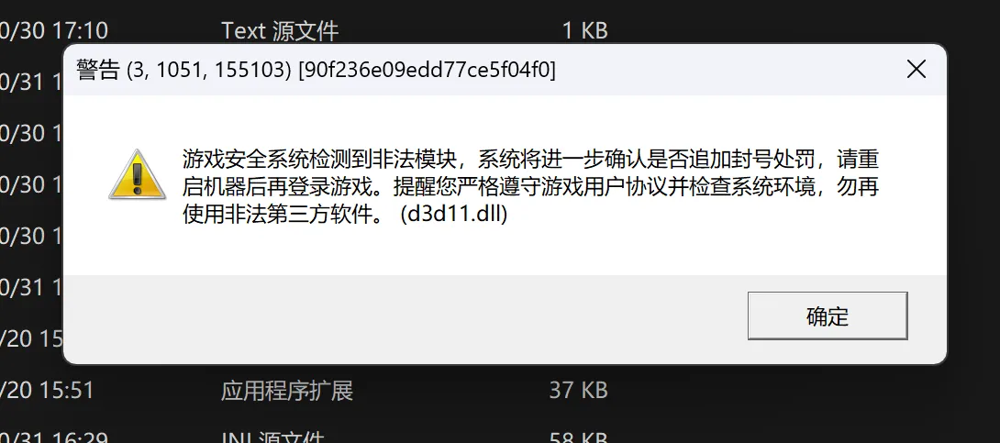

# 🏠 SSMT3 主页配置指南

欢迎来到 **SSMT3** 的配置世界！第一次安装好后，让我们一步步配置它，让工具为你量身定制。🔧

## 📋 初始界面与基本配置

安装完成后，打开 **SSMT3**，默认显示 5 个游戏：



点击右下角的 **设置按钮** 进行具体配置。配置完毕后，才能正常使用！

本次以 **原神** 为例演示：



- 🎮 **游戏名称**：自定义游戏名称，默认自带一些，你也可以创建新的。
- 🎯 **游戏预设**：非常重要！每个游戏都有唯一的预设，例如原神选择 **GIMI**。
- 🧹 **纯净游戏模式**：只有特殊需要的人才开启，一般不用。



- 📁 **3Dmigoto 路径**：安装完毕后，默认设置到 SSMT 缓存文件夹。如果你结合第三方工具，可以手动选择目录。
- ⬇️ **自动下载**：点击按钮自动下载每个游戏预设推荐的 3Dmigoto 包！




如果你没有选择3Dmigoto包，或者没有点自动下载的话，切换到对应没配置3Dmigoto文件夹的游戏就会弹出一个顶部通知提示你：


- 🔗 **进程路径**：3Dmigoto 要注入到的游戏进程路径。
- 🚀 **启动路径**：点击【开始游戏】后，先启动注入器，再启动游戏的路径。
- ⚙️ **启动参数**：顾名思义，用到了就填。



> 💡 **小贴士**：剩余配置都有详细介绍，多试试就会了！

## 🎮 各游戏配置注意事项

### 🌟 二重螺旋、卡拉比丘、尘白禁区
- 游戏预设都选 **SnowBreak** 即可。

其中 **二重螺旋** 的游戏路径如下，不要选错了：



> ⚠️ **重要提醒**：二重螺旋的收入全部 100% 来自于皮肤，不建议制作 Mod 发布，只建议用来制作二创视频。

### 🎯 其他游戏预设
- 原神：**GIMI**
- 崩坏三：**HIMI**
- 崩坏：星穹铁道：**SRMI**
- 绝区零：**ZZMI**
- 鸣潮：**WWMI**
- 少女前线 2 及其他 Unity CPU PreSkinning 类型：**GF2**
- 燕云十六声：**YYSLS**

### 🏹 燕云十六声特殊配置
进程路径比较特殊，有时候是 `r` 有时候是 `rh`：



游戏启动时随机选择进程，导致注入失败。以如下路径为例：

```
D:\yysls\yysls_medium\Engine\Binaries\Win64r\yysls.exe
```

如果不对，换成 `rh`：

```
D:\yysls\yysls_medium\Engine\Binaries\Win64rh\yysls.exe
```

启动路径不填，因为 3Dmigoto 只支持 DX11，需要从官方启动器启动，并勾选 DX11 选项：



### 🚫 解限机已不支持
很显然，解限机是 PVP 游戏，且卖皮肤，且机甲模型是宝贝，且之前上了高价值模型保护系统。使用 ACE 来拦截任何可能的外挂程序。

> 🎉 配置完成后，享受你的 Mod 制作之旅吧！

之前在公测的时候还是可以使用的，但是目前已经无法使用了，所以各位就不要再尝试了。



