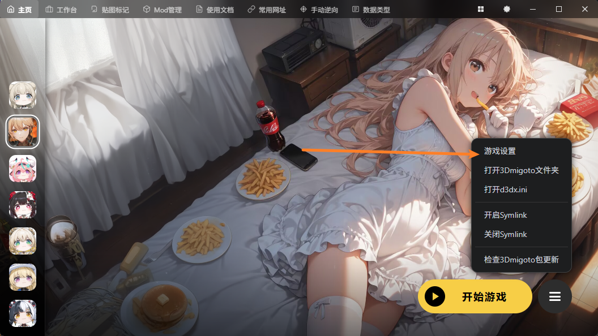
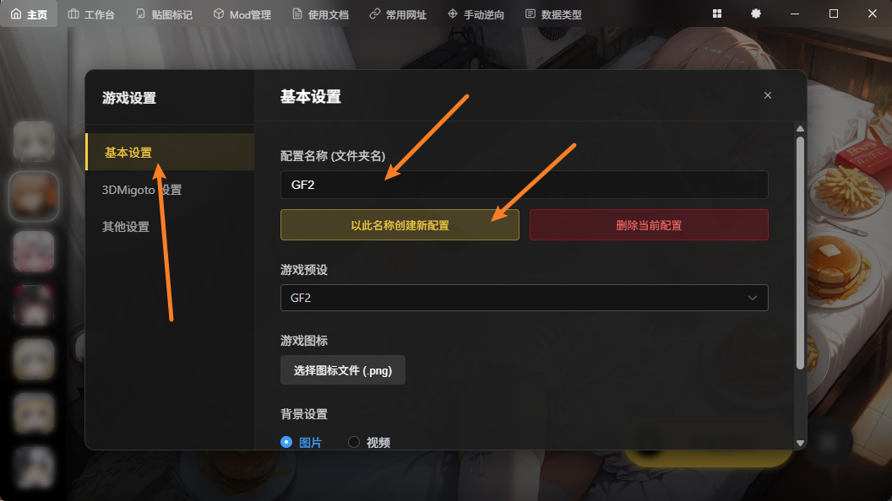
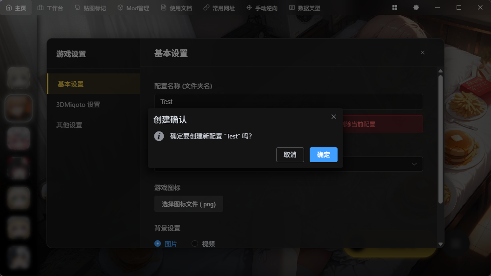
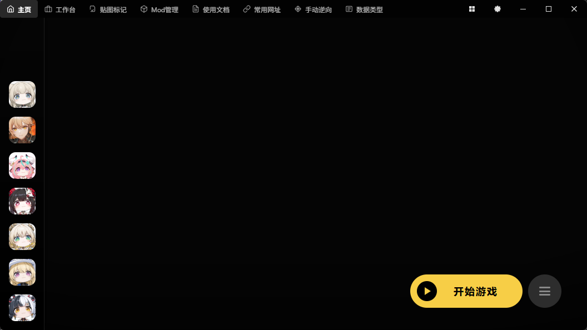
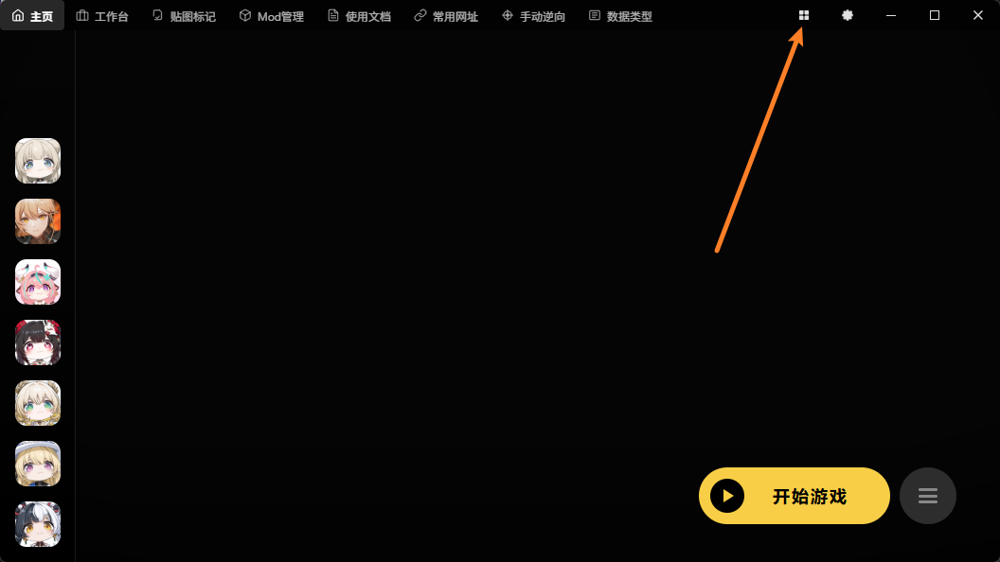
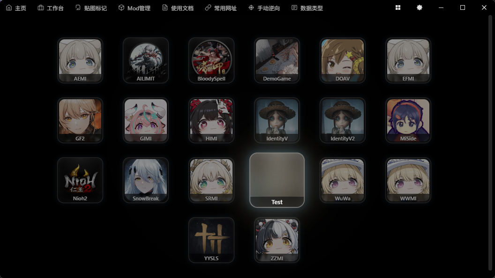
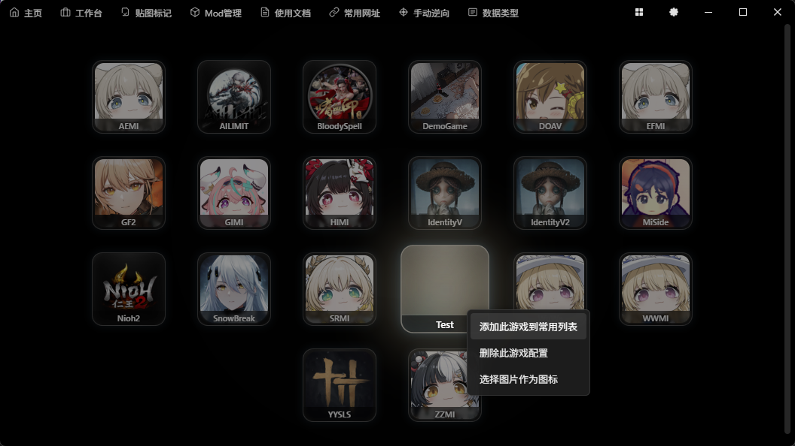
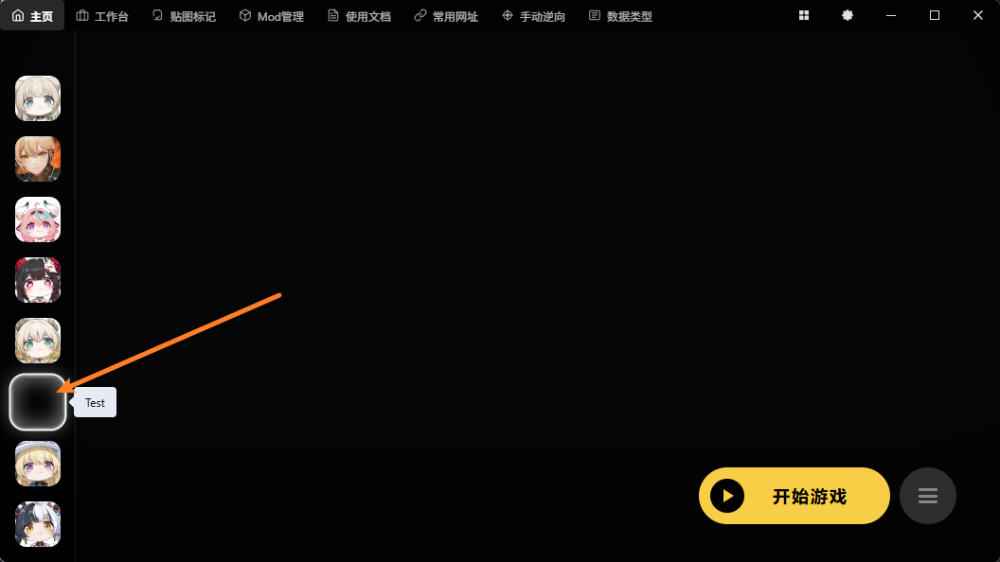

# 如何创建新游戏配置？

# 第一种方式

> 注意：新版本中可能已经移除此方式，请查看第二种方式。

第一个方法是，切换到任意游戏，点击右下角 游戏设置 按钮：

基础设置分类中可以填写新的配置名称，点击创建即可：

这里我们输入Test，点击创建，就多了一个Test配置：

创建完成后，默认是放在游戏库页面的，你也可以手动加入左侧常用列表：

右键添加此游戏到常用列表

点击后跳转回主页，并添加好了：

# 第二种方式

切换到游戏库页面，任意位置右键：

点击新增游戏配置：

填写后就创建完成了，你可以右键把它放到常用列表：

# 总结

一般情况下是不需要添加自定义配置的，除非你有特殊需求

例如你有原神国际服和国服，你需要两个图标。

例如你有新游戏需要测试，你需要复用某个游戏预设。