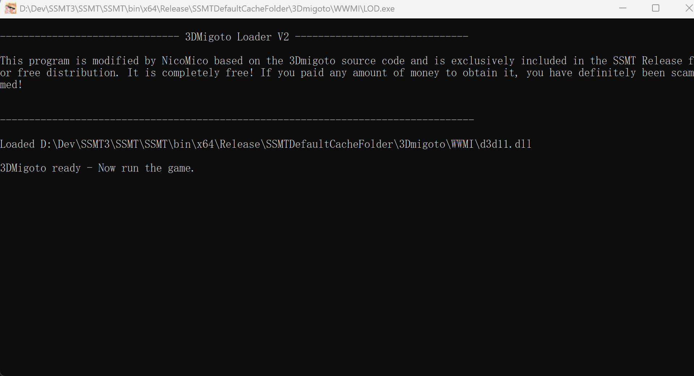
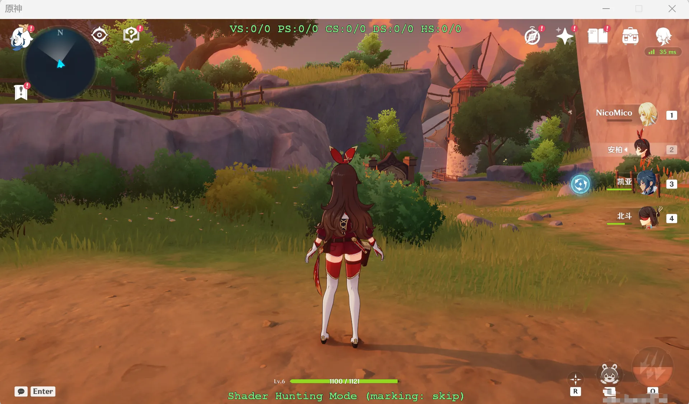

# 🔗 3Dmigoto 注入游戏指南

准备好让 **3Dmigoto** 与你的游戏完美融合了吗？确保你已经完成了 **主页配置** 步骤，然后跟随这些简单步骤注入吧！🎮

## 🚀 1. 主页配置完成后，点击【开始游戏】

点击 **【开始游戏】** 按钮，会先启动 **LOD.exe** 并显示如下界面：

> ⚠️ **如果没有启动 LOD.exe**：可能是你开启了 **纯净模式**，或者 **LOD.exe** 被微软安全设置中的 **Smart Screen** 拦截了。

启动 **LOD.exe** 后，会自动运行 **启动路径** 中的程序。如果没填启动路径，就需要 **手动启动游戏** 了。

随后，在游戏中成功注入 **3Dmigoto**：

🎉 注入成功！现在你可以进行其他步骤了，比如提取模型或制作 Mod。享受你的创作之旅吧！