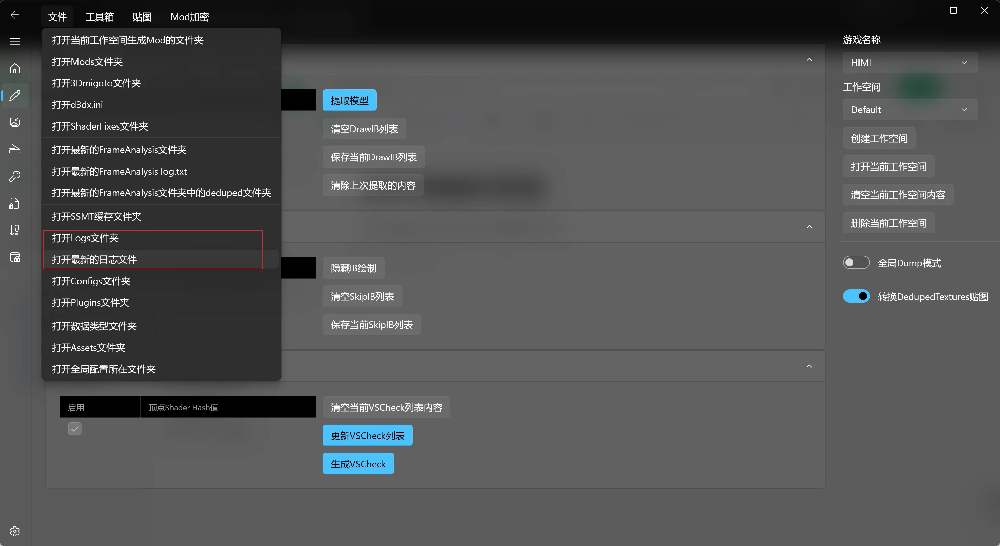
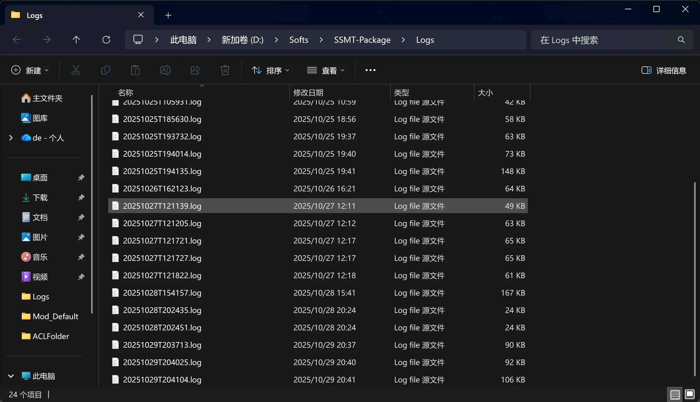
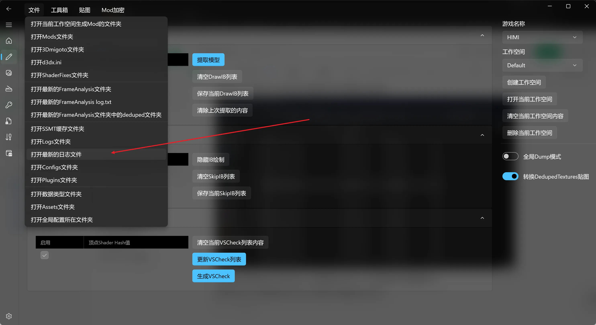
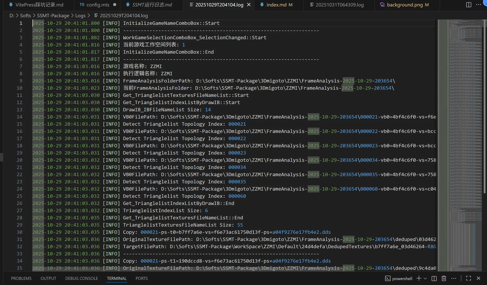

# 📋 SSMT 运行日志指南

在使用 **SSMT** 的过程中遇到错误？别慌！运行日志是你的最佳助手，能帮你快速排查问题。🔍

## 🚨 遇到错误怎么办？

如果遇到错误，请将 **SSMT** 最近一次运行的日志或完整操作触发 BUG 的录屏发给我，以便协助排查。

## 📂 如何打开运行日志？

**SSMT** 的运行日志可以在工作台的菜单中打开：

点击后，会打开 **Logs 文件夹**，即 SSMT 缓存文件夹下的 Logs 目录：

你会发现这里有很多 `.log` 日志文件，其实都是文本文件，可以用任意文本编辑器打开。

## 🔍 查看最新日志

如果你点击 **【打开最新的日志文件】**，则自动打开这个日志文件夹下面最新的日志文件：

可以看到，我这里因为默认设置使用 **VS Code** 打开 `.log` 文件，所以就在 VS Code 中打开了。里面一行一行记录了程序的运行日志。

> 💡 **小贴士**：一般如果运行出现错误，错误会在日志的 **最后几行** 显示。如果你遇到了问题需要技术支持，把那次运行失败的日志文件发给我，方便协助排查。因为如果不发日志，有时候信息传递不完整，导致很难理解问题出在哪里，还得反复问细节。

> 🎥 **额外建议**：有条件的话，最好也录屏发一下错误的完整触发过程！

