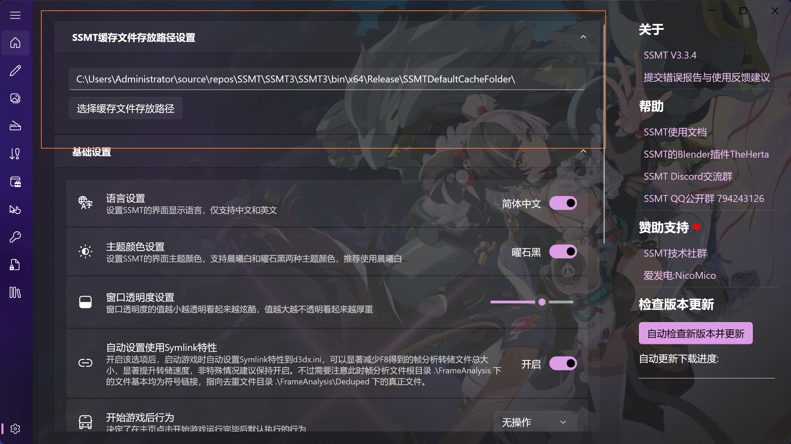
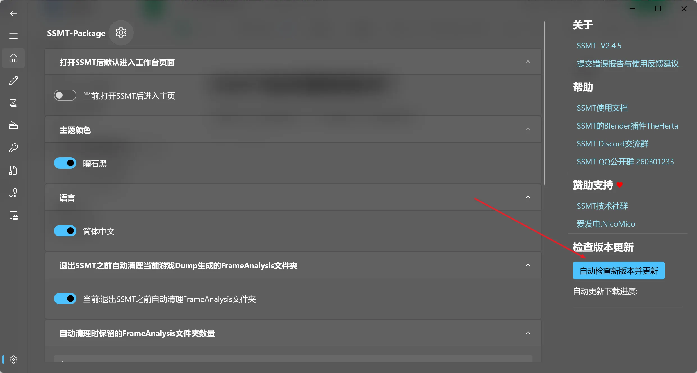
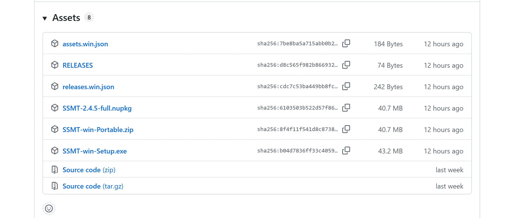

# 🔄 SSMT 版本更新指南

欢迎来到版本更新小课堂！保持软件最新，就像给赛车换上新轮胎，跑得更稳更快哦。🏎️💨

## 🛠️ 手动更新

如果你喜欢亲力亲为，手动更新是你的不二之选。你可以前往 **GitHub**、网盘链接或者群文件下载 SSMT 的压缩包，解压到桌面就能直接使用啦。

::: tip 💡 萌新小贴士
在开始之前，请先检查你是否设置了 `SSMT缓存文件存放路径`。
:::

如果你的缓存文件存放路径还在解压出来的 SSMT 文件夹旁边，建议把它设置到一个**固定的、很久都不会变**的位置。

这样做的好处是：只要设置过一次，后续更新 SSMT 时，新版本会自动读取全局配置定位到这个文件夹。也就是说，你不需要再手动迁移 3Dmigoto、Mod文件 等内容了，缓存文件夹中的宝藏可以在多个版本中完美复用！✨

### 🚫 手动更新需要覆盖旧版本吗？

::: danger 🛑 绝对禁止覆盖
请直接解压新版本使用，**不要**覆盖旧版本文件！
:::

**为什么不能覆盖呢？** 🤔
SSMT 的文件结构在每个版本都可能发生变动。如果你选择覆盖，旧版本残留的文件可能会像幽灵一样干扰新版本的运行，导致各种奇奇怪怪的问题。覆盖是一个危险行为，我们不推荐哦。

**最佳实践方案** 🌟
只要你之前已经把 SSMT 的缓存文件夹设置到了磁盘上一个固定的地方，那么更新就变得超级简单：

1.  确保 SSMT缓存文件夹 已设置到自定义路径（不要放在 SSMT 文件夹内部）。
2.  删除旧的 SSMT 本体文件夹（拜拜了您嘞 👋）。
3.  解压新的 SSMT 安装包，直接运行。

新旧 SSMT 共享全局配置文件，新版本会无缝衔接，直接读取旧配置并找到你的缓存文件夹。丝滑切换，就是这么简单！

## 🤖 自动更新

如果你比较懒（像我一样），可以使用自动更新功能。切换到 SSMT 的设置页面，点击右下角的按钮即可 **自动更新版本**：

### 🔧 自动更新按钮报错怎么办？

如果报错了，通常是因为你的网络无法连接到 **GitHub**。毕竟自动更新是去 GitHub 搬运最新版回来。

::: warning 🌐 网络连接提示
建议开启 **加速器**、**梯子** 或 **魔法** 🪄，确保你能顺畅访问 GitHub 后再点击自动更新。如果实在连不上，手动更新也是个不错的选择。
:::

### 📥 GitHub 这么多选项下载哪一个？

面对琳琅满目的下载选项，是不是有点眼花缭乱？别担心，看这里：

*   🏆 **首选推荐**：下载 `SSMT-win-Portable.zip`。这是便携版，解压到桌面就能直接用，干净又卫生。
*   📦 **安装包**：如果你有安装包情结，也可以下载 `SSMT-win-Setup.exe`。但请注意，这个安装包会强制一键安装到 C 盘，无法自定义路径哦。

---

## 📅 结语

更新软件其实就像给房间大扫除，虽然偶尔会遇到一点小麻烦，但焕然一新的感觉真的很棒！希望这份指南能帮你轻松搞定更新。

📅 **最后更新日期**：2025年12月16日

---

::: details 📜 免责声明 (点我展开)
本文档仅供**学习交流**使用，旨在帮助大家更好地理解软件操作流程。
*   🚫 请勿用于任何**商业用途**。
*   ⚖️ 作者不对因使用本文档所述方法导致的任何直接或间接损失负责。
*   🎮 软件使用需谨慎，请备份好重要数据。
*   🙏 仅供参考，如有雷同，纯属巧合。
*   🤖 **此文档内容由AI生成，仅供参考。**
:::

