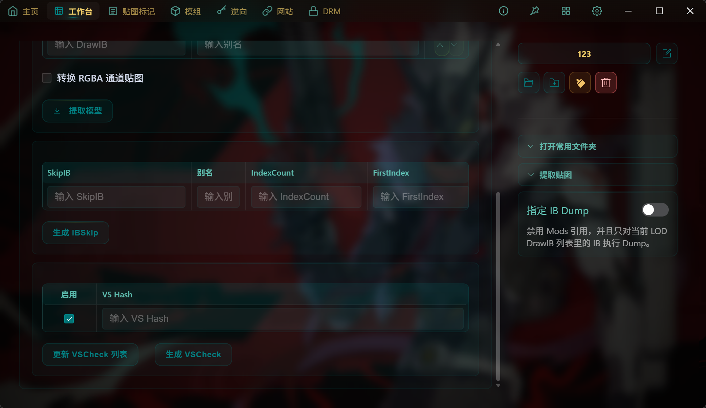

# 什么是VSCheck？

VSCheck是SSMT中的一个用于测试的概念，全程Vertex Shader Check

此功能诞生的原因是：

- 部分游戏使用全局check会导致严重掉帧问题
- 部分游戏某些特殊VS被Check之后，会导致游戏画面卡顿，黑屏等问题

为了解决这个问题，我们不使用全局Check防止误伤

而是在需要Check的时候，Check指定的VertexShader Hash来避免误伤，且容易排查出哪些VS是不能进行Check的

这里的VSCheck列表，在你填写了DrawIB列表或者SkipIB列表后，就可以点击更新VSCheck列表

它会从当前选定的FrameAnalysis文件夹中寻找当前填写的两个IB列表的IB在Dump文件中用到的所有VS

然后把这些VS都更新到列表里，已经有的不会重复添加，只会添加没有的

这样在我们的测试加载器 MinBase-Package里，没有设置任何全局Check的情况下，通过生成VSCheck就能让Mod生效

缺点是游戏更新时，VS可能会发生变化，从而导致之前做的Mod失效

但是Mod失效未尝不是好事，至少在商业情况下对作者来说是好事，对玩家来说不是好事。

此功能大部分时候用于测试阶段使用，而非正式发布使用

