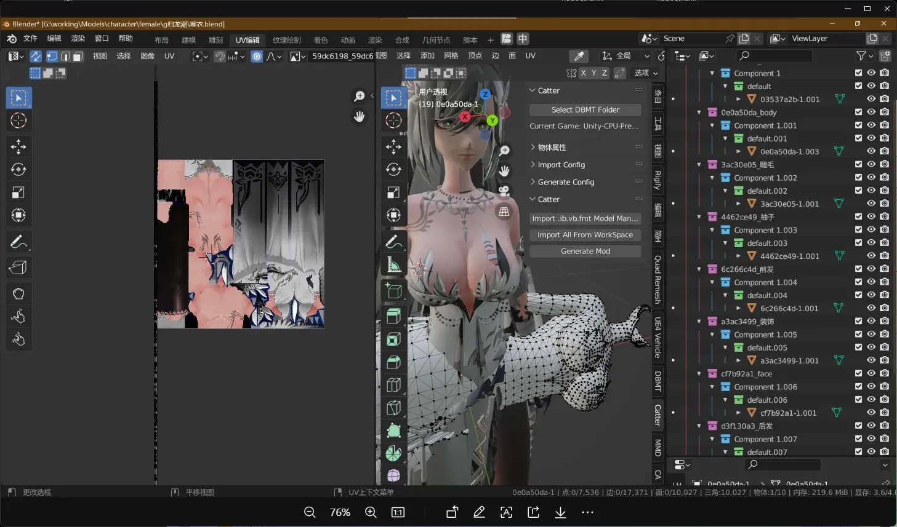
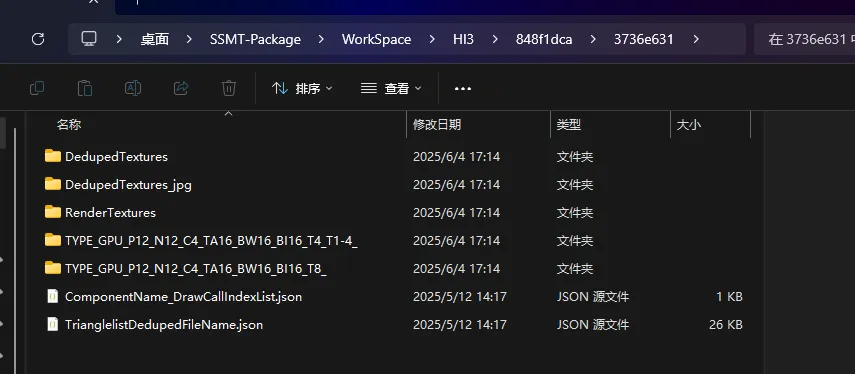

# 🗺️ 导入模型后 UV 错误怎么办？

## 🚫 问题描述

**SSMT** 提取时会把符合 **Buffer** 步长的数据类型都提取出来，大部分时候都是正确的。

但是如果导入后 **UV** 不正确，例如下图，可以看看是不是导入 **Blender** 的数据类型错了。

## 🛠️ 解决方案

### 方法一：更换数据类型

如果有多个数据类型则换个数据类型导入。

### 方法二：删除错误数据类型

这里我们可以打开当前工作空间对应这个 **IB** 的 **Hash** 的文件夹，然后删掉错误的数据类型，只保留正确的数据类型即可。

比如上图中有两个数据类型，他们的 **UV** 的数据类型分别是 **T4_T1-4** 和 **T8**，即把 **Dump** 下来的 **Buffer** 描述为 **R16G16_FLOAT** 类型的两个 **UV**，或者把 **Dump** 下来的 **Buffer** 描述为 **R32G32_FLOAT** 类型的一个 **UV**。

虽然总长度都是 8，但是两种不同的 **UV** 描述会导致 **Blender** 解析数据时完全不同的结果。

### 方法三：联系开发者

如果只有一个还错误，说明 **SSMT** 暂未添加支持，可以联系开发者添加这个数据类型的支持。

> 💡 **提示**：通过检查和调整数据类型，可以解决大多数 **UV** 导入错误问题。

