# SSMT 的 Blender 插件安装教程

## 要求

推荐使用 Blender 4.5 LTS 或更高版本。

## 下载插件

前往 [GitHub 仓库](https://github.com/StarBobis/TheHerta4)，下载 Release 中的最新插件压缩包。

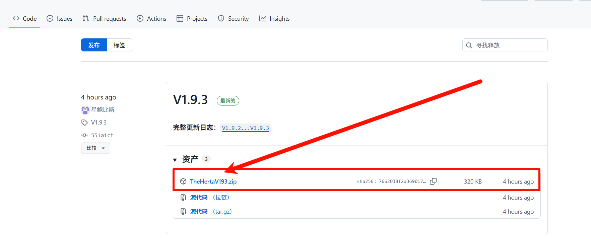

下面以 Blender 4.2.9 和 Blender 3.6.23 为例。

## Blender 4.2.9 及以上

1. 顶部菜单选择 `编辑` > `偏好设置`。

   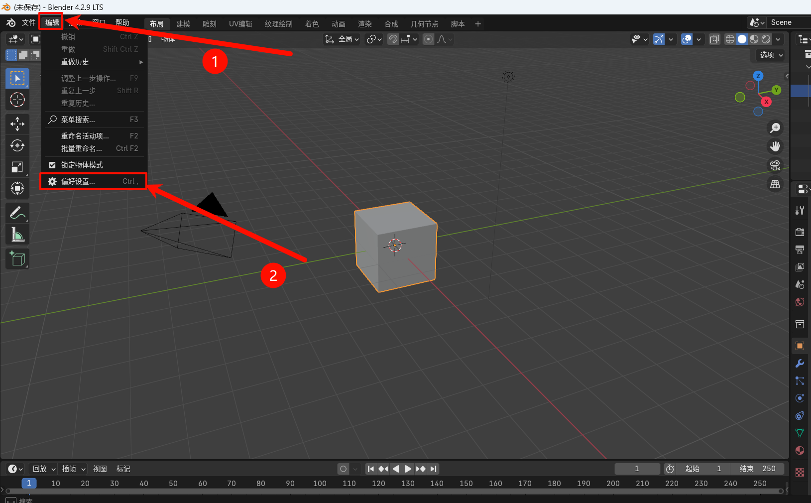

2. 进入 `插件`，点击右上角箭头，选择 `从磁盘安装`。

   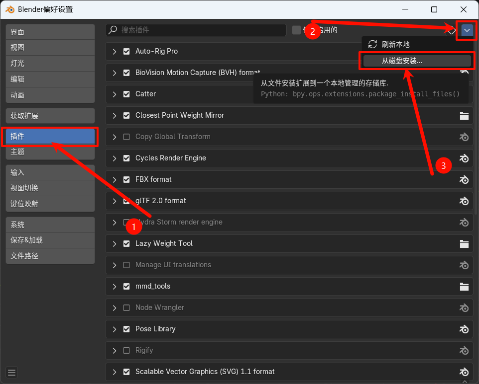

3. 选择下载好的 `TheHertaVxxx.zip`，点击 `从磁盘安装`。

   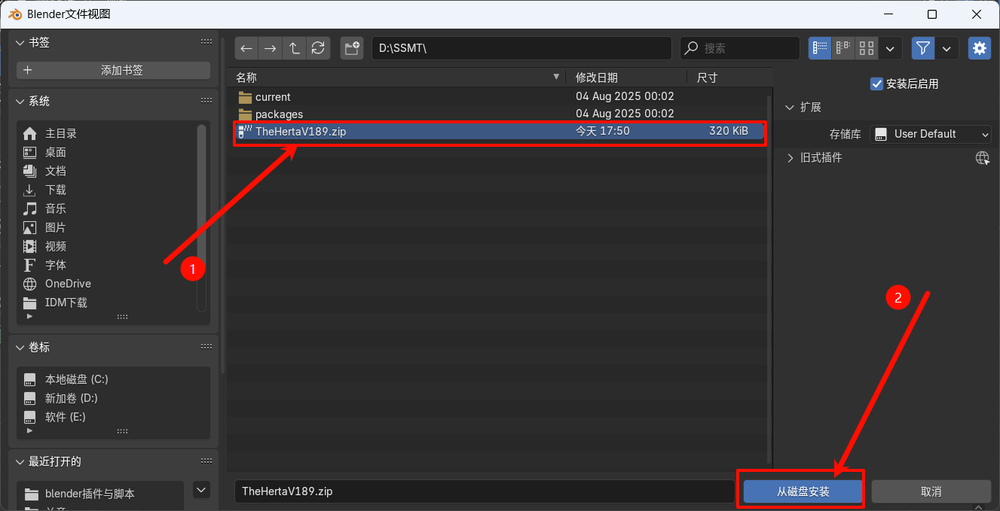

4. 关闭偏好设置。在 3D 视图中按 `N` 打开侧栏，确认出现 `TheHerta`。

   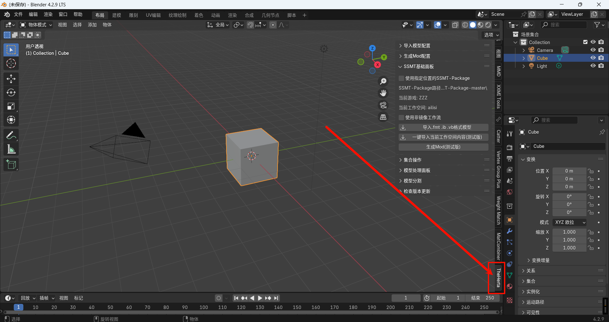

## Blender 3.6.23

1. 打开 `偏好设置`。

2. 进入 `插件`，点击顶部的 `安装`。

   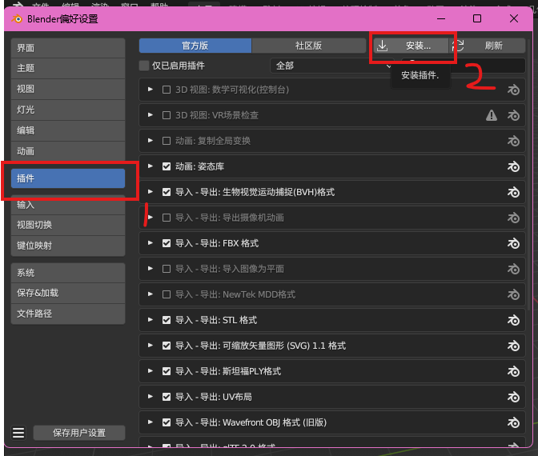

3. 选择下载好的 `TheHertaVxxx.zip` 并安装。

4. 切换到 `社区版`，勾选启用插件，然后保存配置。

   如果找不到插件，可以在 `社区版` 中搜索 `SSMT`。

   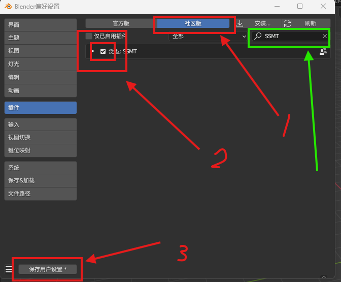

5. 在 3D 视图中按 `N` 打开侧栏，确认出现 `TheHerta`。

## 更新插件

在侧栏打开 `TheHerta` 工作菜单，点击 `检查 ssmt_blender_plugin 更新`。

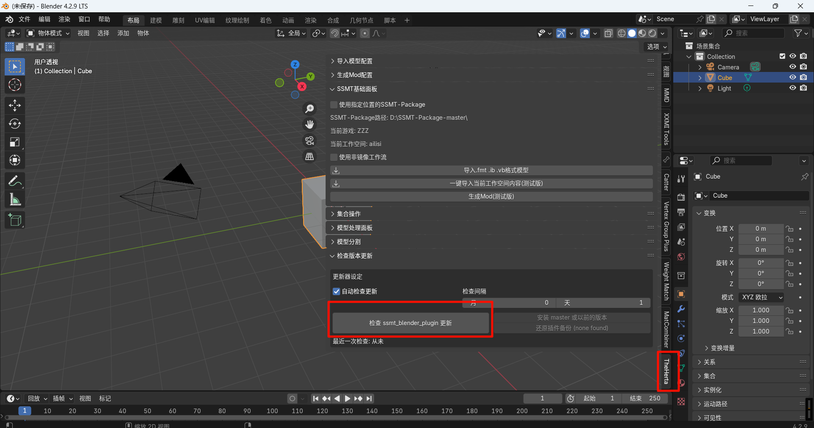
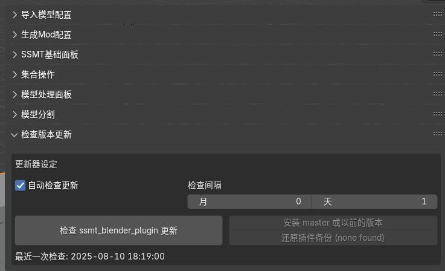

如果有更新，点击 `Update Now to (x.x.x)`。

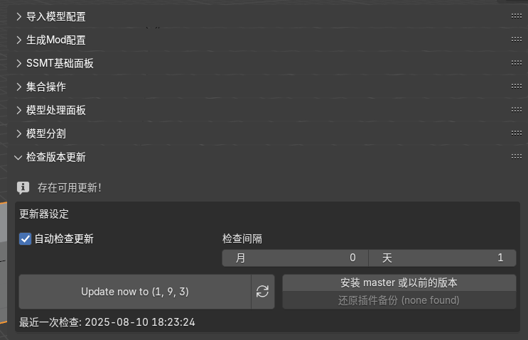

更新完成后重启 Blender。

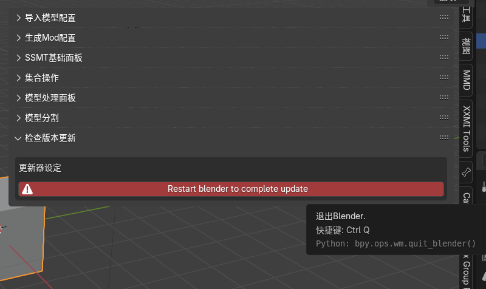
