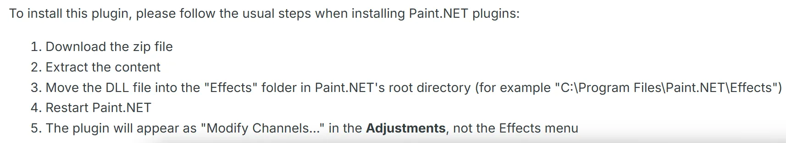

# 🔧 Paint.NET Modify Channels 插件

> **插件下载链接**: [Modify Channels v1.11 (2022-03-07)](https://forums.getpaint.net/topic/110805-modify-channels-v111-2022-03-07/)

## 📥 插件安装步骤

1. 下载插件文件。
2. 将插件文件放置到 Paint.NET 的插件目录中。
3. 重启 Paint.NET 以加载插件。

## ❓ 为什么要使用这个插件？

**为什么不直接用 PS + NVIDIA 或 Intel 插件？**

在实际使用过程中，某些贴图的 **Alpha 通道** 可能无法正确导出，导致游戏中模型发出耀眼的白光。

> **解决方案**: 使用 Paint.NET 的 Modify Channels 插件修改对应的通道，即可解决此问题。

> **提示**: 如果你没有遇到过这个问题，可能不需要这个插件。但如果你遇到过且无法通过 PS 工作流解决，不妨试试这个插件。