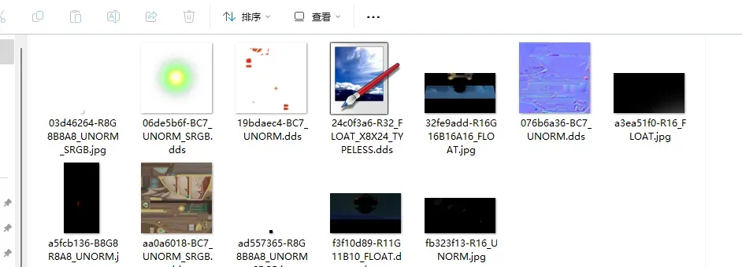
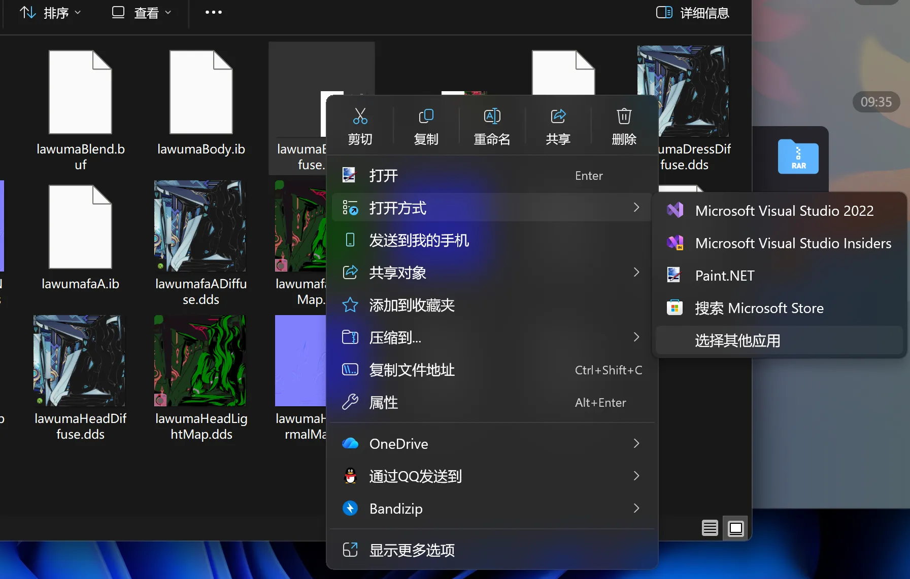
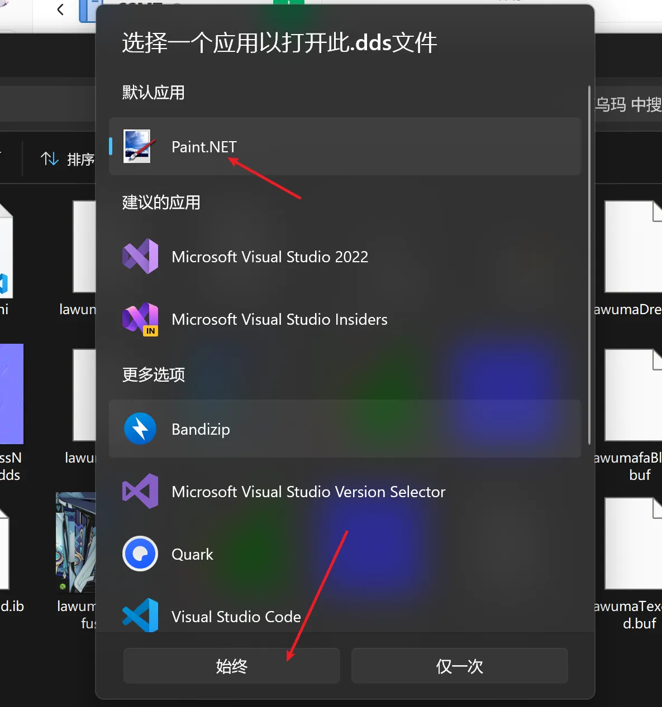

# 🎨 Paint.NET 工具介绍

在制作 **Mod** 的过程中，非常常用的一款工具是 **Paint.NET**。

## 📥 下载地址

- **GitHub Releases**: [https://github.com/paintdotnet/release/releases](https://github.com/paintdotnet/release/releases)

## 🛠️ 用途

- **提供 DDS 贴图预览图**：有了这个就能在文件夹中预览 **DDS** 格式贴图了。

- **快速修改并游戏内 F10 刷新查看效果**：很方便测试使用。
- **快速修改 DDS 贴图的格式**。

## 🚫 缺点

- **原版 Paint.NET 无法按通道修改贴图内容**。
- **功能较少**。

## 📋 安装后开启 DDS 贴图预览

因为安装之后默认选项的话是不会主动关联 **.dds** 格式贴图的，也就无法显示预览图，此时需要你 **右键 => 打开方式 => 选择其他应用**。

出来的界面里选择 **Paint.NET**，然后选择 **始终使用此应用打开**。

这样就能显示预览图了。

> 💡 **提示**：**Paint.NET** 是 Mod 制作中不可或缺的图像编辑工具，特别适合处理 DDS 贴图。

