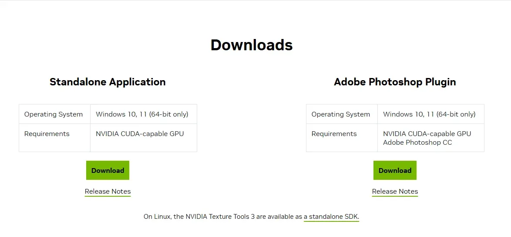
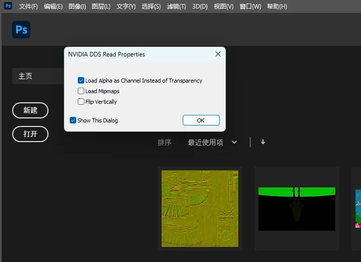

# 🔧 PhotoShop

**PS 就是 PhotoShop**，这个你自己下载一个版本就好了，推荐 **2021 及以上的版本**。

> **下载链接**: [Adobe PhotoShop](https://www.adobe.com/hk_en/products/photoshop.html)

## 🛠️ NVIDIA Texture Tools Plugin

NVIDIA Texture Tool 分为独立程序和 PS 的插件两个部分。

> **下载官网**: [NVIDIA Texture Tools Exporter](https://developer.nvidia.com/texture-tools-exporter)

结合 Paint.NET 使用可以覆盖 3Dmigoto 大部分贴图应用场景。

这里我们不推荐使用单独的程序，而是推荐使用右边的 **Adobe Photoshop Plugin**。

### 📥 安装步骤

安装也很简单，只要你的电脑上安装好了 PS，直接运行 Adobe Photoshop Plugin 的安装包一路下一步就安装好了。

这里要注意一个细节：

### ⚙️ 插件选项说明

安装这个插件后，在打开 DDS 文件时会弹出一个对话框指定加载选项。

- **Load Alpha as Channel Instead of Transparency**  
  这个选项顾名思义，Alpha 加载为单独的通道而不是透明度，这个非常重要，因为除了基础色之外大部分 DDS 贴图都有 4 个通道，而部分游戏的基础色贴图也使用 Alpha 通道绘制灰度值来控制游戏内部件渲染的透明度，所以这个必须勾选。

- **Load Mipmaps**  
  Mipmap 顾名思义，一般情况不需要加载，只有部分特殊情况，比如 UE 引擎可能会使用到。

- **Flip Vertically**  
  3Dmigoto 导出的所有贴图以及对应的 UV 都是上下相反，左右再相反的，这里千万不要勾选。

- **Show This Dialog**  
  这个必须勾选，不然以后打开 DDS 贴图就不显示这个对话框了，不勾选的话后面制作贴图时会很难受，会把 Alpha 加载为透明而不是通道，导致无法修改 Alpha 通道的内容，导致无法制作 mod。

## 🛠️ Intel Texture Works Plugin

部分用户反馈 NVIDIA 的 DDS 插件不太好用，PS 的 Intel DDS 插件更好用。

的确，PS 默认保存 DDS 格式的贴图时，总是保存为固定的 BC7_SRGB 或 BC7_UNORM，导致我们仍然需要在 Paint.NET 中再次转换格式。

> **下载链接**: [Intel Texture Works Plugin](https://www.intel.com/content/www/us/en/developer/articles/tool/intel-texture-works-plugin.html)